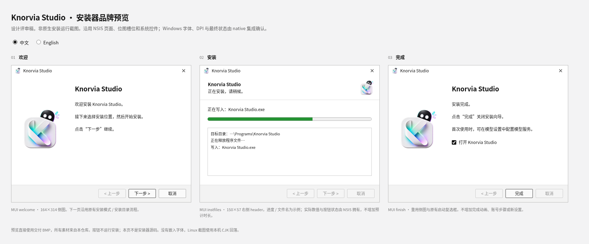

# 安装器品牌交付

仅新增品牌资源与设计预览。没有接入安装配置、编译安装器或执行真实安装。

[中英文可切换预览](preview.html) · [英文三页预览](overview-en.png) ·
[设计与来源](DESIGN.md) · [native 接入交接](INTEGRATION.md)

| 交付 | 路径 / 规格 |
| --- | --- |
| 欢迎 / 完成侧图 | `packages/desktop/build/installer-branding-20261003/installerSidebar.bmp`，164×314 |
| 安装页右侧 header | `packages/desktop/build/installer-branding-20261003/installerHeader.bmp`，150×57 |
| 来源与转换绑定 | `packages/desktop/build/installer-branding-20261003/sources.json` |
| 中英文短文案 | [copy.json](copy.json)，尚未写入实际 LangString |
| 单页预览 | [欢迎](welcome-zh.png)、[安装](install-zh.png)、[完成](finish-zh.png)，英文对应 `*-en.png` |

两位图为标准 24-bit、BI_RGB 白底 BMP，整张正式图仅等比缩小后合成到白底。
没有新的外部图形、字体或图标设计。bitmap 不包含按钮、文案和进度，原生文本/
控件仍由 NSIS 拥有；保留原有中间安装模式/目录步骤。

[最小检查](asset-checks.json) 接受文件头、尺寸、编码、输入图未改和预览真实资源
加载；中英文三页无裁切/溢出。仅运行素材与静态预览检查，没有应用构建、测试、
lint/typecheck 或全量审计。预览是 MUI 槽位设计稿，系统字体/DPI、真正的 NSIS
集成与安装包尚未验证，不能当 Windows 原生运行截图。

native 消息未送达：环境缺少线程消息工具，CLI queue 因只读状态库失败。整合者
可直接转交 [准确路径、尺寸与 native 所有权](INTEGRATION.md) 给线程
`01a1001a-4b5f-750a-9eaf-bfa1d2c5d0d4`。真正的脚本接入、安装包和 GitHub Release
由 native/整合任务负责，本路没有发布 release。
