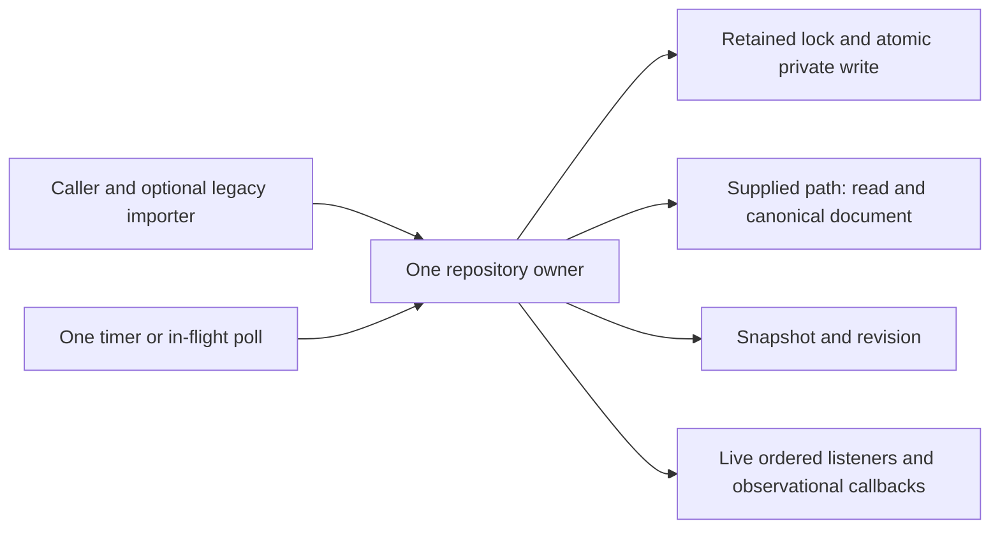

# Complete personal provider configuration repository contract

Prepare the complete allocated repository owner for root. Preserve public options, factory, class constructor/read/update/onDidChange/dispose and both exported interfaces. Keep existing private method organization unprescribed. Supplied configuration facades, codec/schema, shared lock/private-write utilities and D config/registry owners remain separate, unchanged collaborators.

## Construction, path identity and public lifecycle

Construction validates that supplied filePath.trim() is nonempty, but stores/passes the original untrimmed string to every read/write/lock. Do not resolve a home directory, normalize/casefold the path, derive an account identity, read env/config/credentials or instantiate a different repository. The constructor captures callbacks and polling interval; it performs no read, write, lock or scheduling. Nullish polling interval defaults to1000ms. False disables polling; a non-false value less than or equal to0 throws the fixed error. Do not add a finite/integer check, clamp or reject NaN/Infinity beyond current behavior; platform timer handling remains delegated.

Each repository instance owns listeners, one pending timer or in-flight poll, write-completion generation, polling-error latch, optional observed revision and disposed state. These are lifecycle state, not a second configuration fact store. Multiple instances have separate state; shared lock collaborator owns cross-instance/process file serialization. No watch filesystem subscription, retry policy or caller-visible cancellation API is introduced.

read and update reject after disposal at entry, before their try/finally or any IO. onDidChange throws synchronously after disposal. dispose is idempotent, marks disposed, clears a truthy pending timer, nulls its slot and clears the live listener set. It does not await/abort an in-flight read, import, lock, write, update or poll; already-started public operations may still settle and update internal revision/generation, but disposed suppresses new notifications/scheduling. Repeated dispose does not clear again. The factory simply constructs one class instance with supplied options.

## File reading and ordinary read behavior

Read UTF-8 text from the exact path and JSON.parse it. Treat as missing only an object/non-null error with a code property exactly ENOENT; inherited code also qualifies, and other errors propagate. A valid JSON null or other invalid document is a present invalid file, not a missing file. No stat, home lookup or secret/account discovery is performed.

An ordinary read first checks current content without a lock. Missing content with no importer returns a new empty update-derived snapshot without acquiring a lock or writing. Existing content is decoded by the retained codec; compare JSON.stringify(parsed value) against JSON.stringify(encode(decoded update)). Equal strings mean canonical current content and return its update-derived snapshot without locking. Formatting whitespace alone therefore does not cause a rewrite, but parsed property order or representation can. Do not substitute deep equality or a whitespace/text comparison.

Missing content when importer is configured, or noncanonical decoded content, enters retained withFileLock. Re-read the file inside the lock; never write based on the unlocked read. If it is now present, decode and compare against its encoded form; canonical content returns its snapshot without import/write. Noncanonical content is written through the canonical write procedure, then the read result snapshot is made from the original decoded update, not the returned canonical update object. This observable identity distinction remains.

If locked content is missing, invoke the optional captured importer with the repository instance as receiver, no arguments, and await it. The original private-field optional call binds this receiver; do not destructure it into an unbound local call. Nullish import uses a newly made empty update; a truthy imported update is canonically written and its returned canonical update becomes the snapshot source. A null result or absent callback returns an empty snapshot without an atomic write; the lock collaborator may still have created the directory. Never invoke importer for a present invalid document or from a poll.

Ordinary read/import/normalization does not emit updated; only a public update emits that reason. A successful public read initializes observedRevision only while nullish; it does not overwrite an already observed baseline on every explicit read. This matters for later external-change detection. The public read catches failures of its current read path, including decode/import/lock/write/revision creation, and performs the recovery below. It ensures polling in finally even after recovery or a rejected recovery computation, unless lifecycle gates prevent scheduling. Its entry disposed rejection is outside this finally.

## Recovery: preserve original material

On public read failure, call onRecovery if supplied with the repository instance as receiver and a shallow-frozen event containing the exact original error object. Exceptions thrown by this observational callback are swallowed. Then construct an empty in-memory overlay snapshot, initialize observed revision only if nullish and return it. Do not rename, delete, backup, chmod, overwrite or replace the invalid original file during recovery. Missing and invalid material are distinct. No backup recovery or alternate data extraction is authorized by this packet.

Only the observational callback is guarded: failures during empty facade creation/encoding/hash/snapshot calculation still reject. Recovery does not clear or set the polling-error latch and does not emit a change event. The read finally still applies normal polling scheduling. update does not use this recovery path and cannot silently replace a corrupt file with an empty transform input.

## Transactional update and canonical commit

Call retained withFileLock on the original path and run the entire operation under that lock: locked re-read/import/normalization, synchronous transform, selected update projection, validation/canonicalization, atomic write and committed revision publication. The transform is a normal function call with the locked current snapshot; it is not awaited and is invoked once. Do not support an async transform, skip a same-value write, reorder the lock boundary or use an unlocked stale snapshot.

Copy only providers, models, providerOrder and defaultModelSelection from transform result into a new shallow-frozen update record. These four are own keys even if values are undefined. Do not include providerTemplates or arbitrary additional fields. Keep referenced facade/order/selection values; no deep clone/freeze or new fallback/default selection.

Before any durable write, obtain canonical update by decode(encode(selected update)); then encode canonical update for durable content. Strict whole-document/schema/origin/manual-rule validation belongs to the retained codec. Write JSON.stringify(encoded, null, 2) via retained atomicWritePrivateTextFile on the exact path; no trailing newline is added by this owner. This round-trip and second encoding are observable and must not be collapsed to another facade serializer or a post-write validation.

Increment write generation only after atomic writer resolves, and return the canonical update. Every successful write path, including read/import/normalization writes, increments generation; failures before writer success do not. After the update's final write, build snapshot from the returned canonical update and set observedRevision inside the lock before releasing it. Only after withFileLock resolves, emit updated synchronously, then return the snapshot. Same-content updates still write and emit. Failures in lock release, transform, codec, IO, hash, listener or final scheduling are not converted to a success/recovery result. In particular, a listener exception can reject update after content and revision were committed.

An initial locked normalization/import may already write and increment generation before transform fails. Do not claim an all-or-nothing rollback of those preparatory writes. Failure still passes through update finally to normal polling scheduling. Disposal after entry does not cancel the transaction, but notifications and rearming are suppressed.

## Snapshot, revision and persistence identity

Every snapshot is a shallow-frozen record owning revision/providers/models/providerOrder/defaultModelSelection. No providerTemplates property is added. Reference the update's facade/order/selection values; preserve absent order as undefined rather than inserting an empty array into an otherwise absent persisted order. Empty recovery/missing update specifically owns an empty providerOrder array and new empty facade/rule results from their retained static empty methods.

Compute revision from compact JSON.stringify(encode(update)) using SHA256 update on the string and hex digest. It represents canonical encoded content, not pretty disk whitespace, raw source text, path, timestamps or a process/account ID. Do not sort extra keys, normalize order or hash only a subset. Canonical read/write round-trip is important for stable revision. Snapshots themselves and their wrappers are frozen, while nested facade/data/issue objects are not newly deep-frozen by this owner.

Stored codec version1 is a strict root object containing schemaVersion and config. Config has providerConfigRules and modelConfigRules, optional providerOrder and defaultModelSelection, and no new wrapper fields. Provider rules serialize under providerConfigRules.providerRules; model rules use retained toPersonalJSON. Optional order/default selection are omitted only when undefined. Root/schema/rules/selection validation, legacy manual-field normalization and unsupported-version errors stay in the codec. Do not rewrite this wire format, accept a future version or add migration/schema permission relaxations.

## Polling admission and one-at-a-time order

Polling is lazy: only read/update finally ensure it; merely constructing/subscribing does not start it. Do not require a listener before arming. Ensure returns without arming when interval is false, a truthy timer exists, a poll is in flight or disposed. Otherwise schedule one setTimeout with configured interval and invoke timer.unref with the timer handle as receiver if available. This preserves a background timer that need not keep Node alive. Do not convert to setInterval or filesystem watching.

Timer callback first clears the pending-timer slot, then starts a poll without awaiting or attaching a catch. At poll start mark in flight and capture current write generation. Read without lock/import/normalization/write: missing file yields an empty snapshot; present file decodes in memory and produces a snapshot. Polls do not recover invalid material into a successful empty read or invoke onRecovery.

After a successful poll snapshot, discard it when captured generation differs from current write generation, before changing the error latch or observed revision. Otherwise clear polling-error latch even if the revision is unchanged; then stop publication if disposed or revision equals observed. For a genuine new revision, set observed revision first and emit poll-changed. This is also how an initially null baseline becomes observed. A public read can initialize baseline but cannot overwrite an existing one merely because it returned different content.

On a poll error, suppress stale-generation and disposed errors. For a current first error while latch is inactive, activate latch, call onPollingError with repository receiver and original error while swallowing callback exceptions, then emit poll-error. Repeated current failures while latch is active do not repeat callback/event. A current successful poll clears the latch and enables a later failure episode. Successful writes/public recovery do not themselves clear it; stale poll success does not clear it either.

Always clear in-flight state in poll finally and ensure the next single timer under normal gates. A concurrent explicit read/update finally cannot arm a second poll while one is in flight. Generation is a completion fence, not a cancellation token or a global CAS API. Disposal suppresses polling notifications and rearming; it does not abort IO.

## Listener and exception semantics

Subscriptions use a live Set of callback references: duplicate callback references are deduplicated, insertion order matters and returned unsubscribe removes that exact listener (repeated removal is harmless). Its declared return is void; the current remover's underlying Set.delete boolean is not a new public API guarantee. Emit checks disposed once at entry, then iterates the live set without a copy or per-listener catch. Added/removed listeners during emission follow native Set iteration; dispose inside a callback clears remaining registrations. Listeners and transform are ordinary unbound local function calls; configured importer/recovery/polling-error callbacks retain the repository instance receiver from their private-field optional calls. Do not conflate those receiver rules.

Updated listener errors reject the already-committed public update. A poll-changed listener error enters the poll catch and may become the first polling-error episode, including onPollingError/poll-error emission. A poll-error listener throw is not separately swallowed; finally still runs and its internal fire-and-forget promise may reject. Do not add silent exception isolation, change reasons, emit before updating revision or turn onRecovery/onPollingError into configuration truth. Exceptions in timer arming/unref/finally can replace a previously successful return or earlier failure; do not add catches around them by default.

## Private file and IO permission boundary

All actual IO remains on the supplied path through existing readFile/lock/atomic-private-writer and native timer/hash APIs. Retained writer creates same-directory temporary material, writes UTF-8 with requested mode0600, atomically renames with its existing platform error retries and cleans temporary material best-effort on failure before rethrowing. It does not add backup access or a separate destination chmod call here. The repository passes no custom permission/rename/lock options. Shared per-path process FIFO and atomic cross-process lock/release behavior remain collaborator-owned; no new lock or deployment agreement is introduced. Do not claim universal platform ACL proof from a POSIX mode argument.

Future root verification can use only supplied fake IO/codec/facades/import callbacks/clock-free hashing/timer handles. Required cases include missing vs null/invalid documents, locked re-read after external replacement, canonical key-order normalization, import absent/null/present, strict pre-write errors and committed-listener failure, order absence vs empty revision, stale poll success/error after write, error episode reset, callback throw behavior, subscription mutation, timer unref/no double-arm and disposal during IO. This preparation executes none of those operations and no ordinary test/build suite.
