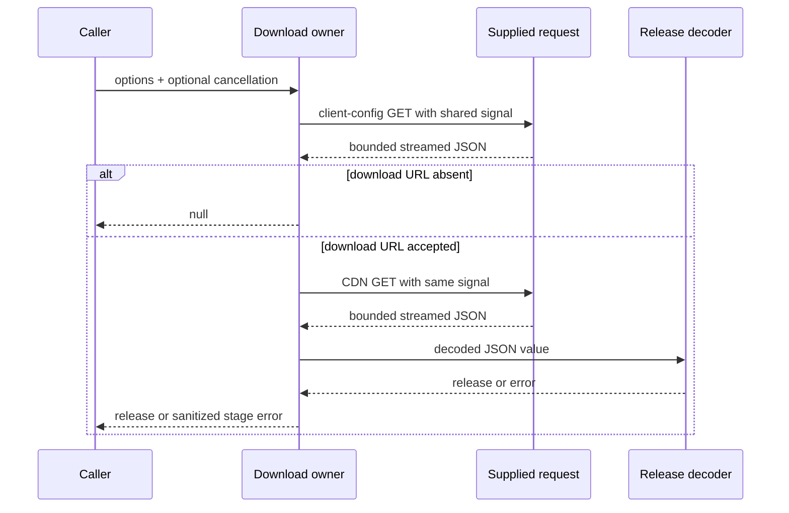

# Complete download owner rules

Own exactly `packages/provider-node/src/builtin-download.ts`; public entry is `downloadKnorviaBuiltinRelease(options): Promise<KnorviaBuiltinRelease | null>` plus the readonly options interface. No disk/cache, provider state, release freshness/monotonicity or source fallback belongs here. The release decoder is a retained collaborator at `./builtin-release.js`, with body-free API and rules in this packet. Root owns that separate reconstruction; D owns the higher config-source and remote-synchronizer.

One invocation owns a local cancellation controller, one overall 20,000 ms timeout and current stage. The timer starts before URL/request work and is optionally unref'd with its timer receiver; it is cleared on exit from the protected operation, including null success and all caught errors. A supplied signal is combined with the internal signal using the existing platform cancellation semantics; otherwise use the internal signal. The same resulting signal applies to both requests and both streamed bodies. This is one total async budget, not a separate timeout for headers, CDN or each chunk; synchronous parsing/decoding is not preempted by a JavaScript timer. It must also reject a pending request/read when the collaborator ignores cancellation. Already aborted input is checked before issuing a request. Keep the existing valid-typed-input boundary; do not add an endpoint validator or new malformed-options fallback.

First URL uses the absolute path `/api/v1/client/configs` against the caller's endpointOrigin with normal URL resolution. Set `app_version` and `platform` to the supplied strings using URLSearchParams, in that order; no trim, substitution or default. An absolute path replaces base path/query/fragment under normal URL semantics. Only the CDN URL has the specific HTTPS/no-URL-credentials refinement below; do not invent matching validation of endpointOrigin or a host allowlist. The supplied request is called as an options property (its `this` is the options object), receives a URL object, and returns a promise of Response. Every call receives fresh init with exactly method GET, shared signal, credentials omit and redirect error. Do not inherit headers/control-plane authentication or reuse mutable init from a previous call. The callback may still implement its own behavior outside this owner's control.

The first JSON value passes the pinned Zod schema: root object with literal numeric code 0 and object data; data contains object configs. All three envelope objects allow and preserve extra keys under canonical passthrough semantics. configs has optional `builtin_provider_config_json`, a canonical URL string additionally requiring parsed protocol `https:` and empty username/password. Omitted or explicit undefined yields null, after normal envelope validation; null/empty/invalid/wrong-type value is a schema failure, not an absence fallback. No separate checks for port, path/query, host, fragment, IP or allowlist. A valid supplied HTTPS URL is used with normal URL normalization. Stage remains `client-config` through first JSON/schema/refinement; once a URL exists it becomes `cdn` before constructing/reading that URL and calling the retained release decoder. Return that exact decoder result, without cloning/normalizing/caching. No retry, alternate URL, bundled release, null-on-failure or endpoint fallback.

For each response: wait cancellation-aware for the supplied request promise. If a response arrives after cancellation, start body cancellation without awaiting it, suppress that cancellation promise's rejection, and report the aborted operation. On non-ok response, likewise start non-awaited body cancellation and raise boundary reason `HTTP ${response.status}` without reading its body. On ok response require a body reader; no reader is `empty body`. A present but zero-byte stream reaches JSON.parse and is `invalid response`, not `empty body`. Do not validate response Content-Type, Content-Length, Content-Encoding or a digest/signature; the current integrity boundary is bounded JSON plus canonical manifest/release schema/security validation. No new cryptographic mechanism is inferred.

Read the stream in order using cancellation-aware waits. Sum each received chunk's byteLength before decoding; each response independently permits at most 10,000,000 bytes, and exceeding it raises `body limit exceeded`. The two bodies do not share a byte counter. Do not use string length or trust Content-Length. Apply default TextDecoder behavior with streaming decode and final flush, preserving split UTF-8 characters, then join decoded text and use ordinary JSON.parse. There is no fatal UTF-8/custom charset mode. After stream completion/flush, check cancellation before parsing. No extra synchronous post-decoder cancellation check exists. A request/read wait checks already aborted signals and subscribes once for abort; an underlying operation settling removes its abort listener. An abort can settle the outer wait before its underlying promise; late fulfillment/rejection remains observed. Keep cleanup and late-response safety without waiting indefinitely on cancellation.

Reader read/limit/decode/final cancellation/JSON failures start reader cancellation without awaiting, ignore its cancellation rejection, and release the reader lock in cleanup; successful completion also releases the lock. Normal platform body/reader/timer methods retain their receivers. Reader acquisition failures are caught by the outer boundary; do not invent a lock that was never acquired. Cancellation cleanup cannot become another unbounded awaited stage.

Every protected-operation failure becomes a new Error with exact message `Knorvia Studio Built-in ${stage}: ${reason}` and no forwarded cause/payload/URL. Choose reason in this precedence: if the shared signal is aborted, `timeout` when the internal timeout flag is set, otherwise `cancelled`; else a local boundary failure uses its fixed message; else a pinned ZodError uses only `invalid schema at ${first issue path joined with dots, or root} (${first issue code})`; else `invalid response`. For a ZodError without a first issue the path is root and interpolated code is undefined. The timeout flag is evaluated when handling the failure; do not substitute the combined signal's reason to change timeout/cancel precedence. JSON syntax, network, URL, release-retired-provider plain Error and other arbitrary failures all use generic invalid response unless earlier categories apply. The public standalone release diagnostic is deliberately not forwarded here. Do not include raw schema input, original issue message, response text, query URL, credentials, arbitrary exception text or stack/cause from the original error.

Acceptance scenarios for root's later bounded review: valid first envelope without URL returns null after one request; valid two responses return decoder identity; first vs CDN schema failures have correct stages; reject insecure/auth-bearing CDN URL before its request; response body absence/non-ok/10 MB boundary, streamed multibyte/JSON failures; cancellation before request, during ignored request/read and late response; one budget across both bodies; timeout reason priority; no indefinite cleanup wait; no caller auth forwarding or redirect following. These are contract obligations, not tests executed by this preparation.
