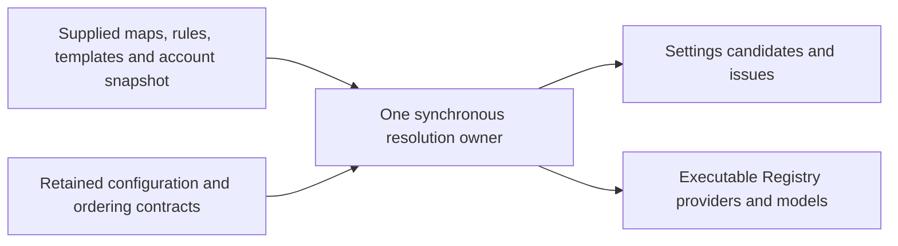

# Provider resolver public behavior contract

Root-only preparation for the complete `packages/provider/src/resolver.ts` owner. Preserve all current settings/registry behavior, data and interfaces. This is a synchronous resolution owner, not a provider transport, service/registry owner, schema implementation or credential store. The original helper decomposition is not prescribed. No author/candidate/production change is authorized by this packet.

## Complete public surface and defaults

Use the accompanying declaration-only API. Four function exports serialize or prove registry provider/model configuration; `ProviderConfigResolver` has one public `resolve(input)` method and no explicit constructor or persistent state. All calls are synchronous. Preserve every exported type/interface and its readonly/union structure. No top-level await, network, account lookup, service call, cancellation registration, filesystem or provider execution is introduced.

The two proof functions call the supplied config's `validateComplete` method with that config as receiver. Default paths are provider/model singleton arrays, applied only when the argument is omitted or undefined. An explicit supplied path reaches the validator unchanged. Nonempty issues produce a failed result with a frozen shallow copy of its issue array. Empty issues produce success with the exact original config object, without reconstructing or freezing it. There is no schema parsing here beyond that delegated validation, no exception catch, and no automatic fallback on validator failure.

## Configuration layers and identity

Only account-provider entries whose IDs exist in the builtin-provider map enter resolution. Each admitted account config is stripped of its group through the retained facade; unknown account IDs are ignored. The resulting map overlays the builtin map. For every resulting builtin entry, a truthy template ID selects that template's config if present; the concrete config overlays its template. Without a usable template config, retain the concrete config. This produces `effectiveBuiltinProviders`.

Personal config for an ID that already exists in effective builtins is likewise stripped of group. For a personal-only ID, a truthy available template config is overlaid by the personal config. Do not apply that personal-template step again to a builtin ID. Overlay the resulting personal map on effective builtins to produce `effectiveProviders`. Preserve rule identity/name/template metadata through the retained map facade; do not reduce rules to plain config values or normalize IDs. The map instances produced by collaborators are returned as those same instances.

Model rule composition receives builtin then personal rule collections through retained `ModelConfigRules.composeEffective`. That collaborator owns rule matching, recommended/manual overrides, base URL interpretation, regex and schema rules. The resolver passes through IDs and selected provider API type/base URL, including absent values; it must not invent defaults or reimplement those rules. The separate effective-builtin model projection always resolves through the original builtin rule collection, not through the composed effective collection.

## Provider and model order

First take effective-map keys whose resulting group is either retained family group, in that key order. The family segment is based on effective membership/group, not just builtin membership. Then delegate the remaining builtin IDs and personal IDs to retained `resolveOwnedOrder`, passing the supplied personal order or an empty array when nullish. Exclude family IDs from both delegated lists and exclude builtin IDs from the personal list. Return the family segment before the delegated segment. Do not sort locale/alphabetically, normalize identity, independently filter that collaborator's output or promote an account ID not in the builtin map.

Within each provider, nullish builtin/personal membership lists are empty. Keep only the first occurrence of each builtin ID in its list order. Keep first occurrences of personal IDs in personal order and remove personal entries also present in the builtin set. Delegate these two owned segments and nullish-default-empty `modelOrder` to the same retained ordering function. Model candidate `source` is builtin precisely when its ID is in the deduplicated builtin membership set; otherwise personal. No global model list, cross-provider fallback or selected default model is created.

## Provider admission and issues

For each ordered provider, retrieve its complete rule through the effective-map receiver. Preserve the rule's providerName value. Account access of the retained account discriminator makes provider enabled even when a legacy rule enabled value is false; otherwise enabled uses the rule's value with a nullish default of true. Do not turn this into Boolean normalization for noncanonical runtime values.

Validate provider completeness at the providers/providerId path. The per-provider issues are a mutable local copy of validation failure issues, or a fresh empty list on success. A nullish template ID is projected as undefined. A truthy template ID without a truthy template config appends the exact missing-template issue after completeness issues. A falsey ID does not trigger this added issue, even if it is projected as an empty string. Append those provider issues to the aggregate before that provider's model issues. Keep issue object identity; no deduplication or sorting.

Provider execution requires enabled, entitlement, current account snapshot and no provider issues. Entitlement is required to be exactly true only for retained account access; other access types pass this gate. Account snapshot current is permitted unless exactly false, including absence; this check applies to every provider ID, not just account access. Availability, snapshot entitled, connectionKey and effectiveAt are not read by this resolver. Do not turn pending/unknown account state into an extra execution restriction, or use the state snapshot as an account/service query. Off-Peak has no current field and consequently keeps the existing missing-current behavior.

## Model candidates and Registry admission

Every ordered model produces a settings candidate even when its provider is invalid, disabled or not current. Resolve its effective model config first with composed rules, then its builtin reference with original builtin rules, using the same provider/template/model/API coordinates. Validate effective completeness at providers/providerId/models/modelId, appending that result's issue objects to the aggregate in model order.

A model is enabled only when effective config enabled is exactly true. It is executable only with provider execution eligibility, enabled model and no model issues. It is selectable only when executable and provider visibility is not the retained hidden value. Hidden therefore suppresses selection but does not independently remove executable models from Registry. Do not conflate provider enabled, model enabled, executable and selectable.

Each candidate retains effective and builtin config object identities; it has the fixed candidate discriminator, membership-based source and frozen issue array. Preserve shallow freeze behavior: candidate records, candidate arrays and resolved-provider records are frozen. Each resolved provider retains its effective config, provider name and templateId; include templateConfig only for a truthy template config, and effectiveBuiltinConfig only when a truthy builtin result exists. Unlike these two optional config properties, providerName and templateId remain own properties even when undefined. Provider issues are frozen copies and models are the frozen per-provider array. The resolver does not deep-freeze configs or nested issue objects.

If provider validation failed or any provider issue exists, do not add that provider to Registry. Otherwise, select executable candidates, preserving their order, and validate each effective model config again with a newly constructed same-value path. A second validation failure throws the exact consistency error immediately; do not swallow it, convert it to ordinary issues or continue. Repeated validation is observable and must not be optimized away. Registry model records contain the same model ID and successful config object, and are frozen; a provider with zero executable valid models is omitted. Registry provider record, its model array, the final resolved/registry/aggregate arrays and the result object are shallow-frozen. The effective maps are not additionally frozen by this owner.

## Serialization rules

Provider serialization always creates own group/access/api keys. Preserve logo and visibility whenever not undefined, including null. The account access branch is selected only by the retained account discriminator and emits type/accountType/mode/entitled. Other access emits type/apiKey and preserves management URL when not undefined, including null. There is no credential masking or acquisition here; apiKey is part of the existing authorized configuration serialization contract, never a sample credential in this packet.

API serialization includes type/baseUrl and includes headers only when not nullish; headers use the original reference. Membership/order arrays are omitted when nullish and otherwise copied to new arrays, including empty arrays. No templateId/providerId/providerName/rule enabled or account-state fields are added to the serialized provider config. Do not call collaborator toJSON methods as a replacement for this output shape.

Model serialization creates own enabled/properties/optionSpecs keys, with the exact retained property and nested format key sets listed in static data. Values are read from the supplied complete config without extra validation/defaulting; reasoningLevel and maxOutputTokens option-spec values retain their original objects, not new serialized clones. The properties/inputFormat/outputFormat/optionSpecs wrapper records are fresh plain objects. Neither serializer freezes its result. Property access or collaborator exceptions propagate synchronously; no partial result is returned after an exception.

## Calls, failures, safety and migration boundaries

All map/config/template/rule/validator methods preserve their owning receiver. `resolveOwnedOrder` is an ordinary imported function call. Preserve nullish versus truthy versus exact-false/true decisions described above and supplied object/reference identity. Inputs are read; no service setter, credential access, provider request, persistence, user filesystem, event emission, timer, cancellation handler or retry/fallback policy is added. If supplied collaborator methods/getters have effects or throw, the resolver does not suppress or reorder those observations; no blanket purity claim is made about supplied collaborators.

Root will later decide implementation/testing. Necessary fake-only cases include account-ID filtering/group inheritance, both template paths, family/custom ordering and duplicate membership, incomplete configs/missing templates, disabled/entitled/current/hidden distinctions, unknown account snapshots, stable issue order and identity, second-validation inconsistency, synchronous collaborator throws, config/map identity, optional-own-key/null serialization distinctions and shallow freezes. Do not execute native benchmarks or real provider/model/network/account endpoints. No complete suite/build is needed for this preparation packet.

Config-service/registry-service belong to D; facades, schemas, types, static data and the owned-order collaborator stay unchanged. Canonical schema/protocol validation is retained evidence, not newly authored resolver rights. No MIT or whole-file clean-room conclusion follows from packet completeness or future test success.
