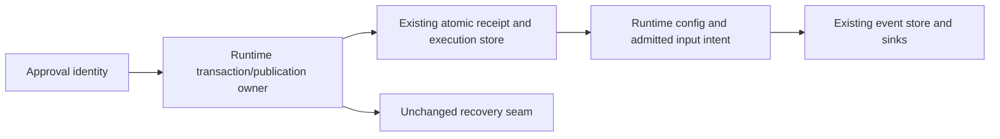

# Runtime permission/execution-state source reconstruction

Allocation: runtime/permission-full-access.ts and execution-state.ts are complete substantive owners. permission-grant-recovery.ts and helpers/permission-broker.ts remain exact conventional public adapters, without reconstruction credit. Four pinned predecessors match the parent allocation. Existing storage codecs, permission decisions, model/tool policy, expiry/grant interpretation, queue owners and public schemas are unchanged dependencies. No new permission or policy is authorized.

## Functional contract

`grantPermissionFullAccess.call(runtime, interactionId, signal?)` is native async. It requires a truthy optional commit port before checking busy state. Busy means permissionFullAccessPending truthy, pendingInputReservations.size greater than zero, or pendingInputDrains truthy. Exact errors are `Full access is unsupported` and `Queue mutation is busy; retry approval`. A previously unpublished different interaction is awaited through the unchanged recovery port before entering the pending region. Failure there does not set pending. Within that region every outcome clears pending in finally.

Check signal before reads, then await optional sessionEntries({sessionID,type:PERMISSION_FULL_ACCESS_ENTRY}); absence still has a native await. Select the first exact receipt ID `${sessionId}:permission-full-access:${interactionId}`. Existing receipt must parse through the unchanged permissionFullAccessReceiptSchema. Event session and interaction must equal this request or throw `Permission receipt scope mismatch`. Do not reinterpret malformed or mismatched receipts as fresh grants.

With no receipt, await rebuildProjection and capture pendingSteerInputs.pendingInputId in order, duplicates included. Resolve current execution state using the existing shared helper; next preserves planEnabled and changes mode to yolo. Create SessionModeChanged on runtime receiver and root trace with payload fields next state, previousMode, previousPlanEnabled, source command, permissionGrant {interactionId,queueItemIds}. Check signal again before the one awaited atomic commit. Commit input key order sessionID,queueItemIds,signal,execution,receipt. Execution data is the next state reference. Receipt fields id,sessionID,type,touchSession false,time {created:Date.now(),updated:Date.now()},data {interactionId,event}. Execution entry is built before the receipt's two clock reads. No further abort check after commit, including publication failure recovery.

After either durable path, take the event payload and record recovery for this runtime/interaction. Grant targets derive solely from that event's queue IDs. Apply runtime memory at most once per interaction per runtime identity: lastPermissionGrantId,config.mode,config.planEnabled in that order; then replace intent only for active pending inputs with matching ID and truthy intent, preserving other fields and intent properties. Unmatched items and matched items without intent retain identity. Record application only after these assignments. A fresh receipt recovery must not promote later queue items or reapply memory that was already applied. Recovery remains a publication action, not a second queue or grant store.

Await eventStore.getEvents(sessionId); first event with matching ID is sent by exact reference to notifyEventSinks(existing,rootTrace), otherwise appendEvent(event,rootTrace). Both calls use runtime receiver. Remove recovery only after awaited publication succeeds; return String(event.id). Failures leave existing durable/memory partial effects and recovery available, and propagate original thrown/rejected errors. Queue selection, application and publication ownership are fixed by the same committed receipt.

`readRuntimeExecutionState(runtime)` delegates to shared resolveExecutionState(runtime.config). `buildExecutionStateEntry(sessionId,state)` reads Date.now once; ordered id `${sessionId}:runtime-execution-state`,sessionID,type SESSION_ENTRY_EXECUTION_STATE,touchSession false,time {created:timestamp,updated:timestamp},data exact state reference.

`applyRuntimeExecutionState(runtime,input,cause)` is native async. Busy full-access state rejects `Permission update is busy; retry mode change` before recovery or normalization. If the unchanged unpublished WeakMap has this runtime, await recovery. Normalize previous config and then input with previous fallback through shared resolveExecutionState. Equal mode/plan returns the next object with no goal/persistence/event effects. Enabling plan from false awaits the optional readSessionTargetForContext(cause.traceContext ?? rootTrace), even when absent. Active goal rejects `Plan and Goal cannot be active at the same time.` before persistence/memory. Other goal statuses and undefined permit transition.

Await a native persistence operation, including when it is a no-op. It saves only when sessionPersisted is truthy and optional sessionStore.saveSessionEntry is truthy. Call on store receiver with the execution entry. Save failure leaves memory, reminders and event publication unchanged. After persistence succeeds assign config.mode then config.planEnabled; if plan toggled, set needsPlanModeExitReminder = !next.planEnabled. Then select cause.traceContext ?? rootTrace and await appendEvent(createEvent(SessionModeChanged,payload,trace),trace). In this nested call the append port is looked up before createEvent. Payload order next state,previousMode,previousPlanEnabled,source,conditional truthy toolCallId. Both runtime method receivers and event reference must be preserved. Event failure propagates after memory changes; there is no rollback/retry/repair. Return exact next state object.

No new native async gates around receipt selection, memory application, or event construction; private representation is author choice. Preserve existing no-op and optional-port await gates, and do not fold recovery into a second permission owner. Runtime prose and schema vocabulary are fixed public compatibility material.

## Source and validation boundary

The curator has read the predecessors. A fresh internal author receives only this functional contract, public declarations, minimal type/port declarations and runtime vocabulary; no source/history/tests/compiled oracle. Draft is saved and hashed before curator comparison. All subsequent source-exposed corrections and failed proofs remain separately recorded. Restricted input is not an absolute clean-room or whole-file originality/licence claim; standard primitives and constrained projection correspondence are disclosed.

Use minimum synthetic authority, fixed-target/recovery, execution-state persistence/cancellation and actual SessionModePort observations. No real grants, configuration, credentials, files/processes/agents/providers/network effects. Ordinary suites/builds/native acceptance are deferred. Held task registry, E/G/context, shared licensing and all other permission owners remain unchanged.

