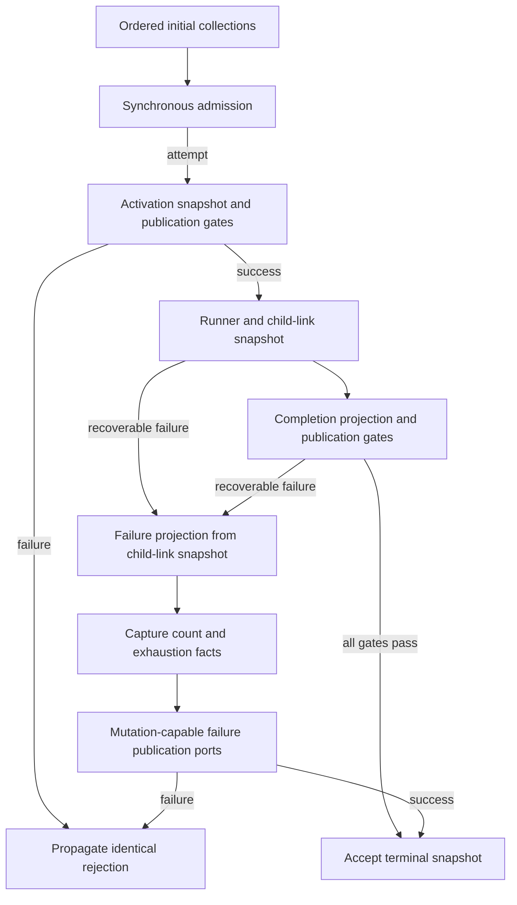

# Complete collection-planner packet and author handoff

The complete owner packet covers the serial sweep, synchronous admission, activation, child links, success publication and recovery. It targets corrected checkpoint `39cc7b5fa60c7337a4b1139e8bab8cc0d6a079ec`, including primitive failure facts captured before mutation-capable publication ports. This is candidate evidence only; production integration and licence disposition remain with root.

## Frozen inputs and boundary

The [packet directory](evidence/collection-planner-author-packet-20261002/) contains the functional contract, public declarations, public data schemas and curator provenance manifest. Commit `d90976cd` froze the three author inputs before creation of the fresh native author. The same bytes were mirrored to its bounded scratch input directory; 14 input/source bindings were verified. The declaration packet explicitly identifies collection identity as `collectionId` and expansion's result parameter as `WorkflowGraphSchedulerPlannerRunResult`.

The curator is source-exposed. The contract was distilled from corrected behavior and public APIs after the existing owner review; it is not evidence of a source-unexposed specification writer. No implementation, tests, comparison report, private attempt record or prescribed private helper decomposition was passed to the author. Required clock ordering, field presence/order, original references, receiver binding and rejection identity are behavioral constraints. The author chooses internal organization; neither brevity nor an unfamiliar algorithm is an acceptance requirement.

A fresh native author `/root/collection_planner_packet_author` was created with `fork_turns: none`, `model: gpt-6-astra`, `reasoning_effort: high`, in this same saved executor. It was not the expansion author. The tool has no separate Fast/service-tier selector. The exact task message is [author-invocation.txt](evidence/collection-planner-author-packet-20261002/author-invocation.txt). Only the three frozen inputs and its own outputs are allowed reads. This boundary is instruction-based; the shared executor is not an independent filesystem sandbox, and a read attestation cannot establish absolute non-exposure.

## Frozen author output

The author froze its complete single-module draft at `2026-10-02T13:44:05.970439Z`. The curator archived the identical bytes at `2026-10-02T13:44:27.418532+00:00` before reading or comparing its body. The author reports no boundary breach or unresolved question. This is an author attestation, not an independently enforced access audit.

| Artifact | Bytes | SHA-256 |
| --- | ---: | --- |
| [Complete owner draft](evidence/collection-planner-author-packet-20261002/draft-collection-planner.ts.txt) | 11,700 | `23403026dd2dadc7cab3221b90f863e6b3762a628b6920a95caeb065c13d5703` |
| [Exact author record](evidence/collection-planner-author-packet-20261002/author-record.json) | 2,383 | `db0d92b7c8aa66f0aff6b8f1e0d930dc0aff64a047c7026e9f3164b407f60d6c` |

The [curator draft manifest](evidence/collection-planner-author-packet-20261002/curator-draft-manifest.json) binds the exact invocation, output and author record. Inputs remain unchanged at their earlier freeze commit. The draft includes admission in the complete owner, with no separate admission output. No curator edits were applied to author output.

## Observable publication boundary

Cancellation observed in the recoverable catch rethrows the caught value. Terminal projections never replace the snapshot observed by child-link callbacks. The diagram summarizes required behavior, not an author implementation layout.

## Existing source relationship remains recorded

[E's existing expression review](knorvia-collection-planner-expression-review-20261002.md), commit `fd5e9e2e7f56253cf083aaa66364e3c9838d4dcd`, remains applicable to the corrected existing planner and admission helper. They remain source-exposed mixed expression with bounded decision/result/control contributions; the new packet does not retroactively clear either file. Preserving immutable failure facts restores behavior already present in the publisher predecessor and is not a new exhaustion policy.

Fixed event/status/reason strings, artifact path and label formats, API names, necessary field projections and standard language constructs are not grounds to demand gratuitous changes. A later contribution review must distinguish those compatibility constraints from discretionary expression and assess the complete candidate. Lower dependency owners, schema ownership, package notices and whole-repository licensing are outside this candidate's scope.

## Validation and integration limits

Only packet/source binding and evidence checks were run here. No dependency installation, compiler, runtime differential or broad suite was run. Root's earlier planner-expansion v2 strict compilation and eight source/emitted differential passes concern that separate candidate; they do not validate this complete collection-planner candidate. Root owns exact-candidate compilation, unchanged source/emitted and real-consumer checks, and any subsequent expression/licence decision. No production file, notice, licence, global inventory, release or deployment changed.
