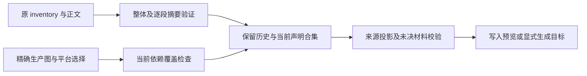

# 依赖平台选择与历史声明再生成修复

本批修复实际来源工具错误，未把缺少权利材料的组件改称合规。基线为 `234af1fff3910ddc951ac2f68f69bab910602547`；逐项来源、输入摘要、两份 musl 归档及 UI 说明前后摘要见[机器证据](../licensing/evidence/dependency-tool-repair-20260930.json)。根 LICENSE 仍为 Apache-2.0，严格材料门仍拒绝 27 项。

独立只读研究全文来自 Library `libfile_63c7ca271598819194106ec5813b8d80`，`Knorvia-dependency-license-evidence-2026-09-30.txt` version 1。本写入环境完整阅读，并独立重现有效平台配置、当前精确生产图、两份缓存 musl 归档、声明生成预览及历史文本保留。其他逐版本 npm/原生源码研究归属于该报告，不把其仓外路径或检查冒充本环境执行结果。

## 修复行为

旧工具按三个 canvas 名称允许缺失，遗漏 libc，错误要求 glibc 配置实装两个 musl 包。现在由精确 lock 的 os/cpu/libc 约束、有效 pnpm 配置和有依据的主机 libc 共同决定选择；不改安装目标或许可允许列表。`pnpm ls --lockfile-only` 会把部分 optional 子边平铺为 dependencies，所以从固定 snapshots 复原，并要求所有可达路径均可选。任何必需路径、选中但缺失的包、旧版本或未知元数据仍失败。

当前 Linux x64 glibc 配置的目标为 Linux/Darwin/Windows、x64/arm64、glibc。五份未选中 canvas 包分别由 Android、arm、riscv64、musl 约束排除，记录完整原因和目标选择。两份 musl 包仍有历史声明，不因未实装便删除来源义务；这也不证明任何实际发行物的组成。

旧生成器把当前生产图外的开发/历史 override 当作 stale 并拒绝。现在先验证原 inventory 和通知正文，再按原 package union 保留历史记录、原 notice 字节、引用、例外与 inactive patches。每段旧正文另按自身摘要验证，即使有人同步重算外层摘要，改变原版权文本仍被拒绝。当前包覆盖独立校验，历史记录不能掩盖当前必需包缺失。

真实预览还暴露了署名检查错误：143 份复制文件与固定 ZCode 基线归一摘要一致，已有 ZCode 修改说明应保留；五份 AI Elements 文件已有本地改动却只有旧说明。生成器只对固定基线匹配认可 ZCode 原说明，五份文件补充 Knorvia 修改说明且保留 Vercel/ZCode 头部。将新增一行移除后，各文件与本批前版本逐字节一致。五份文件继续未审定，UI 逻辑、样式、布局、数据格式不变。

## 执行证据

- 先行失败门：平台 7 项中 4 项失败；再生成 3 项中 2 项失败。新增断言后来源工具总计 81/81 通过。
- 完整离线回归：3870 项，3863 通过、7 项平台跳过、0 失败；245160 ms。根类型检查与 lint 通过，lint 零警告。
- 真实基础许可检查通过，扫描 1692 份已安装包；仍报告 27 项未决义务。
- 仓外真实生成预览含 1201 份历史/当前 package union、1123 个当前生产图精确键、五份有明确平台排除证据的未实装记录。原 928 段 notice 每段字节及引用全部保留。
- 根 `THIRD-PARTY-NOTICES.md` 未修改，SHA256 `05d366f61fe430c5a0c7ed6b27ac9bb6626591151331f2817cb9120649e4c67f`。预览 SHA256 `2a7e6e78826ccd0440dcc62981167af7c5f986ee8e780cd38912ac3a893957ce`，元数据多九字节；原 notice 正文未重建或重新署名。
- 本地两份缓存 musl tarball 与独立报告归档/二进制摘要一致，仅含 package.json、README、原生二进制，没有独立 LICENSE。原 Skia 17 份完整通知及 692 字节 jcarith 首注释不刷新。

## 27 项材料的剩余边界

| 数量 | 精确对象                                                                                                                                                                                                                                  | 缺失证据和可行处理                                                                                                                                                                                                                              |
| ---- | ----------------------------------------------------------------------------------------------------------------------------------------------------------------------------------------------------------------------------------------- | ----------------------------------------------------------------------------------------------------------------------------------------------------------------------------------------------------------------------------------------------- |
| 10   | unsafe-pointer@0.2.0、react-remove-scroll-bar@2.3.8、quickjs-wasi@2.2.0、@hono/node-ws@1.3.0、strict-event-emitter@0.5.1、semaphore@1.1.0、boolbase@1.0.0、@open-draft/deferred-promise@2.2.0、is-node-process@1.2.0、ansi-to-react@6.2.6 | 当前生产来源的完整原版版权/许可正文或其他明确授权。精确 registry URL、保留补充文件及摘要见机器证据 npmExceptions；标准条款和 metadata 作者不能补造版权声明。可继续查出版者固定来源，无法取得时由出版者授权或另行核验等价替代。                  |
| 2    | lazy-val@1.0.5、keyv@4.5.4                                                                                                                                                                                                                | 开发构建依赖的同类原版声明缺口，不能从历史合集删掉规避。                                                                                                                                                                                        |
| 3    | @arms/rum-browser@0.1.8、@arms/rum-core@0.1.4、@arms/rum-electron@0.0.3                                                                                                                                                                   | 当前 lock 已无，但历史发行声明仍保留；缺原版权利材料，不能拿新版本声明覆盖旧版本。                                                                                                                                                              |
| 8    | Desktop/Web 两个 material-icons 根下的 folder.svg、docx.svg、pptx.svg、xlsx.svg                                                                                                                                                           | 仅能确认 ZCode 基线，原设计/修改者权利及出版者精确来源未知。[资产验收](knorvia-material-icon-historical-evidence-20260930.md)列出全部路径。须权利人材料或经用户授权的兼容素材替换；478 份 Material Icon Theme 的 MIT 版权匹配不授予商标使用权。 |
| 1    | .agents/skills/react-best-practices；vercel-labs/agent-skills@063bee94c3f4df8453406c830b0a7df0f2860278                                                                                                                                    | MIT 标识和 Shu Ding/Vercel 署名仍缺完整原版授权正文；需发布者原文/确认或授权替代指令。                                                                                                                                                          |
| 1    | Skia@fe2718df5f53a681087be6f0539045ca1b4b8c09；canvas@0.1.100，来源 db337893b9b53483050ca7b24c6d306e4da06741                                                                                                                              | 核心和既有通知已保留，最终各平台原生链接库、Rust/LLVM/mimalloc/libavif/aom 等精确版本、授权及链接映射未闭合。源码构建标志、DT_NEEDED 或缓存归档不能代替最终静态链接 SBOM。需出版者构建证明或可验证自行构建。                                    |
| 1    | QuickJS-NG@dec012362bd93876449f3ecff4f835b2eba89bab；quickjs-wasi@2.2.0                                                                                                                                                                   | 引擎声明保留，WASI libc 和扩展实际链接版本/来源仍未闭合；需对应构建记录或可验证构建。                                                                                                                                                           |
| 1    | native-search Rust standard library@6a6eaca656978778f7c1c750ee0c3db87f8bffb2                                                                                                                                                              | 缺对应发行二进制的标准库原版权/许可快照及链接证据；需工具链/发布者证明或可验证构建。                                                                                                                                                            |

这些缺口的决定性材料来自出版者、原权利人或可验证构建，并非要求用户自行撰写法律声明。用户若持有原始素材/授权文件可以补证；更换素材、依赖或发布产物须继续保留产品行为并另做兼容验收。目前不发布 MIT 结论。

## 独立实现与原生验证仍未完成

下一批可继续的产品实现是 `apps/cli/packages/adapters/src/device/process-probe{,-shared,-linux,-darwin,-windows}.ts`。`cli-device-mid.ts` 的既有状态所有权必须保留；只有仓外观察和草拟合同，尚无本批永久冻结门或替换提交，不能重复声称历史设备/文件系统六项 harness 已完成。

全库待审范围更大：当前 ledger 在 core/runtime、core/tool、bootstrap/app 与协议、services/studio-runtime/session/agent、UI V4/Studio/组件/hooks/store、Desktop main/host 和共享协议仍有继承或未确认文件。分类只表示待审/待独立替换，不自动表示每份必须重写，也不把新增功能误当作旧 ZCode 来源。后续须按当前规格和状态所有者逐片建立合同、实测兼容、记录作者与来源；本批工具修复和 478 份第三方 MIT 证据不等于全库原创。

独立 QA 已正常取得并校验官方 Electron 41.0.3，但其 Electron/Chromium 均在 sandbox helper 所有权检查退出。本环境未执行原生 UI；需要受支持、正确配置 sandbox 的 runner，不关闭 sandbox。Windows/macOS 原生 UI、打包安装与实际 release payload 检查仍未运行。ComfyUI 原 Windows #185 的单次 1000 ms 超时根因仍未知；新增阶段诊断与后续 CI 成功不将其冒称产品已修复。

本批不写用户库或迁移数据。回滚为撤销本提交的工具实现、证据和五份说明行；根原通知不变。此前日志模块与资产证据仍有独立提交可审查。
