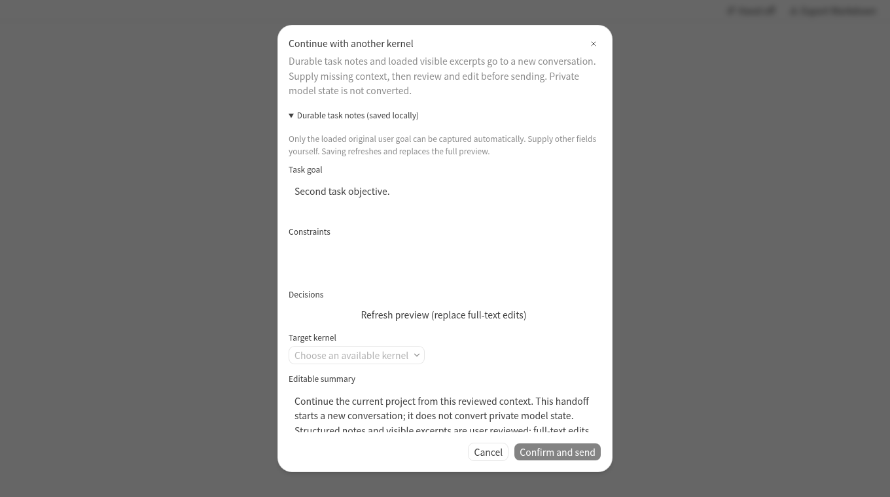

# 持久结构化接力：lane 2 集成说明

基线：`be610f46a7c34a500ec443cb6e335a531f12937b`，v0.8.8。分支：`feat/durable-session-handoff-lane2`。规格：[knorvia-durable-session-handoff.md](../specs/knorvia-durable-session-handoff.md)。独立实现本项扩展，没有读取或复制 Paseo 实现；原有 native/external dispatch 继续复用，不声称完成整个项目的来源替换。

## 接口与所有者

- `@knorvia/shared` 新增 `HandoffScope`、`SessionHandoffRecord`（version 1）、字段键／限额、严格解析、脱敏、相对路径与作用域函数。只依赖纯 shared 函数，无 IO。
- `studioAgentStore` 在原 `knorvia-studio:agent-drafts:v1` storage key 内写 envelope v2；读取 v1/v2，保持 configs/drafts；新增 `handoffs` 与唯一写入口 `saveHandoff(record)`。这是本机 UI 任务记录，不是原生或外部服务端事实／模型记忆。malformed handoff 单独降级；未知 envelope 或原有配置／草稿损坏仍禁止覆盖磁盘。
- `StudioSessionActions` / `SessionHandoffInput` 新增必填 `sourceSessionId`；可选 `workspaceIdentity`、`historyStartKnown`、`totalRecordCount`、`excludedRecordCount`。后两项是原生总行数和原生 adapter 已排除的已加载行数，不能冒充可见消息数。
- 原生 `NativeSessionActions` 使用 `firstRowId === window[0].rowId` 证明已到历史开头，提供总行数和 adapter 排除数；外部 `StudioExternalChat` 使用当前 timeline 的 `nextBefore === undefined`。
- `useSessionHandoff` 只持有本次预览／编辑／确认尝试；`taskHandoff` 只提取已加载可见消息，并通过注入 FileService 的 resolvePath/stat 核验引用。关闭、来源变化及服务变化通过同一 UI gate／generation 使迟到结果失效。
- 既有 `performStudioHandoff` 仍发同一固定 create/send command IDs；`createNativeHandoffAttempt` / `performNativeHandoff` 仍使用同一 V4 `createSession(firstInput)` envelope，并要求 ACK 的 commandId 匹配。

## 与其他 lane 的共同文件

`packages/ui/src/studio/agents/StudioExternalChat.tsx` 仅为现有 actions 提供 source ID／历史起点；`packages/ui/src/v4/NativeSessionActions.tsx` 仅提供同样信息及计数；`studioAgentStore.ts`、`agentDrafts.ts` 保留现有偏好／草稿写入路径并扩展可选任务记录；`packages/shared/src/index.ts` 新增纯 schema 的公开出口。没有修改 Studio runtime command contract、CLI／进程所有者、模型鉴权或 mobile 链路。

任务字段不会从近几条消息猜测决策、失败尝试、验收结果。只有已证实到顶的首个真实用户正文可作为有来源的目标摘录；其他项由用户填写，空项明确缺失。保存任务记录和全文预览编辑分开；用户清空目标后不自动回填。目标保存后不被尾部窗口覆盖。

## 验证与证据

Node v24.14.0、pnpm 10.33.2。目标离线测试 42/42 通过；真实组件浏览器替身验收 5/5 通过，无 page error，没有实际模型请求或文件正文读取。完整 Studio 离线回归：8,320 通过、8 跳过、0 失败（共 8,328 项）；此后新增两项 schema 边界测试已单独通过。CLI 前置构建 17/17 成功。

[浏览器验收 JSON](qa/durable-session-handoff-lane2-20261007/browser-results.json) 包含 reload、零命令取消、stale refs、编辑脱敏、重复确认、native/external 固定命令重试、迟到 ACK／引用核验，以及展开编辑后 760px 桌面视口的按钮可达性。

验证入口：`node scripts/studio-handoff-smoke.mjs [Chromium 可执行文件]`；可通过 `KNORVIA_CHROMIUM_EXECUTABLE` 和 `KNORVIA_HANDOFF_EVIDENCE_DIR` 指定本地浏览器与输出目录。默认输出使用系统临时目录。此入口挂载真实 UI/store/V4 transport，仅替换 workspace services／平台／国际化 hooks；不会启动已登录内核。

初始环境的 Node v24.19.0 导致版本强制合同和依赖它的进程替身失败；已经切到仓库 pin 重新执行。Electron 下载与原生 rebuild 在本环境失败，安装离线检查依赖使用 `--ignore-scripts`；桌面安装包与真实登录内核不属于本次验证。Linux 浏览器验证不代替 Windows/macOS 人工或安装包验收。

## 发布边界

只提交、推送 feature branch 和中文 draft PR；没有 merge、release、签名配置、账号操作、支付或在线网站发布。最终集成器负责共同文件对账、平台 CI 与合并／发布。
