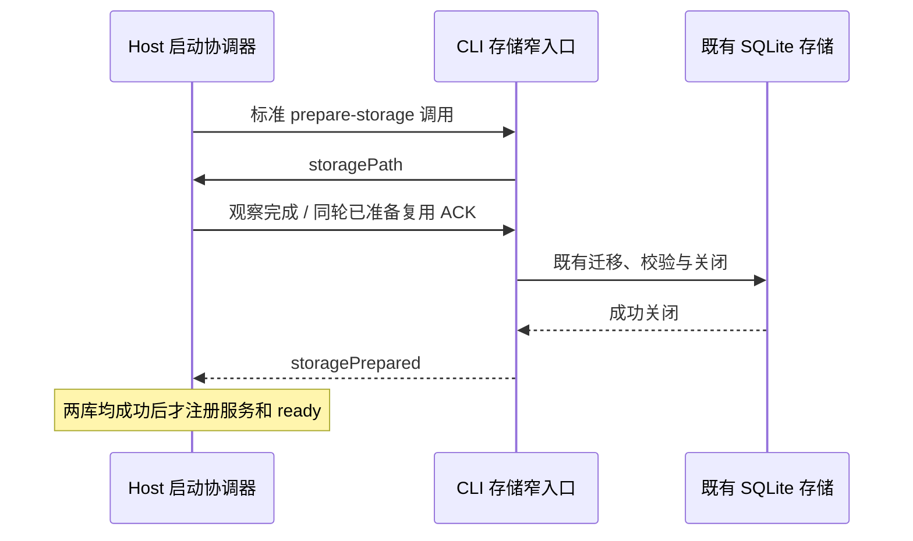

# 启动性能收尾：存储准备窄入口

日期：2026-09-27。基线源码 `d4b5515`，版本 `0.8.0-preview.3`。

## 已确认问题与改动

历史报告中的两个数据库并行准备已经实现，本轮保留。源码核查发现 Host 的标准 `--prepare-storage` 请求仍会经过 CLI `run` 和 bootstrap 总入口，求值工具命令、Agent、Provider、MCP、工作流等依赖，最后才执行不需要这些模块的存储准备。

现在标准内部调用直接进入公开 `@knorvia/bootstrap/storage-startup` 子入口。原协议 `prepareStorageOnly` 分支也委托同一 `prepareKnorviaStorage`，仍使用现有配置、相对 cwd 解析、观察 ACK、SQLite 迁移及关闭流程；数据库迁移和快照实现没有在本性能修改中复制或绕过。其他参数组合继续由原 CLI 路由处理。



Host 仍独占启动状态；没有提前显示可发送状态，没有跨启动成功缓存，没有移除项目 cwd 准备。

## 测量口径修正

- `--desktop-only` 跳过 Vite/Chrome 滚动夹具，单独测最新打包程序。
- 完整包复制到仓库外，工作目录固定为自身目录。只改 cwd 不够：解析器仍会沿祖先找到源码 CLI。新增真实路径和全部祖先检查、exe/asar/CLI 散列以及实际 resourcesPath 核对；仓库内旧调试样本排除。
- 每个冷样本使用全新临时资料，暖样本复用最后一个冷样本的资料，不跳过引导。这里“冷”指新资料，不代表清空 Windows 文件系统缓存。
- OS profile、appData 和 Knorvia 存储目录显式隔离，创建 appData 后启动；只继承系统所需环境。脚本核对 Electron 实际 userData，拒绝非打包程序。
- `--desktop-samples 3` 保持原有 1 冷 + 2 暖口径；`--desktop-cold-samples 3` 将冷样本增为 3，合计 3 冷 + 2 暖。`firstInteractiveByKind` 分开统计，原混合字段保留兼容。
- 旧 `readyToSend` 实际只能证明输入框可见；输出增加 `capability: composer-visible-only`、`modelSendVerified: false`。没有发送请求，没有配置或调用模型，不能把它作为真实可发送验收。

可比前后测量须在同一台机器、Node 24.14.0、相同脚本与生产构建设置下顺序执行；记录各自产物来源。示例：

```powershell
node scripts/perf-baseline.mjs --desktop-only --executable "<生产包目录>\Knorvia Studio.exe" --portable-dir "<生产包目录>" --desktop-samples 3 --desktop-cold-samples 3 --no-ready-to-send
```

## 已执行验证

- Node 24.14.0 下 `cli-storage-preparation-entry.test.ts`、`performance-baseline.test.mjs` 与 `packaged-runtime-evidence.test.mjs`：**16/16 通过**。覆盖标准/非标准调用分类、共享环境规则、cwd、错误退出、真实 SQLite 的 ACK 前零写入、错误 ACK 不创建库、同轮复用、关闭失败不发送 prepared 且清理不覆盖首因、隔离环境、冷暖统计和包路径/散列。WAL 模式下独占事务并不能单独证明连接已关闭，关闭顺序另由真实存储实例的故障注入验证。
- 根 `pnpm lint`：0 警告、0 错误；`pnpm architecture:check --changed`：0 既有、0 新违规。
- 整合后根 `pnpm typecheck`、`pnpm --dir apps/cli typecheck` 与 CLI lint 均通过；真实 package exports 的 `pnpm build:cli-packages` 16/16 构建完成，生产桌面包构建退出 0。早期隔离工作区的临时源码定向检查已由正式命令取代。
- `protocol-lifecycle.ts` 增加输入流的显式共享类型，修正独立 CLI 类型检查发现的 3 条 `on()` 联合重载诊断；无运行行为变化。

## 同条件旧/新包测量

Windows 11 26200，Ryzen 9 7845HX（12 核/24 线程），约 31.2 GiB 内存，Node 24.14.0。构建、全量测试和打包界面验收均结束后测量；没有停止用户原本运行的应用，不宣称整机无其他负载。

旧包为 `dist-workspace-outline/win-unpacked` 的完整外置副本 `D:/tools.cache/knorvia-baseline-20260927/win-unpacked`；新包为本轮生产构建 `dist-stability-20260927/win-unpacked` 的完整外置副本 `D:/tools.cache/knorvia-candidate-20260927/win-unpacked`。二者均为 `0.8.0-preview.3`，以 JSON 中的完整 exe/asar/CLI 哈希识别具体产物，不能单凭相同版本号认定字节相同。

第一轮旧→新，各 3 冷+2 暖；第一轮冷中位数 3761→3800 ms，没有明显改善，因此预先固定再做一轮反向新→旧，各 3 冷+2 暖，以检查顺序和机器波动。以下纳入**全部 20 次**，没有挑选较快样本：

| 指标                                    | 旧包                        | 新包                        | 本机观测变化                   |
| --------------------------------------- | --------------------------- | --------------------------- | ------------------------------ |
| 冷启动首次可交互，6 样本 min/median/max | 3716 / 3866.5 / 4074 ms     | 3388 / 3711.5 / 3985 ms     | 中位数 −155 ms，约 4.0%        |
| 暖启动首次可交互，4 样本 min/median/max | 3589 / 3695 / 4083 ms       | 3353 / 3464.5 / 3847 ms     | 中位数 −230.5 ms，约 6.2%      |
| 数据库准备，各轮首个冷样本              | 1900 / 1896 ms              | 1659 / 1635 ms              | 均值 −251 ms，约 13.2%         |
| 首冷应用进程树工作集，两轮              | 1145.7 / 1158.4 MiB         | 1103.1 / 1105.7 MiB         | 仅时点观测，不作为峰值内存结论 |
| 程序目录（不含 data）                   | 660040963 bytes / 118 files | 660045603 bytes / 118 files | +4640 bytes                    |

原始记录：[旧包第一轮](perf-baseline-2026-09-27-before.json)、[新包第一轮](perf-baseline-2026-09-27-after.json)、[新包反向轮](perf-baseline-2026-09-27-after-reverse.json)、[旧包反向轮](perf-baseline-2026-09-27-before-reverse.json)。各自命令均退出 0。冷样本指新资料，不是清空 OS 缓存；散列取证会读包文件。以上只反映本机少量样本，没有跨设备统计或置信区间证明。

新旧样本范围仍重叠，不能把约 4%/6% 的本机中位差写成稳定保证。准备阶段只记录各轮首冷两次，并非每个样本的数据库统计。动态入口仍位于单体 `knorvia.cjs`；下一轮可先补每次准备的加载/配置/握手/开库/关闭分段计时，再评估独立小产物，保持现有安全顺序。

## 整合验收与剩余边界

- 全量离线回归 **838/838 通过**；真实新包三条交互流程 **15/15 通过**；输入框对齐、侧栏与材质等既有界面回归 **14 组通过**，见 [打包记录](knorvia-packaged-acceptance-20260927.md)。
- **3 秒探索目标未达到**。本轮已减小存储准备入口的加载成本，但没有提前释放 Host ready、跳过升级快照/迁移或把输入框可见冒充模型可发送。
- 旧 2026-09-25 的约 5.5 秒来自不同 Node、目录与环境口径，不能拿它和本轮 3.71 秒直接计算收益。
- 没有再次测量长会话滚动或真实大型升级库耗时；本轮未改这些实现。真实模型、外部 CLI、原生玻璃目视体验没有据此获得验证。
- 新包只用于本地隔离验收；未覆盖桌面便携目录、提交、推送或创建 Release。
