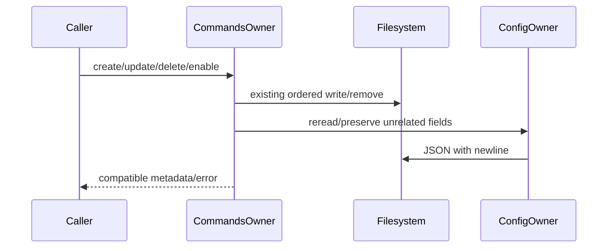

# Complete command owner compatibility specification

Queue baseline `8bc4c6fd697262a61a0e097a7ebad8337e9a389e`.

User-directed source-only batch. Minimum safety check uses fake ports; no commands/processes/user data/network. Coordinator read originals; fresh author sees prose only. No license classification.

# Complete command service and Markdown parser body-free author contract

Implement entire packages/services/src/commands/commandsService.ts and commandFileParser.ts; may create command-owned helpers in this same directory. Each source <=400 nonblank lines, no suppression. No inherited bodies/test/history/diff/frozen original/previous draft reads. Allowed root /workspace/knorvia-studio/AGENTS.md, architecture SKILL, this packet and OWN new code only; declarations below replace source reads. Coordinator source-exposed; bounded fresh-authorship candidate, no blanket license acceptance. No actual commands/processes/filesystem runtime probes/user data/network/product tests/build. No commits. Output ENTIRE owner draft files into /tmp/knorvia-command-runtime-candidates-20261002/commands (DO NOT overwrite repo files). Freeze initial sha256 receipt before notifying coordinator. Conventional expression allowed; no novelty requirement. Do not clone inherited helpers, independently choose a cohesive architecture for the same API/effect order.

Imports permitted retained dependencies: #src/paths.js getKnorviaDataRootDir():string; #src/plugins/installedPluginRoots.js readInstalledPluginRoots(pluginStorageRoot:string):Promise<{defaultEnabled:boolean;marketplace:string;rootPath:string}[]>; node:fs existsSync; node:fs/promises access,lstat,mkdir,readFile,readdir,rm,writeFile; node:os homedir; node:path basename,dirname,isAbsolute,join,relative,resolve,sep. Public @knorvia/shared types/constants below; don't inspect bodies. ./commands.js type ICommandsService below. Shared DEFAULT_ENABLED_OFFICIAL_PLUGIN_IDS:ReadonlySet<string> retained, KNORVIA_COMMAND_AGENT_SOURCE='agent', KNORVIA_COMMAND_AGENT_SOURCES readonly ['agent']. No runtime consumption of UI/RPC/CLI.
Types from shared: CommandAgentSource='agent'; SettingsDirectorySource='knorvia'|'agents' (actual broader retained type); SettingsDirectoryLocation {source:SettingsDirectorySource;scope:'user'|'project';directoryPath:string;projectPath?:string}; CommandConfig {name:string;prompt:string;description?:string;argumentHint?:string;filePath?:string}; storage 'user'|'project'; CommandCreateParams {config;agentSource?;storageLevel?;workspacePath?}; Update same plus commandId:string,oldFilePath?:string; Delete {commandId:string;filePath:string;agentSource?}; SetEnabled {commandId:string;filePath:string;enabled:boolean;agentSource?}.
CommandInfo {name,prompt,content,filePath strings;description?,argumentHint? strings}. UserCommand extends info {id:string;source:'user';agentSource;location;enabled:boolean;scope:'global'|'project';projectPath?:string}. PluginCommand extends info {id:string;source:'plugin';enabled:boolean;pluginName:string;pluginMarketplace:string;pluginEnabled:boolean;scope:'global'}. KnorviaCommand union. CommandsListResult {commands:KnorviaCommand[];userCommands:UserCommand[];pluginCommands:PluginCommand[];capability:{userScopeAvailable:boolean;userScopeReason?:'desktop_only'}}.
Factory createCommandsService(\_options?:{isDesktopRuntime?:boolean}):ICommandsService optionsignored. Service methods list(params:{agentSource?;workspacePath?;workspaceIdentity?}):Promise<CommandsListResult>; writeCommandFile(Create):Promise<{command:UserCommand}>; updateCommandFile(Update):same; deleteCommandFile(Delete):Promise<void>; setCommandEnabled(SetEnabled):Promise<void>; getPrimaryUserCommandsDirectory(params?:{agentSource?}):Promise<{path:string}>. commandId/workspaceIdentity ignored. No new guards, queues, atomic-write policy or security changes.

# Persistent paths/config and storage

Home=process.env.HOME?.trim() || process.env.USERPROFILE?.trim() || homedir(). Only descriptor agent: directorySource knorvia, user/workspace segments ['.knorvia-studio','commands'],extension'.md',format'markdown',namespace '/',supportsArgumentHinttrue. Directory-source priority knorvia then same descriptor with directorySource agents and segments ['.agents','commands']. Lookup agent descriptor with default agent (invalid runtime key remains undefined; do not add validation). Global knorvia directory join(dataRoot,'commands') deliberately ignores home segments; agents global join(home,...segments). Project if storageLevel==='project': falsy workspace throws Error('Missing workspace path for project command'); root join(workspace,descriptor.workspaceSegments),scopeproject,projectPathworkspace. Else global root/scopeglobal. Location source descriptor.directorySource,scope project if project else user,directoryPathroot, projectPath only iftruthy.
Config path join(dataRoot,'cli','config.json'). Read UTF8/JSON any failure ->{}; only non-null object non-array record accepted. Write capture file path FIRST, mkdir(dirname(file),{recursive:true}), writeFile(file,JSON.stringify(config,null,2)+'\n','utf-8'). No mode/rename/locking. Enabled map: config.command record entries entryrecord and entry.enable boolean only. Keys EXACT path, default true. Mutate clones commandrecord (or{}); enabledtruthy deletes path; else replaces entry with {enable:false}; clonedroot retains unrelated fields; omit command key ifempty.
Read plugin config from fresh config record: dirs string-array filtered typeofstring only (no trim); enabled boolean else true; enabledPlugins record boolean entries only; suppressedBuiltins stringarray. Storage if process.env.KNORVIA_PORTABLE_DIR?.trim truthy ->dataRoot; otherwise config.storage record.dir string with trimmedlength>0 ->ORIGINAL raw dir, else dataRoot. Config path resolve '~/' via join(home,suffix); absolute unchanged else resolve(relative) vs cwd. CLIstorage root basename==='cli'?root:join(root,'cli');plugin root join(cliroot,'plugins'). All config parsing snapshots before awaited scans, no reread during a scan.

# Plugin contributions

When plugins disabled return[] before scans. Scan official cache join(pluginroot,'cache','knorvia-plugins-bundled'): readdir STRING names root failure[], eachplugin readdir catchcontinue, eachversion lstat.isDirectory() catchskip; collect fullpaths sort localeCompare. AFTERcache await readInstalledPluginRoots(pluginroot); THEN construct candidates: configured dirs first (resolvedpaths,defaulttrue,marketplaceinline),cache second(defaultfalse,marketplaceknorvia-plugins-bundled),installed last.
Manifest first existsSync of root/.knorvia-plugin/plugin.json,then .claude-plugin/plugin.json,then .codex-plugin/plugin.json. If chosen file unreadable/malformed do not try latermanifest. JSONrecord; name typeofstring trim then /^[a-z0-9][a-z0-9._-]{0,127}$/ else invalid; commands unknown field. Candidate ID `${name}@${marketplace}`. Official suppressedBuiltins match skip BEFORE seen marking. Duplicate ID first wins; mark seen BEFORE enabled check. defaultEnabled=candidate.defaultEnabled||DEFAULT_ENABLED_OFFICIAL_PLUGIN_IDS.has(id); enabled=config.enabledPlugins[id]??defaultEnabled; false skip entirely. commands string ->[it],arraystringonly else[]. Each rawpath absolute rejected; resolved=resolve(root,raw),relative=relative(root,resolved); accept relative==='' OR(!relative.startsWith('..')&&!relative.includes('..'+sep)). Preserve exact limited path authorization, no realpath or extra expansion. If noacceptedroots AND commands===undefined AND existsSync(root/commands) ->defaultroot; explicit invalid/empty commands blocksfallback. Eachroot descriptor {pluginEnabled:enabled,pluginMarketplace:marketplace,pluginName:name,rootPath}.
Discover plugin roots sequentially, recursively readdir STRING names catchreturn; skipstarts'.';lstat eachcatchskip; directories recurse depthfirst; otherentry lower.endsWith('.md') readUTF8/parse within perfiletry/catchskip. Name from relative(root,file),strip/.md$/i,split/[\\/]+/filterBooleanjoin'/',prefix'/'. Seen path key file.replaceAll('\\','/').toLowerCase() acrossALL roots, check AFTER read/parse/name, markbeforepush. Push {...parsed,enabled:descriptor.pluginEnabled && (enabledmap.get(file)??true),filePath:file,id:`plugin:${marketplace}:${pluginName}:${name}:${file}`,name,pluginEnabled,pluginMarketplace,pluginName,scope:'global',source:'plugin'}. No user metadata. Final plugin sort name.localeCompare only. No rootaccess probe forplugin recursion (readdir only).

# User discovery/list ordering

list snapshots enabled overrides FIRST. sources params.agentSource truthy?[it]:KNORVIA_COMMAND_AGENT_SOURCES. Per source use two directory descriptors if sourceagent else single lookup. If workspace truthy capture localworkspace then scan ALL project sources BEFORE all global sources. Directory root: beforecount, access(root) catchANYreturn0; then recursive scan try/catchANYretainalreadydiscovered; countdifference. Each descriptor sequential; if directorySource knorvia AND discoveredCount>0 break same-scopefallback (strongpriority even names differ), else agents fallback. Recursive behavior readdir STRING names catchreturn, encounterorder skiphidden,lstat catchskip, directoryawaitrecurse, .md lowerreadUTF8 parse wholeconversiontrycatchskip. lstat symlink notdirectory but ifname.md readtarget; no depthlimit. Push {...parsed,namefullrelative,agentSource,location,id:`${agentSource}:${location.source}:${scope}:${name}`,source:'user',enabled:overrides.get(file)??true,scope,...truthyprojectPath}. Parsed optional keys description/argumentHint present evenundefined. Dedupe user EXACT name firstwins retaining encounterorder, projectbeforeglobal. Do notsortuser. Plugins scanned AFTER user dedupe with SAME enabledsnapshot, but FRESH plugin config read; only !params.agentSource||agent matches scanelse[]. Return commands newconcat [dedupedusers,...plugins], userCommands SAME dedupedarray,pluginCommands SAME pluginarray,capability userScopeAvailabletrue.

# Write/update/delete lifecycle (preserve failures/partial effects)

Filename config.name.replace(/^\//,'') removes firstleading slash only, append'.md'. No traversal/containment/new sanitizer. descriptoralwaysnamespace'/'; compatibility for descriptor ':' would replaceall':'with'/' (notneedednew publicpolicy). Name/ID/location as above.
Create: source??agent, target; await mkdir(ROOT,{recursive:true}) (notnestedfilenameparent); joinfile. Try awaitaccess(file),then throw Error(`Command file already exists: ${filename}`); catch only error.code==='ENOENT' allowscreate otherwise rethrow SAMEerror. Generate parser withconfig andformat, awaitwriteFile UTF8. Then rereadconfig,setoverride(file,true),writeconfig. THEN parsewrittencontent, ifnull Error('Failed to parse written command file'). Return fulluser withenabledtrue. No rollback ifconfig fails afterfilewrite.
Update: target/newfile first, await enabledmap snapshot, existingcontent if oldFilePathtruthy readFile UTF8.catch(()=>undefined). If oldtruthy&&old!==new, awaitrm(old) ignoreALLerrors BEFORE collisioncheck. If new!==old then same access/existingerror/ENOENTonly logic. Generate config preserving existingcontent, mkdir(dirname(new),recursive), writeUTF8. If oldtruthy&&different&&INITIALoverrides.has(old): rereadconfig,setoldtruethennew(initialoldvalue??true),writeconfig. THEN parsewrittencontent/nullerror; enabled return uses FRESH awaited enabledmap near constructing finaluser (afterother metadata);scope/location etc same. Same old==new skipscollision andmigration. No atomicrename or rollback; old removal before failing newcollision is intentional compatibility.
Delete: awaitrm(file) nooptions;catch ENOENTswallowelse rethrow SAMEerror. Then rereadconfig,setpathtrue,writeconfig. SetEnabled rereadconfig/setoverride/writeconfig, no queue. Primarydir getglobalroot(params?.agentSource),mkdirrecursive,return{path}.

# Complete Markdown parser

Export type CommandFileFormat='markdown'; class CommandFileParser staticparseCommandFile(content:string,filePath:string,_format:CommandFileFormat='markdown'):{name,prompt,content,filePath strings;description?:string;argumentHint?:string}|null; staticgenerateCommandFileContent(config:CommandConfig,\_format='markdown',existingContent?:string):string. Formatignored.
Basename path.split(/[\\/]+/).pop()??''. Split content '\n'; opening FIRST line.trim()==='---' anywhere (unanchored),closingFIRST laterline.trim()==='---'. Either missing ->frontmatter[],alloriginalcontentlines. Bothpresent ->betweenfrontmatter,bodyAFTERclosing discardsbeforeopening. No CR normalization. Key read: startsASCIIspace/TAB ->undefined;else /^([A-Za-z0-9_-]+)\s\*:/ on line.trim(),lowercasecapture. Multiline value find targetkey then ownline remainder AFTER firstcolon trim,iftruthypush; whilecollecting any nextrecognizedkey endscollection; indented non-keylines trim+push; join' '.trim truthy||undefined. Plain unindented non-keylines ignored. Firsttarget occurrence only. parse name '/'+basename.replace(/\.md$/i,''); prompt bodyjoin'\n'.trim;contentbodyjoin WITHOUTtrim;alwaysreturn keysdescription/argumentHint evenundefined. staticparse catchANYnull.
Generate preserve oldfrontmatter allunknown lines with state skip=false: recognizedkey sets skip=(key in {'description','argument-hint'}),pushlineonlyif!skip; blank/comments followpriorblockskipstate. Then append description ifconfig.description?.trimtruthy `description: ${trim}`,arg similarly `argument-hint: ${trim}` inthatorder. NoescapeYAML. Ifnofrontmatterlines returnconfig.prompt EXACT;else '---\n'+lines.join('\n')+'\n---\n\n'+prompt (noextraendnewline). Preserve unknownmetadata/indentation/order, remove replacedblockcontinuations.

Final clarified invariants: plugin root key config.plugins; suppression exact official plugin ID; raw storage path expands only after plugins enabled. Relative HOME is resolved after expansion. Sources captured before enabled-map await; source-before-scope discovery order. Each user location has separate identity. First-ready limitations and correction hashes recorded in evidence.
