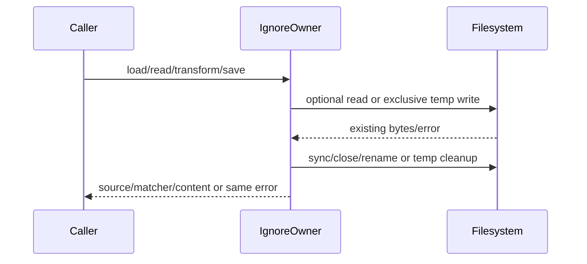

# Complete persistent ignore owner specification

Baseline `628e207a0bcc093d0aeaf6d15d5a6592df83fbe1`. Existing literal output corpus is retained compatibility data, not new authorship. Complete new persistence/transformation/loading owner from body-free behavior contract; coordinator source-exposed. No license grant.

Ordinary suites/builds deferred; positive/negative minimum fake-port checks. Actual ignore dependency unavailable: original scoped types fail TS2307, exact diagnostics frozen. Synthetic matcher port is only test IO boundary, not claimed real matcher validation.

# Complete persistent workspace ignore owner body-free contract

Fresh-author entire packages/services/src/file/workspaceFileIgnore.ts, may add cohesive ignore-owned helpers under same file/ directory if needed. DraftONLY /tmp/knorvia-file-storage-candidates-20261002/ignore. <=400 nonblank eachsource,no suppressions. Allowed packet, ignore-data.json (exact retained compatibility/output literal data ONLY), /workspace/knorvia-studio/AGENTS.md, architecture SKILL, ownnewcode. Do not read inherited target/dependency bodies/tests/history/diffs/original snapshots/previousdrafts. No actual fs/network/tests/build/probes/userdata/credentials/commit. Freeze first-ready files/hashes/access receipt. Coordinator source-exposed; literal data retains prior expression lineage, no wholefile/MIT/licenseclaim. Complete owner authoring not extraction; conventional expression allowed.
Imports nodefs/promises open,readFile,rename,rm; nodepath basename,dirname,resolve; ignore defaultfactory and type Ignore (retained THIRD-PARTY library, never handwrite gitignoreparser). Existing nodenext types require factory cast ignoreFactory as unknown as ()=>Ignore. Type ServiceLogger from ../logger/serviceLogger.js; private logger Pick<ServiceLogger,'info'|'warn'> callbacks(traceId|undefined,...unknown[])=>void. Fixed JSON values in packet data are existing external output/compatibility literals, preserve exact values and sequence. No parse/algorithm implementations in data.
Export const WORKSPACE_FILE_SEARCH_IGNORE_FILE_NAME='.knorviaignore'; sole public funcs:
loadWorkspaceFileSearchIgnoreRules(rootPath:string,logger?:Logger):Promise<{matcher:Ignore;source:'file'|'created-from-gitignore'|'created-from-template'|'fallback-gitignore'|'fallback-builtin'}>;
isWorkspaceFileSearchPathIgnored(rules:above,relativePath:string,type:'file'|'directory'):boolean;
readWorkspaceFileSearchIgnore(rootPath:string):Promise<{content:string;source:'file'|'template'}>;
transformWorkspaceFileSearchIgnore(rootPath:string,transform:'sync-gitignore'|'reset-defaults'):Promise<{content:string}>;
writeWorkspaceFileSearchIgnore(rootPath:string,content:string):Promise<void>.
No additional runtime exports, publicports, locks, configpaths/security policies/real user files. Gitignore filename '.gitignore'. Matcher factory().add(content). Never create own matcher. isIgnored directory passes `${relativePath}/` unconditionally (even trailing slash already), file passesexactpath; no normalization, catch or validation.
Optional-read awaitreadFile(path,'utf8'); catch only error?.code==='ENOENT' ->null; ANYother throw sameerror. Allpaths resolve(root,filename). Atomic save: dir=dirnamepath,temp=resolve(dir,`.${basename(path)}.${process.pid}.${Date.now()}.${Math.random().toString(16).slice(2)}.tmp`); let handleundefined; tryhandle=awaitopen(temp,'wx',0o644);await handle.writeFile(content,'utf8');awaitsync();awaitclose();handle=undefined;awaitrename(temp,path). catch awaithandle?.close().catchignore;awaitrm(temp,{force:true}).catchignore;throwORIGINALerror. No mkdir/retry/direct target write/fallback on save. If close fails trycloseagain but don'toverrideoriginalerror.

# Exact text transformation (all fixed strings in ignore-data.json)

Builtin defaults: ifgitignoreContent===null returnbuiltinlines.joinLF. Else split /\r?\n/,trim each,skipempty orstarts'#' or'!';record exacttrim andsame.trim.removeONEtrailing'/' using /\/$/. Filter builtin line ifneither exactline norone-trailing-slashremoved is declared; preserve builtin order;joinLF. Anchored/case variants notequated, negationsignored fordedupe.
Gitignore section: nonnull&&trimlength>0 -> ORIGINAL content ifendsLF elsecontent+'\n'; otherwise TEMPLATE_HEADER.joinLF+'\n'. Initialtemplate joins [gitignoresection,SYNC_MARKER,builtinDefaults(gitignoreContent),DEFAULTS_MARKER,CUSTOM_SECTION_HINT,''] withLF. Preserve blankline effects whenfirstsectionalreadyendsLF. Existingcontentnull/empty different source labels.
Split sections: split /\r?\n/;FIRST indices line.trim===eachmarker;missing ordefaultsIndex<=syncIndex ->null. gitignoreSection linesbefore sync joinLF WITHOUTtrim;defaultsSection betweenmarkers.joinLF.trim();customSection afterdefaultmarker.joinLF.replace(/^\n+/,'') onlyleadingLF,retainotherwhitespace.
Sync transform validsections ->join [newGitignoreSection,SYNC_MARKER,OLDdefaultsSection,DEFAULTS_MARKER,OLDcustomSection]LF then.replace(/\n+$/,'\n') (does notappend ifnoendingLF). Invalidsections initialtemplate(gitignoreContent). Reset validsections ->join [OLDgitignoreSection,SYNC_MARKER,builtinDefaults(OLDgitignoreSection),DEFAULTS_MARKER,OLDcustomSection]LF thenreplace trailingLFsame. Missingsections ->initialtemplate(currentgitignore). No save bytransform; only write function saves.

# Load/fallback lifecycle order and failure identity

load computesignorepath. Readoptional existing inside try; onANYreadexception degrade(reason`读取 .knorviaignore 失败`,error): reread root.gitignore optional.catch(()=>null); ifnonnull logger?.warn(undefined,`[workspace-file-ignore] ${reason}，降级为运行时使用 .gitignore 规则`,error),returnmatcher(content),sourcefallback-gitignore;elsenotice`[workspace-file-ignore] ${reason}，降级为内置默认忽略规则`,error,returnmatcher(initialtemplate(null)),sourcefallback-builtin. Exactlyonewarn ondegrade, matcher/loggererrors notswallowed.
Existingnonnull ->matcher(existing),sourcefile OUTSIDEreadtry;emptycontentvalid. Else readgitignore optional.catchnull;initialtemplate;tryatomicwrite(ignorepath,initial). Ifwritefails loggerwarn(undefined,`[workspace-file-ignore] 自动创建 .knorviaignore 失败，降级为运行时使用${gitignoreContent!==null?'.gitignore':'内置默认'}规则`,error);returnmatcher(INITIAL TEMPLATE, notrawgitignore),source fallback-gitignore iffnonnull elsebuiltin. Success loggerinfo(undefined,`[workspace-file-ignore] 已自动创建 .knorviaignore（来源：${gitignoreContent!==null?'.gitignore 拷贝':'默认模板'}）`);returnmatcher(initial),sourcecreated-from-gitignore iffnonnull elsecreated-from-template. No cache/retry/rereadpostsuccess. Buildmatcher occurs afterwrite/log;failuredoesn'trollbacksave.
read computesignorepath,optionalexisting WITHOUTcatch,nonnullreturnexactcontent/sourcefile;elsegitoptional.catchnull,returninitial/source template NO save.
transform optionalexisting.catchnull,THENgitoptional.catchnull EVEN reset withexistingvalid;current=existing??initial(git); choose sync ifexacttransform==='sync-gitignore',else reset. Returncontent withoutwrite. write computesignorepath andatomicwrite(content) exactbytes(noaddednewline/validation).
