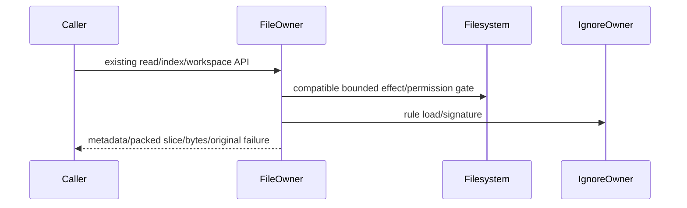

# Complete file service owner specification

Baseline `628e207a0bcc093d0aeaf6d15d5a6592df83fbe1`. Coordinator source-exposed; public declarations mechanically retained, implementation authored from body-free prose. No license grant or schema/data migration.

User source-only queue; fake positive/negative safety checks only. Original scoped types blocked by missing ignore dependency (TS2307), exact diagnostics retained. Ordinary suites/builds deferred.

# Complete file-service owner body-free contract

Fresh-author ENTIRE packages/services/src/file/fileService.ts, may add cohesive file-owned helpers under same directory. DraftONLY /tmp/knorvia-file-storage-candidates-20261002/file. Each source <=400 nonblank, no suppressions. Allowed packet,file-api.ts (AST-selected declaration-only interfaces verified zero implementation bodies), /workspace/knorvia-studio/AGENTS.md, architecture SKILL, ownnewcode. No inherited target/dependency/shared/search/filter/ignore/logger bodies/tests/history/diffs/original snapshots/prior drafts. No product execution/tests/build/actualfilesystem/network/probes/userfiles/database/credentials/commit. Freeze raw initial files/hashes/access receipt before ready. Complete behavior owner; coordinator source-exposed, retained public declarations/policy/error vocabulary outside original-expression claim, no globallicensegrant/novelty requirement.
Public createFileService(options:CreateFileServiceOptions={}):IFileService. Exportinterface CreateFileServiceOptions {workspaceFileSearchFilter?:WorkspaceFileSearchFilter}; ALL methods in file-api.ts unchanged. Imports retained nodefs type Dirent; fs/promises mkdir,open,readFile,readdir,realpath,stat; nodepath extname,join,relative,sep. Type APIs FileEntry {name,path,type:'file'|'directory',isSymbolicLink?:boolean},FileStat{path,type,size?:number,mtimeMs?:number},WorkspaceFileEntry {name,path,relativePath,type},FileTextSlice {path,content,offset,bytesRead,totalBytes,truncated,isBinary},FileMediaPreview {path,mediaType,dataBase64,totalBytes},FileBinaryPreview{path,dataBase64,totalBytes} from @knorvia/shared. getMediaPreviewFormat(path):{mediaType:string,kind:unknown}|null from shared; packWorkspaceFileEntries(entries:WorkspaceFileEntry[]):string from @knorvia/shared/workspaceFileEntriesCodec; WORKSPACE_FILE_SEARCH_DISPLAY_CAP from @knorvia/shared/workspaceFileSearch (retainedconstant, don't duplicate value).
Retained #? ORIGINAL relative imports: ../logger/serviceLogger.js createServiceLogger(scope:string)->ServiceLogger; ../paths.js getConversationWorkspaceDir():string,getKnorviaDataRootDir():string; ./file.js IFileService,WorkspaceFileSearchParams types; ./workspaceFileMentionFilter.js defaultWorkspaceFileSearchFilter,WorkspaceFileSearchFilter type; ./workspaceFileSearch.js buildHostFileSearchCandidates(packed:string,root:string):Promise<WorkspaceFileSearchCandidate[]> and searchHostFileCandidates(candidates,query:string,limit:number):Promise<WorkspaceFileEntry[]>; keep APIs, don'treadbodies. Filter interface evaluate(entry:{name,path,relativePath,type},context?:{ignoreRulesActive:boolean})->{include:boolean,traverse:boolean}. ./workspaceFileIgnore.js WORKSPACE_FILE_SEARCH_IGNORE_FILE_NAME '.knorviaignore'; loadWorkspaceFileSearchIgnoreRules(root,logger?):Promise<Rules>; isWorkspaceFileSearchPathIgnored(rules,relativePath,type):boolean; readWorkspaceFileSearchIgnore(root):Promise<{content,source:'file'|'template'}>; transformWorkspaceFileSearchIgnore(root,transform:'sync-gitignore'|'reset-defaults'):Promise<{content}>;writeWorkspaceFileSearchIgnore(root,content):Promise<void>. Rule opaque passed only; shared/logger/paths/filter/search/ignore implementation retained or independently authored otherowner, nevercopy them.

# Pure read/input/path policies

Four clamps: numberIsFinite(length)?Math.trunc(length??default):default, then Math.min(Math.max(safe,1),maximum). Text default131072/max262144; media4194304/max8388608; binaryrange262144/max1048576; binarypreview26214400/max26214400. Do not tighten NaN/Infinity/negativeoffset beyond described behavior. MIMEinfer extname(path).toLowerCase dictionary .apng image/apng,.avif image/avif,.bmp image/bmp,.gif image/gif,.ico image/x-icon,.jpeg and.jpg image/jpeg,.png image/png,.svg image/svg+xml,.webp image/webp;elsegetMediaPreviewFormat(path)?.mediaType??'application/octet-stream'. Binary detection bufferemptyfalse;ANY0byte true; suspiciouscount values1..8 OR14..31 OR127, whitespace9/10/12/13 excluded;ratioSTRICT>0.3 true.
Scratchname trim,empty Error('Workspace name is required.'),/[\\/]/match Error('Workspace name cannot contain path separators.'),elsetrimname; no new '..'/containment restriction. Workspace relative path hostrelative(root,target).split(sep).join('/'). Skippable directory list error code EACCES/EPERM/ENOENT only using error?.code;anyotherpropagates.
Entrytype classify isDirectorytrue =>directory;!isSymbolicLink=>file;elsetrystat(entryPath),isDirectory?directory:file;ANYerror=>file. Do notrealpathfollow/recurse symlink dirs. Plain publicstat considers stats.isDirectory only; othernondirs typefile.

# Instance ownership/existence caching

Factory captures filter options.workspaceFileSearchFilter??default; createServiceLogger('workspace-file-ignore'); allcache/maps instance-local: existence Map<string,{exists:boolean,expiresAt:number}>,pendingExistence Map<string,Promise<boolean>>,workspaceindex Map<string,Index>,inFlightIndex Map<string,{signature,promise}>. No moduleglobalcache/newdisposeAPI.
Existence get(key): lookup;noneundefined;ifexpiresAt<=Date.now delete+undefined;else delete/reinsert SAMEentry forLRU returnexists. Set: now=Date.now;walk all existing removeexpiresAt<=now;deletekey,set{exists,expiresAt:now+60000};while size>100 delete first key. check: cacheget first includingfalse,thenpendingreuse;ifnew check=stat(path).then(stats=>stats.isFile()).catch(()=>false).then(exists=>{cacheSet;returnexists}).finally(()=>pending.delete(path));pending.set beforeawait;returnthatpromise from asyncwrapper. Bothpositive/negative cached. Existing pending rejection only if unexpected downstream failure, no catchfinallypolicychange.
Public checkFilesExist: ifparams.paths.length>15 throw Error('File existence check supports at most 15 paths.');elsePromise.all(paths.map(asyncpath=>({path,exists:awaitcheck(path)}))) preservesinputorder+dupes. No pathnormalization/hiddenfilter.

# Whole workspace index/search/cache lifecycle

Index{at:number,signature:string,packed:string,candidates?:ReturnType<typeof buildHostFileSearchCandidates>}. ensureIndex(rootPath,workspaceIdentity?,refresh=false):key=workspaceIdentity?.trim()||rootPath; awaitloadIgnore(root,logger) EVERYcall BEFOREcachechecks; signature=`${rootPath}\n${awaitfingerprint(root)}`. Fingerprint trystat(join(root,'.knorviaignore'))=>`${mtimeMs}:${size}` catchANY=>'none'. For eachcachedentry, if Date.now()-entry.at>=60000 delete (observeclockperentry). If!refresh&&inFlight[key]?.signature===signature returninFlight.promise BEFOREcachehit. Then!refresh&&cachedsame ->delete/reinsertSAMEindex,return. Different signature/refresh starts newscan even pending.
Scanasync closure entries[],pendingDirs=[root]; invoke EXACT8 workers in Promise.all; eachwhiletrue path=pendingDirs.pop,if!pathreturn;tryawaitreaddir(path,{withFileTypes:true}),catchskippablecontinue otherwise throw. For eachchild encounterorder entryPathjoin,relativenormalized;ifrelative==='.knorviaignore' skipBEFOREtype/stat/filter. type=awaitclassify(entryPath,entry.isDirectory(),entry.isSymbolicLink()). IfisIgnored(rules,relative,type) continue BEFOREfilter. decision=filter.evaluate({name:entry.name,path:entryPath,relativePath,type},{ignoreRulesActive:true}). Ifdecision.include push same entry fields. If type==='directory'&&!entry.isSymbolicLink()&&decision.traverse pushpath. Preserve original queue worker lifetime; do not add dynamic pump/parallel fairness or cancellation. Allworkersfinish then sort directoryfirst(othercompare relative.localeCompare),packed=pack(sorted);returnindex{at:Date.now(),signature,packed}. No root-lstat/depthlimit extrasecurityfilter.
SetinFlight[key]={signature,promise:scanning};awaitscanning. OnlyifinFlight[key]?.promise===scanning cachedelete/reinsertnewindex and whilecache.size>4 dropfirstkey (ifundefinedbreak). Stale scan returnsitsownindex to itscaller butneveroverwritesnewcache. Finally delete inFlightkeyONLYif samepromise. Failure doesn'tcache, oldcache remains unlessTTLpurged. No cache serialization.
Search requestedLimit=params.limit??sharedcap; if!Number.isFinite(requestedLimit)||typeofparams.query!=='string' Error('Invalid workspace file search query or limit'); limit=Math.min(cap,Math.max(0,Math.trunc(requestedLimit)));zero=>[] BEFOREanyIO. awaitensureIndex(params.rootPath,params.workspaceIdentity,params.refresh). index.candidates??=buildHost...(index.packed,params.rootPath) (assign promise synchronously, cachedrejectedpromise retained);returnsearchHost(awaitindex.candidates,params.query,limit), liveparamsquery/rootobserved afterawait as written. Length ensureIndex(params.rootPath) with noidentitythenpacked.length. Range awaitensureIndex(params.rootPath),offset=Math.max(0,Math.trunc(params.offset));ifoffset>=packed.length '';elselength=Math.max(0,Math.trunc(params.length)),packed.slice(offset,Math.min(packed.length,offset+length)). NaN native slice semantics retained.

# Public directory/path/workspace operations

readdir awaitnode readdir(params.path,{withFileTypes:true});filter includeHidden===true OR !entry.name.startsWith('.');mapall Promise.all to {name,path:join(params.path,name),type:awaitclassify(...),isSymbolicLink:entry.isSymbolicLink()};sortdirectoryfirstthename.localeCompare. Publicstat awaitstat(params.path),isDir=stats.isDirectory();return {path:params.path,type:isDir?'directory':'file',...(isDir?{}:{size:stats.size,mtimeMs:stats.mtimeMs})}. resolvePath returnrealpath(params.path) noextraresolve/trim.
Defaultworkspace pathjoin(dataRoot,'workspace','projects');awaitmkdir recursive;awaitstat;!isDirectory Error(`Workspace path is not a directory: ${workspacePath}`);return{path}. Scratchsame rootplusvalidatedname BEFOREmkdir;no initgit/templates. Conversationworkspace getConversationWorkspaceDir();createdfalse;trycreated=(awaitmkdir(path,recursive))!==undefined;catcherror:stats=awaitstat(path).catch(()=>null);if!stats throwsameoriginalerror;if!isDirectory newError(samepathmessage,{cause:error});thenAFTERcatch/success awaitstatAGAIN,!isDirectory newError(samepathmessageWITHOUTcause);return{path,created,workspacePurpose:'conversation'}. Keep created bool and double-stat/recoveryorder.

# File byte/media reads and close/error identity

Text awaitstat(params.path);!stats.isFile Error(`Path is not a file: ${params.path}`); offset=Math.max(0,Math.trunc(params.offset??0));ifoffset>=size return{path,content:'',offset,bytesRead:0,totalBytes:size,truncated:false,isBinary:false} withoutopen. Elselength=Math.min(clampText(params.length),size-offset);awaitopen(params.path,'r');tryBuffer.allocUnsafe(length),await handle.read(buffer,0,length,offset),chunk.subarray(0,bytesRead),binaryflag;return{path:params.path,content:binary?'':chunk.toString('utf-8'),offset,bytesRead,totalBytes:size,truncated:offset+bytesRead<size,isBinary:binary};finallyawaitclose() (closeerroroverridesearlierresult/error, preserve).
Range same stat/filegate;offset=Math.max(0,Math.trunc(params.offset)) with NO??default;offset>=size=>newUint8Array(0);clampbinarylength/min;openr;tryallocUnsafe/read;returnnewUint8Array(buffer.subarray(0,bytesRead)) INDEPENDENTcopy (must notexpose unsafe pool/unreadbytes);finallyawaitclose.
Media/binary preview: awaitstat firstfilegate;max=clampcorresponding;size>max Error(`File is too large to preview: ${params.path}`) BEFOREread;readFile(params.path) fullbuffer noencoding. Mediareturn{path:params.path,mediaType:inferpath(params.path),dataBase64:content.toString('base64'),totalBytes:stats.size}; binaryreturn same WITHOUTmediaType. No actual postreadsize/growthrecheck, compression/decode/upload/network. Preserve statsizeeven readbuffersizediff.
Ignore public methods forward currentparams root/content/transform toretainedAPI; noindexinvalidation added (signature nextcall authoritative). Returnwrite awaited existingfunction resultvoid. No product authority/permissions added or bypassed; exactpath/validation gates retained. Source-owned fresh functions must preserve effectorder/references; declarations/codecs/search/filter/logger/shared remain retained.
