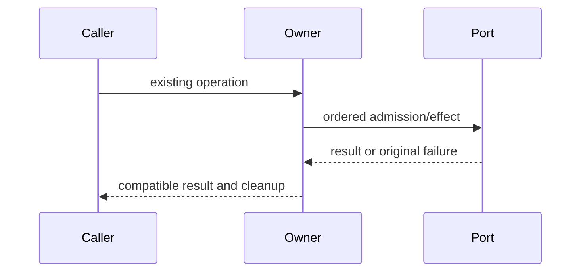

# Complete owner compatibility specification

Queue baseline `628e207a0bcc093d0aeaf6d15d5a6592df83fbe1`. Coordinator inspected originals; fresh author receives prose/API only. No licensing grant or new user data behavior.

Ordinary suites/builds deferred. Minimum positive/negative checks run against fake ports only; no actual user files/database/process/network. Frozen originals/raw initial candidate precede review.

# Complete atomic text/JSON write owner body-free contract

Author entire packages/services/src/fs/atomicFileUtils.ts fresh, <=400 nonblank per source, no suppression. Draft ONLY /tmp/knorvia-file-storage-candidates-20261002/atomic; no repo overwrite. Read only this packet, /workspace/knorvia-studio/AGENTS.md and .agents/skills/architecture-governance/SKILL.md, own draft. No inherited target/dependencies/tests/history/diffs/original snapshots/previous drafts. No product execution/tests/build/probes/network/user files/credentials. No commit. Freeze initial candidate bytes/hash and access receipt before ready. Coordinator source-exposed for extraction/review; bounded candidate no globallicense/MIT claim. Conventional expression allowed, no novelty requirement.
Retain deps node:fs/promises mkdir,writeFile,rename,rm,readdir,stat; node:path dirname,basename,join; node:timers/promises setTimeout alias sleep; @knorvia/shared/node acquireFileLock(filePath:string,retryDelays:readonly number[],ownerlessGraceMs:number,maxWaitMs:number):Promise<()=>Promise<void>>; ./fsFaultInjection.js isInjectedFsFaultError(error:unknown):boolean,maybeThrowInjectedFsFault({operation,path}):void (error propagated). No additional locks, containment/security policies, fallbacks, modes or directory writes.
Public atomicWriteText(filePath:string,content:string,options?:AtomicWriteTextOptions):Promise<void>; atomicWriteJson(filePath:string,data:Record<string,unknown>,options?):Promise<void>. PRIVATE interface AtomicWriteTextOptions optional renameRetryDelaysMs/lockRetryDelaysMs readonlynumber[],lockOwnerlessGraceMs/lockMaxWaitMs/tempFileStaleMs numbers,useFileLock boolean,beforeRename ()=>void|Promise<void>,runRename (renameFile:()=>Promise<void>)=>Promise<void>. JSON native stringify(data,null,2) before invoking text, no endnewline, native serialization error identity preserved.
Defaults rename delays [50,100,200,400,800,1600,3200],lock [25,50,100,200,400],grace100,maxwait8000,tempstale60000. Text: dir=dirname(file), temp=join(dir,`${basename(file)}.${process.pid}.${Date.now()}.${Math.random().toString(36).slice(2)}.tmp`) BEFORE mkdir fault/check. maybeThrow mkdir(dir), awaitmkdir recursive. Then useFileLock===false?null:await acquireFileLock(file,options?.lockRetryDelaysMs??defaults,grace??100,maxwait??8000). Lock acquisition is OUTSIDE write try/finally (no temp cleanup/release if it fails).
Inside try cleanup stale temps BEFORE write; cleanup captures dir,basename,prefix `${basename}.`,Date.now() once. tryreaddir STRING names; awaitPromise.all entriesmap: starts prefix AND ends'.tmp' only; join dir,skip exact own temp; trystat, if now-mtimeMs <staleMs skip;otherwise rm(force:true); catchall perentryignore; catchall outerignore. No type/file/symlink checks, no policy extension.
maybeThrow writeFile(temp); awaitwriteFile(temp,content,'utf-8'); awaitoptions?.beforeRename?.(). Then renameFile closure calls renameWithRetry(temp,target,options?.renameRetryDelaysMs) observing options at callback construction/time; if options?.runRename truthy awaitoptions.runRename(renameFile),elseawaitrenameFile. Retain wrapper permission to invoke zero/multiple times, no new enforcement.
Rename loop attempt0: try maybeThrow rename(target), awaitrename(temp,target),return. catch: delay=delays[attempt]; if delay===undefined OR error classified injected ->rethrow SAMEerror; otherwise error object nonnull with propertycode string must be EPERM/EBUSY/EACCES (any other/no/stringcode false), rethrow else awaitsleep(delay),incrementattemptretry. Error classifier isInjectedFsFaultError called before code checks. Do not retry injected fault even retryablecode.
Writecatch awaitrm(temp,{force:true}).catch(ignore),throw original error; finally await releaseLock?.() (release rejection overrides success/earlier failure as baseline). No temp rm on success; rename owns replacement. Stale cleanup best effort, beforeRename failure retains target and cleans temp. No direct target write/rollback added.
