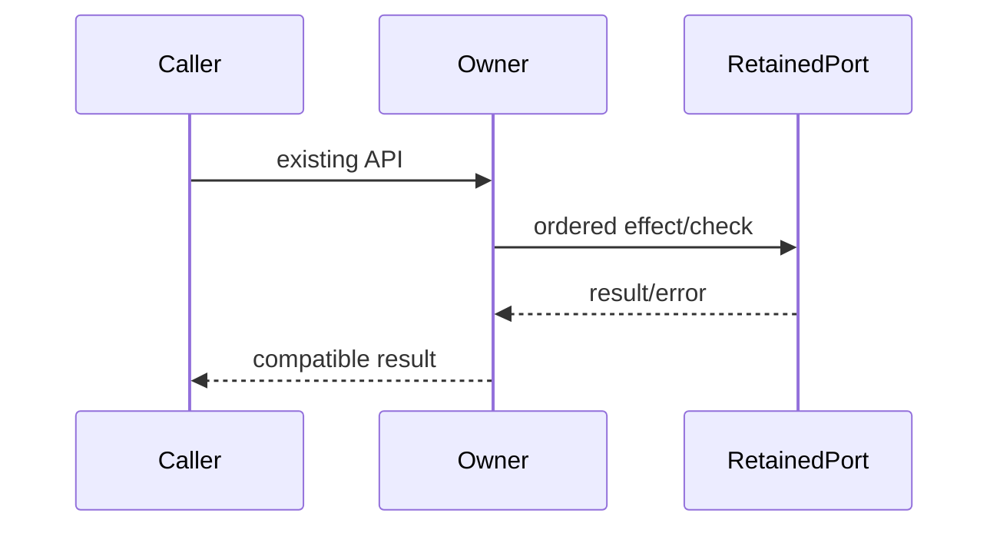

# Complete owner compatibility specification

Queue baseline: `8bc4c6fd697262a61a0e097a7ebad8337e9a389e`. Coordinator source-exposed; no directory/license grant. Existing APIs, dependencies, data and authorization boundaries retained.

Ordinary tests/builds skipped by user direction. Minimum safety probes use synthetic ports only. Frozen original/raw candidate hashes precede review; no actual commands/process signals/user data/network/device operations.

# Body-free process ownership author contract

Replace packages/services/src/process/processTreeOwnership.ts in full. Do not read the original target, its snapshots/async snapshot implementations, inherited tests, history/diffs, frozen originals or previous drafts. You may read root AGENTS.md, architecture SKILL, this packet, unchanged type-only processTreeTypes.ts, and your own new code. Coordinator already inspected inherited bodies; this is a bounded fresh-author candidate, not blanket license acceptance. Do not run product code/tests/build/network/process commands. Write through apply_patch delete/add or shell overwrite WITHOUT reading target. Keep every changed owner <=400 nonblank lines, no suppressions. Do not commit/push. Return exact files and access receipt. Freeze your initial candidate files with sha256 to /tmp/knorvia-command-runtime-candidates-20261002/process before telling coordinator ready. Spec is already written by coordinator; implement from this prose contract, conventional expression allowed.

Retain imports type ChildProcess from node:child_process, types ProcessIdentity, ProcessTreeOwnershipResolution, ProcessTreeTerminatorOptions from #src/process/processTreeTypes.js; synchronous captureProcessTreeSnapshot and filterCurrentProcessIdentities from #src/process/processTreeSnapshot.js; async equivalents with Async suffix from #src/process/processTreeSnapshotAsync.js. Capture takes child/options, returns snapshot|null (async Promise); filter takes readonly identities/options, returns identities array (async Promise). Dependency bodies stay retained, never copy them.

API resolveCurrentOwnedIdentities(child:ChildProcess,knownIdentities:readonly ProcessIdentity[],options:ProcessTreeTerminatorOptions,allowRootDiscovery=true):ProcessTreeOwnershipResolution; async same args returns Promise. Exited means exitCode!==null OR signalCode!==null. Identity equality uses pid,startTime,processGroupId strict equality; parentPid irrelevant. Merge arrays by pid retaining first insertion order and final value per pid. Return plain result with childStillOwned,currentIdentities,knownIdentities.
Sync event order: rootPid=child.pid (non-null assertion only), knownRoot=first known pid root. Exited -> false, filter all known, copy known. If knownRoot, filter singleton first: if length!==1 -> false, filter all known, copy known. No knownRoot and discovery disabled -> false and two empty arrays without calling snapshot/filter. Capture live snapshot only if child not exited at capture time, copy snapshot identities else empty. No knownRoot+no fresh root -> false/two empties. Known+fresh root identity disagreement -> false/filter all known/copy known. Otherwise merge known and (fresh root exists ? all fresh : none), filter merged, childStillOwned iff filtered includes root; known result merged. No extra signal/write/launch behavior.
Async: non-Windows delegates directly sync. Windows exited -> use process.kill(pid,0) for each known in .some order, any throw means false. If none alive, false/empty current/copy known without async filter; otherwise false/await filter all known/copy known AFTER await. Windows nonexited knownRoot -> await filter ALL known, owned iff filtered root exists, then known copy AFTER await. No root + discovery disabled -> false/two empties. Otherwise await async capture, copy identities, if fresh root exists owned true and BOTH current/known reference that same copied array; else false/two empty arrays. No final exit revalidation on this async discovery branch. Preserve filtering ownership authorization in retained ports; no new root claims.
