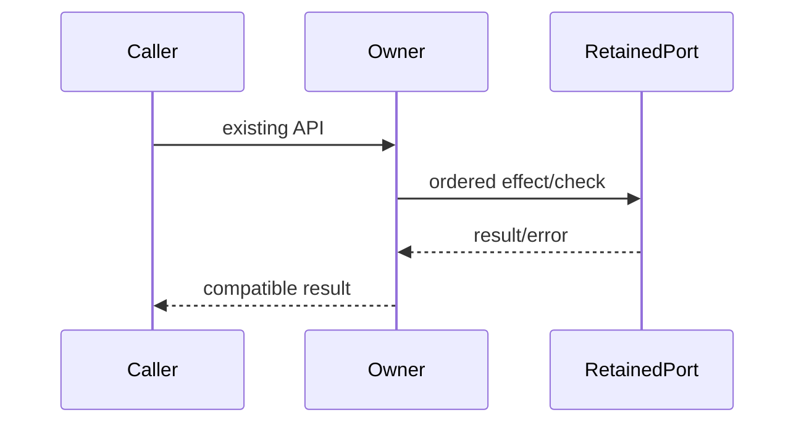

# Complete owner compatibility specification

Queue baseline: `8bc4c6fd697262a61a0e097a7ebad8337e9a389e`. Coordinator source-exposed; no directory/license grant. Existing APIs, dependencies, data and authorization boundaries retained.

Ordinary tests/builds skipped by user direction. Minimum safety probes use synthetic ports only. Frozen original/raw candidate hashes precede review; no actual commands/process signals/user data/network/device operations.

# Body-free login shell capture lifecycle contract

Replace packages/services/src/runtime-tools/runtimeLoginShellEnvCapture.ts in full. Do NOT read inherited target/dependency bodies, history/diffs/tests/frozen originals/drafts. Read only root AGENTS, architecture SKILL, this packet, own new code; resolver dependency API prependPathEntries(current:string|undefined,entries:readonly string[]):string. Coordinator source-exposed bounded candidate, no license claim. <=400 nonblank lines, no suppressions. No actual process/command/probes/network/product tests/build. No commit. Freeze initial candidate+sha256 /tmp/knorvia-command-runtime-candidates-20261002/login before ready; return access receipt.
Imports node:child*process execFileSync,spawn,typeChildProcess; node:fs accessSync,constants; prependPathEntries from './runtimeToolResolver.js'. Export buildShellBootstrapPath(currentPath:string|undefined):string; captureLoginShellEnvSnapshot(options:{baseEnv?:NodeJS.ProcessEnv;platform?:NodeJS.Platform;shellPath?:string|null;executeShell?:LoginShellExecutor;timeoutMs?:number}={}):Promise<Record<string,string>|null>; captureLoginShellEnvSnapshotSync(baseEnv:NodeJS.ProcessEnv):Record<string,string>|null. Export typeLoginShellExecutor=(shellPath:string,shellArgs:string[],options:LoginShellExecutionOptions)=>Promise<string>; options interface encoding:'utf8',windowsHide:boolean,timeout:number,maxBuffer:number,env:NodeJS.ProcessEnv,signal?:AbortSignal.
Module-init bootstrap string darwin '/usr/local/bin:/opt/homebrew/bin:/usr/bin:/bin:/usr/sbin:/sbin', otherwise '/usr/local/sbin:/usr/local/bin:/usr/sbin:/usr/bin:/sbin:/bin'. buildBootstrap delegates prepend(current,bootstrap.split(':')). Module cache Record|null|undefined for SYNC ONLY.
Shell resolution candidates baseEnv.SHELL,/bin/zsh,/bin/bash,/bin/sh truthy accessSync(X_OK)first, catchANYskip. Explicit async shellPath null bypasses discovery, empty ->null. Command literal shell text printf '%s\0' '**KNORVIA_LOGIN_ENV_START**'; env -0; printf '%s\0' '**KNORVIA_LOGIN_ENV_END**' (backslash-zero preserved as two chars in command format). Args ['-ilc',command] if shell endsWith('/zsh') or '/bash', else ['-lc',command]. Build opts encodingutf8,windowsHide true,timeout4000,maxBuffer2097152,env{...baseEnv,PATH:bootstrap(baseEnv.PATH),TERM:'dumb',CI:'1'}.
Default async executor: spawn(shell,args,{env:options.env,windowsHide:options.windowsHide,stdio:['ignore','pipe','pipe'],detached:process.platform!=='win32'}) BEFORE local state setup. stdout string/outputBytes0/settledfalse. Kill tree: if platform nonwin and child.pid truthy, try process.kill(-pid,'SIGKILL') and return on success; catch fallback child.kill('SIGKILL') catchignore. Executor kill action does tree kill then stdout?.destroy and stderr?.destroy (these destroy errors not caught). abort handler kills BEFORE settle Error(`login shell environment capture timed out after ${options.timeout}ms`). settle(error?) no-op if alreadysettled, else marksettled, remove signal abort handler, reject SAME error or resolve accumulatedstdout. Chunk decode Buffer.toString('utf8')/string passthrough, bytecount Buffer.byteLength(decoded), combined stdout+stderr limit strictly >max: kill then settle Error(`login shell environment capture exceeded ${options.maxBuffer} bytes`), otherwise stdout chunks appended only. NO settled guard in chunks/abort before kill, preserve late-event behavior. stdout/stderr.on data, child.once error settle, child.once close: code===0 settle(), else Error(`login shell environment capture exited with code ${code??'null'}, signal ${signal??'none'}`). Register signal abort once then if alreadyaborted invoke. Data/error/close listeners retained; abort listener removed on settle only.
Parse using LAST occurrence of '**KNORVIA_LOGIN_ENV_START**\0' and LAST '**KNORVIA_LOGIN_ENV_END**\0'; start<0 or end<=start null. Between markers split NUL, skipempty, first '=' index<=0skip, trimkey then /^[A-Za-z*][A-Za-z0-9_]\*$/ check, value restunchanged. Plain {} result, no prototype policy changes, lastduplicates overwrite. Empty valid region ->{}.
Async capture: baseEnv??process.env; platform??process.platform; if platformwin32 OR baseEnv.VITEST truthy return null before shell/timer. resolve shell only if option undefined. shellfalsy null. timeout??4000, newAbortController; deadlineTimer null. try invoke executor FIRST with built opts overwritten timeout+signal. Then deadline promise timer: controller.abort() THEN reject timeoutError; race execution/deadline thenparseoutput. ANYthrow/rejection->null. finally clearTimeout only if deadlineTimer truthy. No extra abort after execution success/parsefailure, no async cache. Sync: if cache!==undefined return SAME cached object/null. Skip if process.platformwin32 OR process.env.VITEST (not baseEnv), cache null. Resolve shell elsecache null. try execFileSync with same command/builtopts thenparse,catchANYcache null. Return cache. Never reset cache, no new authorization/concurrency policy.

Visibility correction: LoginShellExecutionOptions is private; LoginShellExecutor remains exported. Initial candidate/revision hashes retained in login evidence.
