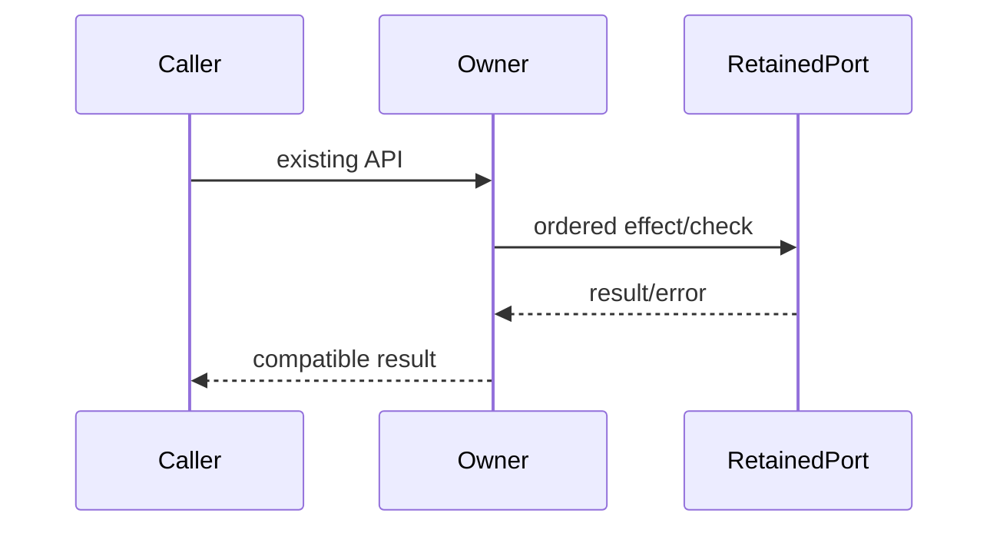

# Complete owner compatibility specification

Queue baseline: `8bc4c6fd697262a61a0e097a7ebad8337e9a389e`. Coordinator source-exposed; no directory/license grant. Existing APIs, dependencies, data and authorization boundaries retained.

Ordinary tests/builds skipped by user direction. Minimum safety probes use synthetic ports only. Frozen original/raw candidate hashes precede review; no actual commands/process signals/user data/network/device operations.

# Body-free runtime tool resolution author contract

Replace packages/services/src/runtime-tools/runtimeToolResolver.ts in full, <=400 nonblank lines, no suppressions. Do NOT read inherited target/catalog bodies, history/diffs/tests, frozen originals/drafts. Allowed root AGENTS, architecture SKILL, this packet and your own new code only. Coordinator source-exposed; bounded fresh candidate no license claim. No product commands/test/build/probes/network. Write original without reading. No commits. Freeze initial candidate and sha256 to /tmp/knorvia-command-runtime-candidates-20261002/resolver before ready, report access.
Retain imports node:fs accessSync,constants,existsSync; node:path delimiter,dirname,join,resolve; @knorvia/shared getRuntimeToolRuntime, typeRuntimeToolId ('bfs'|'ripgrep'|'ugrep'). Descriptor API getRuntimeToolRuntime(id) -> {binaryEnvVar:string,bundledResourceDir:string,resolveEntrySegments(platform:string):string[]}. Don't copy catalog. Public prependPathEntries(currentPath:string|undefined,entries:readonly string[]):string, appendPathEntries same, buildRuntimeToolEnvPatch(toolIds:readonly RuntimeToolId[],baseEnv:NodeJS.ProcessEnv=process.env):Record<string,string>. findRuntimeToolBinary is private, not an export. Preserve only the three listed public functions.
Executable probe accessSync(path,constants.X_OK), catch ANY false (no stat). Candidate check order truthy then existsSync then executable. PATH helper splits current with node:path delimiter, filters falsy, combine entries before/after accordingly then skip falsy/duplicate exact strings first wins; no trim/casefold/resolve.
find: descriptor then segments for process.platform; env[descriptor.binaryEnvVar]?.trim first, if exists/executable return. resourcesPath if typeof process.resourcesPath==='string', retain exact string incl empty. runtimeRoot env.KNORVIA_SERVER_RUNTIME_ROOT?.trim. moduleDir=import.meta.dirname IN SAME ORIGINAL FILE. Search roots runtimeRoot/tools/bundledResourceDir/segments, resourcesPath/tools/bundledResourceDir/segments, then bundled tool roots for `${process.platform}-${process.arch}`: resolve(process.cwd(),'bundled-tools',key); cwd/packages/desktop/bundled-tools/key; cwd/../desktop/bundled-tools/key; moduleDir/../../../desktop/bundled-tools/key; moduleDir/../../desktop/bundled-tools/key (module roots null if moduleDir falsy). For each root resolve(root,bundledResourceDir,...segments), preserve first existing executable. After all candidates, take segments[last], no binary name -> null. Remove /.exe$/i from binary name and search PATH. PATH absent/falsy -> null. Windows: PATHEXT?.split(';').filter(Boolean) ?? ['.EXE','.CMD','.BAT','.COM']; use these only if !command.includes('.'); otherwise ['']; POSIX ['']. PATHsplit node:path delimiter, skip falsy without trim; each entry then extensions -> join(entry,command+extension); probe executable ONLY, no existsSync in PATH search. First wins.
Patch: iterate original order including duplicates; descriptor fetched BEFORE find (find fetches descriptor again), missing skip, assign patch[descriptor.binaryEnvVar]=binarypath,pushdirname(binarypath). If any found set patch.PATH=appendPathEntries(baseEnv.PATH,dirs). None -> {} without PATH. No mutation of baseEnv or writes/launches.

Coordinator contract correction: patch return/internal map is Record<string,string>; findRuntimeToolBinary is private. Resource candidate requires a truthy string, string getter observes twice before runtimeRoot; bundled roots observe cwd separately three times. Original packet omissions and initial hashes recorded in resolver evidence.
