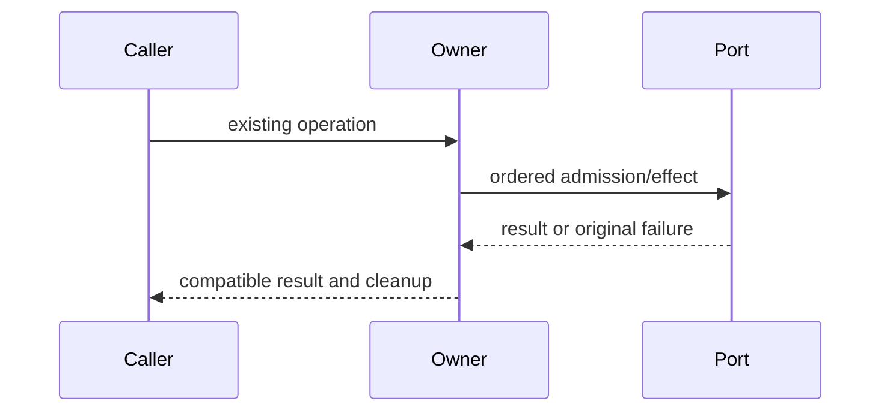

# Complete owner compatibility specification

Queue baseline `628e207a0bcc093d0aeaf6d15d5a6592df83fbe1`. Coordinator inspected originals; fresh author receives prose/API only. No licensing grant or new user data behavior.

Ordinary suites/builds deferred. Minimum positive/negative checks run against fake ports only; no actual user files/database/process/network. Frozen originals/raw initial candidate precede review.

# Complete bounded storage cleaner body-free contract

Author entire packages/services/src/storage/adapters/fsCleaner.ts fresh. DraftONLY /tmp/knorvia-file-storage-candidates-20261002/cleaner, <=400 nonblank lines, no suppression. Read only packet, /workspace/knorvia-studio/AGENTS.md, architecture SKILL, unchanged TYPE-ONLY storage/app/ports.ts and storage/contract.ts if useful, own draft. No inherited implementation/domain/walker/test/history/diff/original snapshots/previous drafts. No runtime IO/tests/build/probes/network/user data/credentials/commit. Freeze first-ready/hash/access receipt. Coordinator source-exposed, no blanketlicense claim. Managed storage adapters layer; preserve dependency direction.
Deps nodefs/promises lstat,readdir,rm,rmdir; nodepath dirname,join,relative,sep; type FsCleanerPort,StorageDeleteResult from ../app/ports.js; type StorageCleanCandidate from ../domain/cleanPlan.js {relativePath:string,bytes:number,mtimeMs:number}; type StorageCleanScope from ../domain/storageCatalog.js {prefix:string,recursive:boolean}; normalizeStorageRelativePath(string):string retained domain API; walkStorageRoot from ./fsWalker.js API ({rootPath:string,onEntry:(entry:{relativePath:string,bytes:number,mtimeMs:number})=>unknown}):Promise<unknown>. Sole export createFsStorageCleaner():FsCleanerPort. Interface listCandidates(rootPath:string,scopes:StorageCleanScope[]):Promise<Candidate[]>; deleteFiles(rootPath:string,targets:Candidate[],options:{keepDirectories:string[]}):Promise<{deletedCount:number,freedBytes:number,failures:{path:string,code:string}[]}>.
List: for eachscope in input order choose recursive orshallow andstart concurrently Promise.all; flatten arrays scopeorder; Map keyed normalize(candidate.relativePath),set each =>lastvalue perkey wins, first insertion order retained; returnMapvalues withoutsort/copyvalues. Shallowdirectory join(root,prefix); readdir STRING names catchANY=>[]; eachname sequentialtry awaitlstat(join(dir,name)), if !stats.isFile skip;elsepushrelativePath `${prefix}/${name}`,bytes stats.size,mtimeMs stats.mtimeMs;catchall skip (includes stats methods). No hidden filter. Recursive awaitwalker root join(root,prefix),onEntrypush({...entry,relativePath:`${prefix}/${entry.relativePath}`}); no extra onError/abort/options; errors propagate.
Delete: result counters0/failures[],deletedrelative[],queue=[...targets]. Launch EXACT8 workers via Promise.all(Array.from({length:8},worker)); eachworker for target=queue.shift();targettruthy;target=shift(): normalize relative FIRST,absolute=join(root,normalized),back=relative(root,absolute). Reject iff back.startsWith('..') OR back.split(sep).includes('..') -> failure {path:normalized,code:'EOUTSIDE'},continue no rm. Preserve conservative dot-dot prefix behavior, no additional authorization/security policy. try awaitrm(absolute,{force:false}); deletedCount++,freedBytes+=target.bytes,deleted.push(normalized);catch error ->failure code objectnonnull propertycode typeofstring else'UNKNOWN', pathnormalized; no error subclass/name. Failures/deleted order follows async completion. Unexpected normalize/path error outside rmtry rejects whole operation while alreadylaunchedworkers continue; no cancellation/rollbackadded.
After allworkers complete prune parent dirs: keepSet= newSet(options.keepDirectories) EXACTrawstrings. For each deleted normalizedpath current=dirname(path),while currenttruthy && current!=='.'&&!keepSet.has(current):Set.addcurrent,current=dirname(current). Stop at firstkeepancestor, norootprune. Sort directories descending a.split('/').length (literal '/', stabletieseffect). Sequential awaitrmdir(join(root,dir)).catchignoreANY. Returnresult. No parent pruning for failed/outside targets. No stat/revalidation/symlink/realpath guard changes; retained walker/domain policies remain outside fresh scope.
