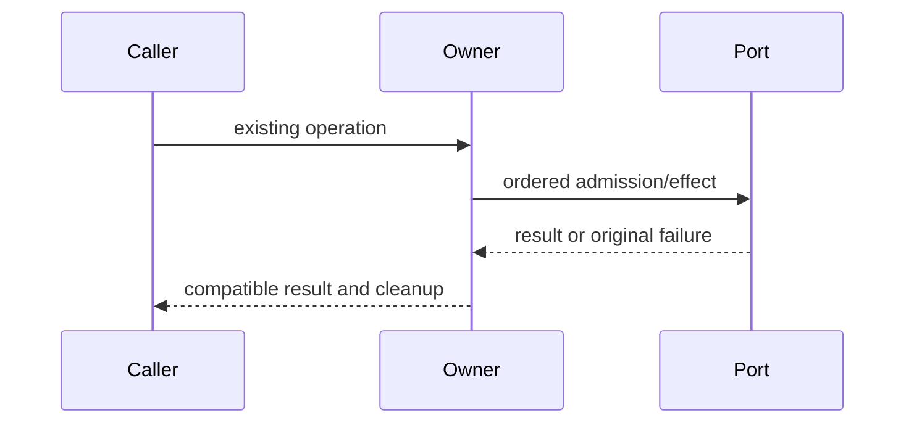

# Complete owner compatibility specification

Queue baseline `628e207a0bcc093d0aeaf6d15d5a6592df83fbe1`. Coordinator inspected originals; fresh author receives prose/API only. No licensing grant or new user data behavior.

Ordinary suites/builds deferred. Minimum positive/negative checks run against fake ports only; no actual user files/database/process/network. Frozen originals/raw initial candidate precede review.

# Complete storage service/scan-job lifecycle body-free contract

Fresh author ENTIRE packages/services/src/storage/app/storageService.ts AND scanJob.ts. DraftONLY /tmp/knorvia-file-storage-candidates-20261002/lifecycle, <=400 nonblank perfile,no suppression. Readonly packet,/workspace/knorvia-studio/AGENTS.md,architecture SKILL, unchanged TYPE-ONLY storage/app/ports.ts and storage/contract.ts,ownnewcode. No inherited bodies/domain/shared functions/tests/history/diffs/original snapshots/previousdrafts. No runtime IO/tests/build/network/probes/userdata/database/credentials/commit. Freeze first-ready bytes/hash/access receipt. Coordinator source-exposed, bounded candidate no MIT/globallicense grant. Managed storage app layer; retain port/domain boundaries. Do not harden known races or add caches/dispose guards; exact baseline lifecycle is contract.
Public createStorageService(deps:StorageServiceDependencies):IStorageService. PRIVATE deps {roots:RootsResolverPort;scanRunner:ScanRunnerPort;cleaner:FsCleanerPort;now?:()=>number;progressThrottleMs?:number}. Emitter<StorageUsageSnapshot> from @knorvia/rpc API .event,.fire(snapshot),.dispose(); retainactualemitter,don'tauthorit. Imports type IStorageService from ../contract.js; planStorageClean from ../domain/cleanPlan.js (API params{categoryId,candidates,context:{rootId,hasCustomDataBaseDir},now:number} ->{targets:Candidate[],skippedCount:number}); getStorageCategoryCleanability(categoryId)->'none'|'safe'|'confirm',getStorageCleanScopes(categoryId)->{prefix,recursive}[] from ../domain/storageCatalog.js. Types from @knorvia/shared; ports from ./ports.js; createScanJob/ScanJob same freshpair.
Type shapes: rootid 'home'|'dataBaseDir'; category id union sessionStore/subagentTranscripts/toolOutputs/modelTrajectory/devTraces/logs/backups/exports/runtimes/config/other; rootspec{id,path,hasCustomDataBaseDir:boolean}; rootusage{id,path,volume:unknown|null,bytes,fileCount,categories:unknown[]}; patherror{path,code}; snapshot{jobId,status:'scanning'|'complete'|'cancelled'|'failed',startedAt:number,finishedAt?:number,roots:StorageRootUsage[],errors:StoragePathError[]}. Interface startScan():Promise<{jobId:string}>;cancelScan(jobId:string):Promise<void>;getSnapshot():Promise<Snapshot|null>;onScanProgress emitter.event;clean(request{rootId,categoryId}):Promise<{deletedCount,freedBytes,failures,skippedCount}>;dispose():void.
Factory captures now=deps.now??Date.now,throttle=deps.progressThrottleMs??300,emitter,currentJob=null,latestSnapshot=null,latestJobId=null,jobCounter0. cancelcurrent invokes currentJob?.cancel thensetsnull. Resolve root awaitdeps.roots.resolveRoots(),find firstid exact;missing Error(`storage root not available: ${rootId}`).
startScan cancelcurrent FIRST;jobId`scan-${++counter}`,latestJobId=jobId BEFORE awaitroots. Afterroots createScanJob({jobId,roots,runner:deps.scanRunner,now,throttleMs,emit(snapshot){ifjobId===latestJobId latestSnapshot=snapshot; emitter.fire(snapshot) ALWAYS even stalejob}}). create job/run begins BEFORE currentJob assigned, no initialemitsource job exceptrunnercall. currentJob=job;voidjob.done.then(()=>{ifcurrentJob?.jobId===jobId currentJob=null});return{jobId}. No stale-start admission guard across awaitroots, no errors swallowed. cancelScan ifcurrentJob?.jobId!==given no-op elsecancelcurrent. getSnapshot SAME latestreference. dispose cancelcurrent THENemitter.dispose; no disposed flag.
clean: getStorageCategoryCleanability(request.categoryId)==='none' ->throw Error(`storage category is not cleanable: ${request.categoryId}`) BEFORE cancellation/roots/IO. Otherwisecancelcurrent,awaitroot(request.rootId); scopes=getStorageCleanScopes(request.categoryId) AFTER rootawait; awaitcleaner.listCandidates(root.path,scopes). Plan reads CURRENT request.categoryId AFTER candidatesawait,contextrootidentity+customflag,now=now(). awaitcleaner.deleteFiles(root.path,plan.targets,{keepDirectories:scopes.map(scope=>scope.prefix)}). Return{...result,skippedCount:plan.skippedCount}. No new authorization/confirmation gate or root/pathmigration; retained domain plan owns category/protection filtering. Exceptions propagate identity, no rescan/event/rollbackadded.

# Scan job entire owner

Export interface ScanJob {readonlyjobId:string;readonlydone:Promise<Snapshot>;cancel():void};export isAbortError(error:unknown):boolean true ONLY error instanceofError&&error.name==='AbortError';exportcreateScanJob(params:{jobId:string;roots:RootSpec[];runner:ScanRunnerPort;now:()=>number;throttleMs:number;emit:(snapshot)=>void;setTimer?:(callback:()=>void,delayMs:number)=>unknown;clearTimer?:(handle:unknown)=>void}):ScanJob.
Captureparams destructurejobId,roots,runner,now,throttleMs,emit;timer defaults setTimeoutcallbackdelay andclearTimeoutasNodeTimeout;newAbortController;startedAt=now();latest={jobId,statusscanning,startedAt,roots:roots.maproot->{id,path,volume:null,bytes0,fileCount0,categories:[]},errors:[]};lastEmitAt=-Infinity,pendingTimer=null,settledfalse.
flush sets pendingTimer=null, lastEmitAt=now(),emit(latest), no settledguard and no priorpendingtimerclear. onProgress ifsettled return;latest shallowcopy updating roots/errors SAME progressarrays;elapsed=now()-lastEmitAt;ifelapsed>=throttleflushelseifpendingTimer==null setTimer(flush,throttle-elapsed). Thus immediate flush can leave earlier scheduled timer live; preserve baseline, don'tfix.
settle(snapshot):settled=true;ifpendingTimer!=nullclearTimer,setnull;latest=snapshot;emit(latest);returnlatest. No settledguard;emit errors may flow into catch.
done=runner.run({roots,signal:controller.signal,onProgress}) called synchronously BEFOREreturn, synchronousthrow propagatesfactory. .thenprogress=>settle({...latest,roots:progress.roots,errors:progress.errors,status:controller.signal.aborted?'cancelled':'complete',finishedAt:now()});.catch(error)=>settle({...latest,status:isAbortError(error)||signalaborted?'cancelled':'failed',finishedAt:now(),errors:isAbortError(error)?latest.errors:[...latest.errors,{path:'',code:errorCode(error)}]}). If success emit throws then catchsettlesagain and secondemiterror canreject done. errorCode objecttruthy propertycode typeofstring ->code else errorinstanceofError?error.name:'UNKNOWN'. Cancel simplycontroller.abort (canrepeat, no settlementuntilrunner completes/rejects). No initialprogress/timer unlessrunner emits. All reference identities,arrayreuse,timer0/null handling and eventualstale-event rules preserved.
