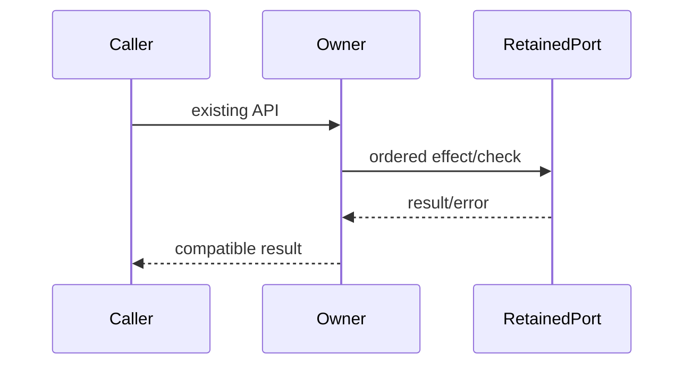

# Complete owner compatibility specification

Queue baseline: `8bc4c6fd697262a61a0e097a7ebad8337e9a389e`. Coordinator source-exposed; no directory/license grant. Existing APIs, dependencies, data and authorization boundaries retained.

Ordinary tests/builds skipped by user direction. Minimum safety probes use synthetic ports only. Frozen original/raw candidate hashes precede review; no actual commands/process signals/user data/network/device operations.

# Body-free integrated shell catalog contract

Replace packages/services/src/system/integratedTerminalShells.ts in full. No inherited target/dependency bodies, history/diffs/tests/original drafts reads. Allowed root AGENTS, architecture SKILL, this prose packet, your own new code. Coordinator source-exposed; bounded fresh author candidate no license claim. <=400 nonblank lines, no suppression. No command/process/probes/network/tests/build. No commits. Freeze initial files+sha256 /tmp/knorvia-command-runtime-candidates-20261002/system before ready, report reads.
Imports fs accessSync,constants; path win32; type IntegratedTerminalShellOption from @knorvia/shared (shape dialect:'cmd'|'git-bash' etc|string retained type; id,label,path strings;source:'system'|'path'). Sole export listIntegratedTerminalShellOptions(options:{env:NodeJS.ProcessEnv;isExecutable?:(path:string)=>boolean;platform:NodeJS.Platform}):IntegratedTerminalShellOption[]. Non-win32 return [] BEFORE reading env/probes.
Env keys case-insensitive lookup first matching Object.keys order, key exists but undefined blocks later variants. CMD path ComSpec value?.trim()||'cmd.exe'; option dialect cmd,id`cmd:${path}`,label CMD,path,source system; CMD never probed. Git Bash system candidates in order C:\Program Files\Git\bin\bash.exe and C:\Program Files (x86)\Git\bin\bash.exe. Probe uses provided truthy callback with NO catch (errors propagate), else accessSync(X_OK) success true catchANYfalse. First direct match source system.
If no fixed match, generate 'git' PATH candidates. Path env missing/falsy -> ['git'] (no suffix probing). Otherwise PATHEXT value?.split(';') ?? ['.COM','.EXE','.BAT','.CMD']; trim/lowercase/filterempty; if '.exe' missing prepend it, do not dedupe. PATHsplit';',filter entry.trim().length>0 but join ORIGINAL untrimmed entries; expand each entry then each normalized extension win32.join(entry,'git'+extension). Generic helper for command with / or backslash returns [command]. Find FIRST executable git only. Then infer win32.normalize(join(dirname(git),'..','bin','bash.exe')), second ../../bin/bash.exe; first executable wins source path. Do NOT continue later git binaries if inferred shell missing. Git option dialect git-bash,id`git-bash:${path}`,label Git Bash,path,source. Return CMD then optional Git option. No launch/write/new permission policy.
