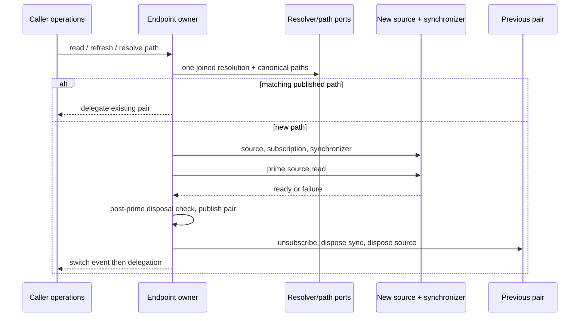

# Endpoint-bound builtin source lifecycle

Complete compatibility contract for independent replacement of `packages/provider-node/src/endpoint-scoped-builtin-source.ts`. The sole owner selects and publishes one current endpoint-bound source/synchronizer pair, holds one shared initialization operation and a live set of change listeners, and owns disposal. Preserve the original exported options interface and class API. Do not change cache/download/release, config-source, remote-synchronizer, schemas, permissions, global provenance or license decisions. This file is a body-free specification; retained collaborator implementations are not author inputs.

Construction stores the supplied options object by reference, without cloning, freezing, resolving an endpoint or allocating collaborators. Option mutation remains observable at subsequent operations. Initially there is no current pair or initialization, no listeners, and disposal is false. No new factory/dependency injection/public exports. Retain the original import routes in the supplied declarations.

Public read, refresh and resolveActiveFilePath first obtain the current pair. New endpoint initialization includes one awaited source.read to materialize/validate it. Public read then calls source.read again and returns that second snapshot directly, without cloning/freezing/revision rewriting; reused pairs receive only this public read. Refresh delegates to the selected synchronizer.refresh with the caller's exact optional options value/reference, including undefined, and returns its result unchanged. resolveActiveFilePath returns the selected path, without another read after initialization. Source and synchronizer methods keep their receivers. Their rejection/errors propagate unchanged. These operations create promises but callers are not promised identical public Promise objects.

Initialization first rejects if disposed with a new Error and exact message `EndpointScopedKnorviaBuiltinSource 已 dispose`. If an initialization is pending, all operations join that operation; no extra endpoint resolution/construction for each waiter. Otherwise begin one operation, retaining its settlement handle until it finishes; success or failure clears the shared slot only if it still refers to that operation. Failure permits a later fresh attempt. No cache of the resolved endpoint between settled operations: every fresh ensure invokes the caller's endpoint resolver again, preserving its options-object receiver, and awaits string or Promise<string>.

Normalize the resolved value with retained normalizeKnorviaBuiltinEndpointOrigin, then call retained resolveKnorviaBuiltinCachePaths with exactly environmentConfigRoot, platform, appVersion and knorviaEndpointOrigin set to the normalized origin. Use current option values at their evaluation time and preserve named fields even when values are undefined. Compare only computed activeFilePath with the published pair's path; if equal, reuse that pair, with no source construction/priming or switch event. Endpoint identity is the canonical isolated path, not raw resolver spelling or a second account/host key. Do not read an old endpoint cache to serve a newly selected path, add a path fallback or alter the retained path/hash/permissions policies.

For a different/new path, construct NodeKnorviaBuiltinProviderConfigSource with exactly bundledFilePath, activeFilePath and watch. Subscribe immediately to its onDidChange before constructing the synchronizer, forwarding all supplied reason strings through this owner's event mechanism. Construct KnorviaBuiltinRemoteSynchronizer with exactly source, controlFilePath, resolveEndpointKey, fetchRelease, onRefreshResult. Its resolveEndpointKey callback must each time freshly invoke the same caller resolver with its options receiver, await and normalize it, returning the canonical origin string, not the hashed cache key or initial captured origin. Pass fetchRelease and onRefreshResult references through unchanged; the synchronizer owns their receiver/cancellation/refresh policy. Do not pass added timing, lease, permission or network defaults.

The source/synchronizer constructors and source subscription precede the guarded priming step. Preserve original error boundaries: if a constructor/subscription throws before priming starts, propagate it without inventing another cleanup/recovery path. For the guarded step await source.read once, discard that snapshot, then assert owner is still not disposed. Priming or this disposal check failing invokes, in order, the returned subscription disposer as an unbound function, synchronizer.dispose with synchronizer receiver, then source.dispose with source receiver, and rethrows the original failure if cleanup succeeds. Cleanup exceptions propagate, stop subsequent cleanup and can replace the original error; no suppression/finally cleanup policy is added. A failed replacement leaves the previously published pair current unless public disposal already changed it.

After successful priming, publish the new path/source/synchronizer/subscription as current before releasing the previous pair. Release any previous pair in ordered unsubscription/synchronizer/source sequence. For a published pair, its subscription disposer is invoked with that internal resource bundle as receiver; the bundle exposes activeFilePath/source/synchronizer/sourceDispose. This differs from unbound failed-prime cleanup. Preserve the source/synchronizer receivers, without requiring a particular internal class name. Emit exactly `endpoint-changed` only if a previous pair existed and its release completed. Initial publication emits no artificial switch reason. A previous release or switch-listener exception rejects the initialization after publication; it does not roll back the new current pair, and a later matching-path ensure can reuse it. No old/new generation, transactional rollback, hidden retry or extra endpoint resolution after priming. An endpoint change during priming is detected by a subsequent fresh ensure; already joined callers use that operation's captured path. Remote synchronizer independently rechecks its dynamic endpoint callback for its own stale-refresh boundary.

onDidChange checks disposal synchronously, adds the exact function to a live Set, and returns an unbound unsubscribe function that deletes it. Duplicate registration of the same function is one membership; deleting via either closure removes it, and runtime return from deletion is the Set.delete boolean despite the public void callback typing. Unsubscription is allowed after disposal. Notifications synchronously iterate the live Set in insertion order, call each listener as an unbound function, and pass the reason unchanged; additions/removals during iteration follow native Set behavior. Exceptions propagate and stop that emission; no catch/log/fallback. If disposed, emission returns silently. Existing-source events can still be forwarded during replacement; newly subscribed source can emit during priming even before it is published. Do not gate events by pair generation or automatically detach the previous subscription before new priming succeeds.

dispose is synchronous and idempotent after its first invocation: set disposed true first, release the published pair if any using its ordered release sequence and bundle-bound subscription disposer, set current null, and clear listeners. It does not clear/cancel the initialization slot or actively abort a pending caller resolver/priming read. A normally completing pending initialization observes disposal after priming and cleans its new pair; subsequent public operations/subscription reject before joining it. Preserve exact checks, including no additional pre-construction check after awaiting the resolver. If published-pair release throws, current clearing/listener clearing do not occur, and later dispose returns because the flag was already set; no new retry/exception swallowing. Source/synchronizer own actual release of file watchers/refresh cancellation. No real file/provider/network operation is part of the permitted verification.

Dependencies are opaque public collaborators: ProviderSource/ProviderConfigLayerSnapshot canonical types; two retained cache helpers; source constructor/read/onDidChange/dispose; synchronizer constructor/refresh/dispose and its options/result/event types. Body-free declaration views provide exact used signatures. Use their existing public paths, not copied implementations or native IO. No source snapshot parsing, permission repair, protocol/URL validation beyond delegated helpers or second state owner. The complete owner remains within legacy provider-node module (managed:false), keeps existing dependency direction, and changes no architecture policy.

| Public import route                   | Supplied declaration symbols                                                                           |
| ------------------------------------- | ------------------------------------------------------------------------------------------------------ |
| `@knorvia/provider`                   | ProviderConfigLayerSnapshot, ProviderSource (types)                                                    |
| `./builtin-cache-paths.js`            | normalizeKnorviaBuiltinEndpointOrigin, resolveKnorviaBuiltinCachePaths                                 |
| `./builtin-provider-config-source.js` | NodeKnorviaBuiltinProviderConfigSource                                                                 |
| `./builtin-remote-synchronizer.js`    | KnorviaBuiltinRemoteSynchronizer, KnorviaBuiltinRefreshResult, KnorviaBuiltinRemoteSynchronizerOptions |

Authorized verification uses only fake sources/synchronizers, synthetic endpoint resolver snapshots and deterministic path ports: lazy construction, coalesced ensure, prime-versus-public read identity, same-path reuse, endpoint switch ordering/reasons, failed prime cleanup, dynamic endpoint callback, disposal while priming and rejection after disposal. Additional exception/receiver checks may use these same fakes. Do not run real endpoint/provider/download/network/config/cache/credential/permissions/native operations, full suites or builds. Candidate/source comparison, AST/target static and later semantic type closure are separate evidence; a frozen candidate is not MIT acceptance. Private accepted history or exact conflicting receipt requires HOLD, not replacement.
