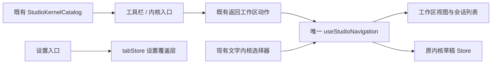

# 工具栏与内核切换条

2026-09-26。用户以窄工具栏、内容侧栏、工作区三列的参考图提出调整，并希望在最左侧划出内核切换区。本规格替代 frontend-shell 中主导航集中在原侧栏的布局限制；沿用既有聊天、设置、黑白视觉与材质规则。

## 布局与交互

- 桌面及宽 Web 使用 56px 窄工具栏。上段依次为单聊、群聊、自动化、工作流、创作、插件；中段用短分隔线划出内核区；底部沿用偏好菜单与设置入口。工具栏不套卡片背景，选中使用既有纸片 token。
- 聊天页面的第二列保留可调整宽度的项目、会话与群聊列表、文件树、新建任务与搜索；工具页按下述规则使用完整工作面。历史导航位于公共标题栏。原横向工具菜单和单聊/群聊分段移至工具栏，不重复占用列表高度；当前内核的文字选择器仍提供完整名称和全部选择。
- 内核快捷区最多四项，固定包含内置内核与当前选择，其余依既有目录顺序展示已检测到的内核。更多菜单能访问全部可选内核和 Agent 管理。相似图标通过提示中的完整名称区分；不把未知或失联状态写成可用。
- 点击不同内核沿用显式切换语义：打开属于新内核的独立草稿，不复制旧上下文，不发送、不安装、不登录。点击当前内核只返回其单聊视图，不创建多余草稿。工具切换、设置往返保留原会话身份。
- 编辑器初始内容的延迟回填必须在卸载或值变化后取消，且不得覆盖已经输入的新文字；快速导航和后台恢复也遵循此规则。
- 设置作为现有覆盖层保留：工具栏常驻，常规设置导航仍为第二列，插件管理使用完整工作面；工作区内容在覆盖期间保持 inert。工具栏点击任一工作入口先返回工作区再导航，不能让被覆盖聊天获得焦点。
- 桌面收起第二列时工具栏仍可达。窄 Web（小于 768px）沿用原紧凑导航，不叠加窄栏。较矮窗口内核区域可滚动，设置和偏好仍可达。
- 黑白主题、玻璃/背景图、圆形按钮、细线图标、键盘焦点和中英文使用现有组件及 token。不改变初始主题与业务页内容；不新增页面。

## 2026-09-26 后续轮廓与插件入口调整

用户最终确认的参考为 `IMG_20260926_220318.png` 上标记的左上圆角和侧边轮廓；此前活动聊天截图作废。保留问候和输入区的位置，不按活动截图移动输入框。

- 窄工具栏位于外框之外。从第二列开始，会话列表与主内容共同组成一个圆角工作面，顶部由独立的 40px 标题栏承接。外框只画一次，内部侧栏、会话、终端及 Side Pane 以细分隔线相接，不叠加第二套圆角卡片。设置页采用同一外框和高度规则。
- 顶部历史导航、侧栏开关与搜索沿用原回调，通过 UI portal 进入统一标题栏；帮助和 Windows/Linux 窗控只有一组。Mac 保留原生窗控避让；窄 Web 不采用此结构。第二列调整宽度、收起、工作区保活、设置 inert、菜单 portal 不变。
- 插件按钮是既有设置中插件管理的直达操作，通过 `setPendingSettingsPluginIntent("plugins")` 与 `openSettingsTab` 执行。插件列表、权限、配置和兼容性仍由原页面负责；不创建插件市场，不建立第二份插件状态。宽布局移除设置侧栏重复的插件入口，窄 Web 保留原入口。设置页仍是分区状态的唯一所有者。
- 内核图标保持真实产品识别，优先使用官方透明矢量或清晰透明素材，保留来源记录和署名。各入口共用 `StudioKernelIcon`，不绘制仿造标记，不把母公司文字代替产品标志，不将品牌位图用全局灰度滤镜压成脏灰。深浅主题使用相应的黑白素材或原始透明彩色素材，视觉边界、尺寸与留白保持一致。
- 验收覆盖共用圆角工作面、顶部控件唯一且可达、设置与插件往返保留草稿、宽/窄入口可达、内核图标资源加载和深浅主题、第二列收起/调整宽度、短窗口滚动。保留用户要求跳过目视复核的限制，使用隔离交互与几何断言，不读原有 data。

## 所有权与边界

### 2026-09-26 输入区对齐与按页面显示侧栏

- 相同窗口、侧栏宽度和空草稿状态下，Knorvia 与外部内核的项目行、输入框左右边界及上沿一致。草稿输入区与问候之间的额外间距由 `conversationDraftLayout.ts` 唯一提供；错误横幅正常占位，外部内核输入框下方的状态提示不得改变输入框上沿。
- 窄工具栏布局中，仅单聊、外部内核聊天和群聊显示原内容侧栏。创作、自动化、工作流从第二列起使用完整工作面，不展示无关的项目／会话／群聊列表及其展开、新建和搜索操作；历史后退／前进仍可用。
- 页面是否需要侧栏从现有 `workspaceMainView` 派生，不写入用户的侧栏展开偏好或宽度。返回聊天恢复先前展开状态、宽度与草稿；隐藏侧栏及其分隔条不可获得焦点。窄 Web 保留原导航。
- 窄栏的插件入口打开既有插件管理，但插件页使用完整工作面，隐藏设置分类侧栏。其他设置分区继续显示分类导航，窄 Web 保留既有结构。底部设置入口始终打开常规设置，保证从全宽插件页仍可进入其他设置。
- 验收在隔离环境测量内核切换前后的输入区坐标，覆盖不同窗口高度；遍历各工具页检查侧栏、分隔条、顶部操作和恢复行为。材质验收见 `specs/knorvia-appearance-materials.md`。

UI 仍属于现有 `ui` 模块。唯一 `useStudioNavigation` 实例从 `App` 提升到常驻的 `RootWorkspaceContent`，通过 props 给工作区与工具栏；设置显隐仍归 tabStore，宽度与收起状态仍归现有 shell，内核事实仍由 `StudioKernelCatalog` 持有。快捷项仅由目录派生，不保存第二份内核状态。不改 Service、Host、RPC 或运行时。

统一外框及标题栏挂载点由 `StudioWorkspaceFrame` 持有，只通过 UI context 暴露布局事实和 portal 容器。标题栏操作仍由 WorkspaceShellLayout 的原回调执行，不搬迁导航状态；SettingsPage 继续拥有 activeSection，插件直达只提交现有设置意图。

切换只改变位置和未发送草稿；运行中会话、权限、模型、历史数据与 Host 所有权不变。目录加载失败仍能保留当前选择，通过原 Agent 管理查看原因，禁止静默换内核。

## 验收

1. 单聊、群聊、自动化、工作流、创作均可从窄栏进入，高亮对应当前工具；原列表与新建入口仍可操作。
2. 内核快速项有界，当前自定义/SSH 内核不会被溢出隐藏；重复选择不新增草稿，跨内核草稿不携带旧内容；更多菜单及管理可键盘访问。
3. 设置往返和工具切换不卸载工作区，底层工作区保持 inert，工具栏仍能操作。隐藏第二列后仍可切换工具与内核。
4. 隔离本地交互测试覆盖上述导航、草稿、设置、收起、短窗口、深浅主题和玻璃模式；不发模型请求、不执行外部 CLI、不读用户 data。
5. 实跑根 typecheck、lint、architecture:check --changed 与相关离线回归，记录真实结果。2026-09-26 后续用户授权打包并覆盖桌面便携版：使用 production 身份，确认目标退出，排除 data 并做覆盖前后逐文件 SHA-256 比对；不额外备份。便携交付后用户追加授权将源码提交并推送到现有 GitHub 仓库 main；不上传 data 或便携程序，不发布新的线上发行版。
