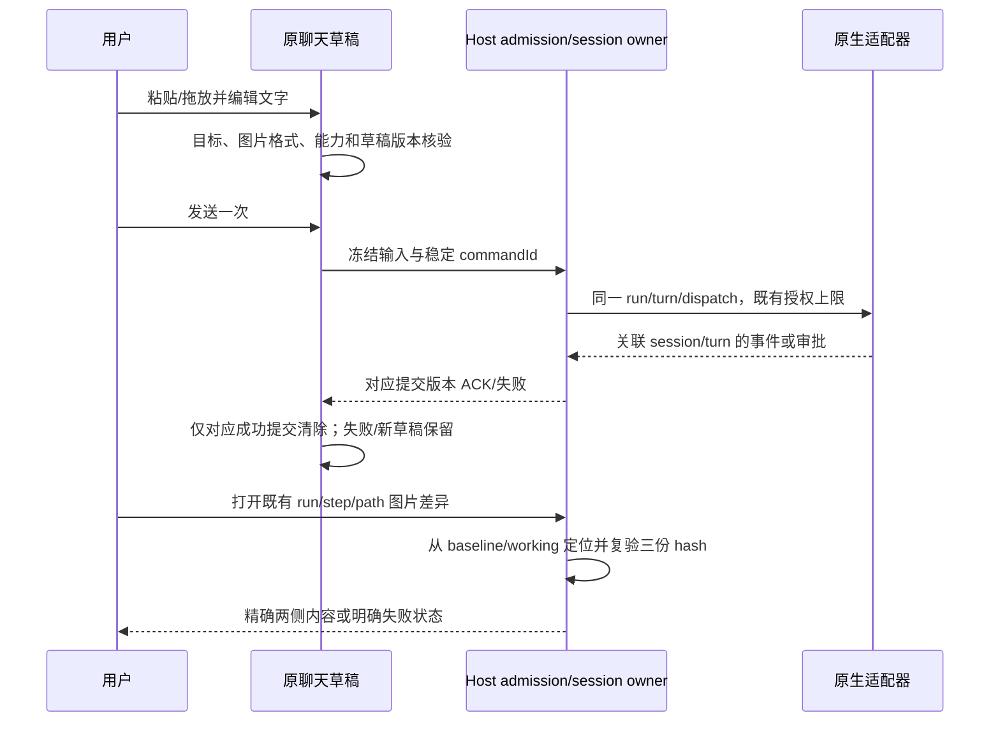

# 外部适配器保真、聊天贴图与工作区图片对比集成

2026-10-08。用户批准「修正＋贴图＋图片对比」，并已明确授权三项统一通过验收后合入 main、按既有 Windows/Linux 范围发布新的正式版。先交付新的 draft 集成 PR、独立回归和适用桌面构建；验收完成前不发布。集成/发布仅由本路线执行，不发布 preview/draft release，不部署网站、不增加手机/macOS矩阵、不修改签名配置或授权策略。

本轮随后追加工作台；用户最新取消原生终端切换，当前范围为 GUI-only：独立导航、一键平铺所有运行任务、同内核的不同任务各占一格，每格独立输入/批准/暂停，拖边调整宽高、保存布局、单格放大，以及零任务先布局。不增加 PTY 交接或原生 history 回灌。工作台路线尚未交付可集成实现，最终发布继续暂停等待工作台整合。现有三项继续验收，最后共同检查/发布必须覆盖确认后的本轮完整范围，不能只发布原三项。

## 基线与范围

- 开工远端 main：`34078257b5d9d1e78c40308b34dab8ff45565156`；最新稳定版 `v0.10.0`，根版本 `0.10.0`。
- 原集成分支 `codex/review-inbox-integration-20261007` 在 `99b913857a0f7055bad8b06b180015cb7520824b`，无未提交改动；它是已合并候选，本轮不继续使用。
- 新分支 `codex/adapter-images-integration-20261008` 从当前 `origin/main` 创建；freshness fetch 后及新分支检查均 exit 0，新分支 ahead 0 / behind 0。基线全仓架构检查 exit 0，违规/基线/新增均为 0。
- 保留全部已有功能、黑白 UI、历史数据、旧记录兼容、根 LICENSE/NOTICE/THIRD-PARTY-NOTICES 和冻结来源证据。版本号暂保持 `0.10.0`；构建须标明候选 exact commit，不能冒充新的稳定版本。
- 三项首批：合成协议证实的外部适配器信息/状态最小修正；本地 Codex 或明确核验图片输入能力的 PNG/JPEG 截图粘贴/拖放；既有隔离工作区精确快照的静态栅格 before/after 并排。
- 矩形短评、文件反查任务、PR 面板、备份检查、评测平台、手机改动不在本轮。既有按明确路径读图能力保持，不把新增 composer 附件入口描述成此前不能读图。

## 当前入口与唯一所有者

| 事实/状态                                 | 所有者与既有入口                                                                                  | 本轮边界                                                               |
| ----------------------------------------- | ------------------------------------------------------------------------------------------------- | ---------------------------------------------------------------------- |
| 原生协议消息与 turn 终态                  | `adapters/kernels/*Protocol.ts`、`kernelRun.ts`；`StudioKernelEvent` / `StudioKernelTurnResult`   | 准确保留协议事实；关联 session/turn，不用 UI 或未知状态推断成功        |
| 发送命令、审批、取消与去重                | `IStudioRuntimeService.command`、现有 command admission/run/session/lease；`StudioKernelSink.ask` | 沿用 commandId/dispatchId 和 owner；新增图片不得绕过审批或另起接受队列 |
| 外部聊天未提交草稿                        | `StudioExternalChat`、`studioAgentStore`、`chatSubmission`                                        | text 和图片属于同一目标的草稿；ACK 只清除对应提交版本                  |
| 已核验能力                                | `StudioKernelStatus` / `kernelOptions` 的能力证据及既有发送 gate                                  | 图片能力为增量、显式证据；缺失/未知不当作支持，不改变五项权限能力      |
| 隔离 baseline、working、source 和文件版本 | `createStudioWorkspaceManager`、`workspaceSnapshot`、Host 运行/步骤收据                           | Host 定位并复验 run/step/path 和三份 hash；Renderer 不选绝对快照路径   |
| 工作区审阅弹窗与异步视图                  | `StudioRunHistory`、既有 `workspaceChanges` / `applyWorkspaceChanges`                             | 新图片只读投影与现有文本/应用共存；关闭/切换后迟到结果不得替换新目标   |
| 二进制传输与图片显示                      | `IFileService.readBinaryPreview`、既有图片预览组件                                                | binary 默认及上限为 25 MiB；`readMediaPreview` 的 4/8 MiB 是另一条边界 |

`workspaceIdentity?.trim() || workspacePath` 保持身份隔离，`workspacePath` 只用于文件/cwd。Desktop continuous 与既有 replayable 恢复语义保持，新增首批图片输入不扩大远程/手机支持。

## 三路交接与共享文件边界

各路独立新分支、中文提交、独立 draft PR；通过本集成 PR 回报 spec、exact head、最小契约补丁、旧基线复现和验证证据。集成路按冻结 head 吸收提交，完成全部 gate 后才统一合入 main；任何路线不得 force-push main 或覆盖 tag/release。首次共享契约改动前先在集成 PR 贴出字段/事件与所属文件，避免各路各自发明图片类型或改写同一段。

| 路线            | 首要拥有文件/语义                                                              | 共享切片与交接规则                                                                                                                                                                                     |
| --------------- | ------------------------------------------------------------------------------ | ------------------------------------------------------------------------------------------------------------------------------------------------------------------------------------------------------ |
| A：适配器保真   | `adapters/kernels/*Protocol.ts` 的事件/状态处理、协议 fixtures、相关运行投影   | `kernelTypes.ts` 的事件/结果字段由 A 协调；`codexProtocol.ts` 的通知、请求、终态/归属切片由 A 改。不得顺带改图片输入、权限策略或 composer                                                              |
| B：外部聊天贴图 | `StudioExternalChat.tsx`、`chatSubmission.ts`、草稿/store、附件接纳与发送链    | `kernelTypes.ts` 的图片输入类型/显式能力字段及 `StudioKernelTurn` 输入切片由 B 提出，与 A 对齐后提交；`codexProtocol.ts` 只改构造输入的切片。`contract.ts` 只扩展既有 send 字段，保留旧 text-only 调用 |
| C：快照图片对比 | `workspaceManager.ts`/快照读取、版本和预览类型、`StudioRunHistory` 的图片分支  | `types.ts` 的 `StudioWorkspaceChange` 和快照读取请求由 C 协调；`contract.ts` 只涉及工作区读取切片，与 B 的 send 字段分开。复用 Host 入口/传输，不增不受控路径读取                                      |
| 集成：本路线    | 本总 spec、独立跨路线测试/真实浏览器验收、必要冲突修正、最后来源指纹与构建证据 | 在功能 PR 冻结前不抢改功能所有者文件；负责 `contract.example.ts` 组合示例和共享变更最终归并，任何更广的修正先给对应路具体复现                                                                          |

- `app/commandAdmission.ts`、`domain/validation.ts`、`app/turnSession.ts`、`app/ports.ts`、`types.ts`：B/C 若需触及，先列出精确符号/切片；既有 approval、session writeback、review、attention 分支均保留。
- `contract.ts` 当前公开 RPC 为 12 个；本轮保持现有预算，不通过放宽架构策略新增平行 RPC。C 先给出复用入口的 typed 请求/响应补丁；若其设计确需新增入口，先在本 PR 列明预算与替代方案，不能直接弱化 gate。
- 新类型必须可选/增量且浏览器安全；缺失按旧记录处理，未知格式不得强行覆盖。持久字段升级必须给旧 SQLite/JSON/草稿 fixture，不凭新建空库推断兼容。
- `third-party/inventory.json` 为生成文件，各路按自己冻结代码再生；集成冲突只从最后合并树重生成，保留原材料义务/历史指纹，不手工「解决」为失实来源。
- 通用 prompt/editor/图片显示组件只做经证实必要的最小扩展，保留内置聊天行为；不为外部内核另起聊天壳子。

## A：修正前必须证实

每个问题先记录现象、当前源码路径、合成原生消息、旧基线 actual/expected 和失败 exit，再最小修正。同一 fixture 在新代码通过并与现有 protocol/runtime 路由核对，才计为已复现/已修复。上游测试名称、定义或文档只是线索，不是本项目复现证据。

- 信息、工具更新、使用量、终态和错误必须保持原生含义；未知字段/状态不能静默等同成功，缺失数据保持未知。
- 不同 session/turn、迟到事件、请求撤回、取消、重复通知不能污染活跃轮次；同一审批仍只有原 owner 接受显式答复。
- 原生 child 权限归属属于高风险修正：先用本项目 fixture 证实 root/child 注册与审批链，保留根 thread fence。首批不擅自增加 child lineage 或新的授权 owner；若需扩展，先给父线程具体最小设计、归属证据和风险，取得范围确认后再实现。未知 child、其他线程和迟到旧轮请求继续拒绝，不得只删除 threadId 判断来使 fixture 通过。
- 合成协议不得联网、调用付费模型、读取真实凭据或真实用户 profile。日志和持久投影不增加秘密或隐藏推理暴露。

## B：输入/草稿接纳契约

- 首批静态 PNG/JPEG；APNG 不因 `image/png` MIME 自动接纳。逐文件核验类型与实际字节、大小/数量/总量明确有界，错误明确且保留已有正文/附件。限制由 B 的 spec/typed 常量说明，不能混用二进制预览预算。
- 支持 image-only 和 text+image，复用一次 send/admission；只把有明确图片能力证据的目标接纳为支持。未知/不支持明确拒绝，零 native dispatch，不自动改内核、模型、权限或使用降级隐藏发送。
- 本地 Codex 协议输入的形状由真实可核验协议/本项目合成 fixture 证实；原明确路径读图与 text-only 行为继续保留。
- 粘贴/拖放只创建当前目标未提交草稿。读取取消、组件卸载、切换 kernel/session/workspace 和迟到 FileReader/ACK 都按目标及草稿代次隔离；不能清除或插入另一个目标的内容。
- 重复 Enter/按钮共用原同步 in-flight gate 与稳定 commandId；确认接纳前失败保留草稿，接纳后的不确定状态不得自动重发。取消沿用原 runId，不顺便发送第二次输入。
- 发送后不可让 Renderer 自选任意 Host 路径；临时文件仅属受控本轮 owner，处理跟随生命周期且不能删用户文件。图片字节不进入公开运行摘要、结构化 handoff 或诊断秘密；持久草稿/已接纳附件的实际存储与清理边界须由 B 明确。
- 旧 text-only 草稿、旧 send 命令、旧持久运行与恢复路径均可用；能力字段缺失诚实为未知，不阻断既有纯文字功能。

## C：精确快照图片契约

- 只做明确白名单的静态栅格并排，沿用已有图片显示；格式由 C spec 写明且至少覆盖 PNG/JPEG。不把任意 `image/*`、SVG/活动内容、视频或未核验动态格式当成静态支持；矩形/区域批注以后再做。
- 每次请求绑定已有 `runId`/`stepId`/Host 返回的相对 `path`、side 和完整 `beforeHash`/`afterHash`/`sourceHash`。Host 根据隔离收据与安全目录解析定位 baseline/working，不能拿两个实时源项目路径冒充旧新。
- 现有 binary change 没有 `version`；先由同一 workspace owner 增量投影三份 hash，再读取精确内容。before 来自发布过的 baseline，after 来自对应 working；source 仅作并发/冲突核验，不能替代 before。
- 预览与读取之间任一字节/hash变化必须明确拒绝；重读获取新版本。读取前后都按安全文件/版本约束验证，路径穿越、链接、ADS/危险别名、秘密路径、跨 run/step/project 不得放宽。
- 单侧 added/deleted 的 null hash/内容是预期缺侧；期待存在却缺失是失败，两者 UI 区分。保留过大、缺失、格式不支持、解码失败、版本过期的明确状态，不显示伪造空白旧图或悄悄截断为可用图片。
- `readBinaryPreview` 默认及上限 25 MiB 保持；复用传输仍先由 Host 定位快照并复验版本，不放开任意路径。`readMediaPreview` 的 4/8 MiB 不作为本入口事实。
- 压缩字节预算不能代替解码尺寸预算。C 单独规格规定每侧宽高各 ≤16,384、像素 ≤48,000,000，含边界；Host 在提供 base64 前检查 PNG IHDR 和每个 JPEG SOF，超界只返回 `unsupported/display-budget`，UI 不为该侧创建图片。该局部阈值不修改贴图、隔离、应用或背景的其他额度。
- 完整静态内容的接纳也属于 Host：合法 zlib 头、CRC、正自然尺寸和浏览器 `decode()` 成功不能证明 PNG 像素行或 JPEG 熵数据完整；浏览器可能恢复为成功的空白图。损坏内容必须以明确的不可用侧返回，不创建成功图片。完整透明 PNG 仍合法，不能用可见像素数量判损坏；原始字节、EXIF、正常 PNG/JPEG、局部预算与既有文本/应用路径保持。
- UI 弹窗请求代次/完整目标与版本绑定；关闭、切换文件/运行、迟到读取/图片 decode、重复打开、失败重试均不能覆盖新目标。图片错误不能阻断既有文本 diff/逐文件应用。
- 旧 baseline metadata v1 和旧 `StudioWorkspaceChange` 无新字段时保留既有二进制说明；可以重新从真实完整 baseline 投影版本，不重建/伪造历史，也不迁移或自动应用源文件。

## 独立验收与交付 gate

首个独立门禁 `packages/services/test/studio-adapter-image-integration.test.ts` 在 v0.10.0 基线实际执行：2/2 pass、0 fail/skip、exit 0。它经原生合成 stdio 与真实 registry/adapter 验证 unowned thread 不能输出、提前结束或打开审批，以及原 read-only owner 继续拒绝执行权限而不显示审批。该结果是保留边界的基线证据，不是三项新功能已完成。初始 fmt/provenance/lint/typecheck/verify:pre-push/fmt:check 均 exit 0；lint 只有原有一条 warning。

第二个独立基线 `packages/services/test/studio-image-legacy-schema.integration.test.ts` 实际执行 1/1 pass、0 fail/skip、exit 0。fixture 直接使用 main `34078257` 的 schema 2 DDL，种入旧 conversation/run/message/command、旧游标与未知字段；重开 owner 后逐字节复核原记录与旧表/索引，未使用新构造器建空库来冒充迁移。新图片写入、受理回执与重开恢复仍须在 B 冻结实现后扩展验证，此基线不能代替这些新行为验收。

第三个独立基线 `packages/services/test/studio-image-rpc.integration.test.ts` 经真实二进制 RPC 与两个独立旧 SQLite Host 核对原 timeline 一/二/三参数、undefined 空位、focus run owner 和连接关闭后的另一 Host 隔离。初始 RPC 用例 1/1 pass、0 fail/skip、exit 0。复核旧 fixture 后将 command 调整为既有 canonical payload/result 真实回执形状，并补原请求重放/不同载荷同 CID 拒绝；修正后与前两个门禁合计 4/4 pass、exit 0，checkpoint `788c5ef9`。新增第四 imageId/第五 admissionCommandId 仍待 B 冻结后在同一 RPC 链路扩展，不能用直接 mock 方法调用冒充传输与归属验证。

初始完整 `test:studio` 已完成：835 文件、8428 总数、8420 pass、0 fail/cancel、8 skip、exit 0。跳过项如实保留，为既有平台/环境条件，不是本轮新增图片验收；CLI 构建 17/17、主图标与 35 个生成资产核验也 exit 0。同一合法 thread 的旧 native turnId 四个 delta/tool/terminal/approval 用例由集成独立 stdio 在旧行为实际复现为 0/4、exit 1，仍等待 A 最小修正后复验，不在初始全量通过中隐去该失败。

### 冻结前独立复核

- B 中间提交 `c071040e`：两张真实 PNG 各 <2 MiB、合计 <4 MiB 的受理被原单记录 4,000,000 字符上限拒绝，APNG 被实际 codec 接纳；独立 2/2 用例失败、exit 1，已交 B 修复。不能提高全局数据库预算或悄悄降低图片预算来消除反例。
- 同一 B 中间提交：真实 Chromium 中，待确认图片提交绑定 service A；替换为 service B 后，B 的相同 target/CID 回执错误清空 A 的图片和提交，实际断言 0 != 1、exit 1。原 retry 的 service 检查不足以保护 overview/timeline ACK；要求保留原执行连接所有权。Desktop 入口经 `useBaseWorkspaceServices` 选启动注册的 base Host，并不等于可以忽略异步 service 更替。
- B 新冻结 `f45d19007bbf956ec3255007462b371ffaa0e7f2`：独立 APNG/预算 2/2、旧 SQLite/真实二进制 RPC/两个 Host/新增参数/持久重开/CID/零派发 3/3 均 pass、exit 0。独立真实 React hook/store 与 Chromium 的同 target/CID 跨 Host 原反例通过；实际 page.reload 后只剩元数据、丢失原内存 service 证明，再切换另一 Host 同 CID 仍保留图片与未知提交，未持久原图字节，exit 0。原路线 14 项 owner 浏览器回归也在该 detached exact head 独立执行 exit 0。仅按真实内部 API 给 `setDraftImages` 传原 service，未手造归属状态或降低断言；新 RPC 测试保存为 `studio-image-admission-rpc.integration.test.ts`。`connectionKey` 仅作窗口内范围证明，不持久化为 Host 身份；重载未知提交不得自动查询、认领或重发。
- B/C 共同树首次完整/changed architecture 均 exit 1：`StudioRuntimeService` 412 行超过既有 400 行门禁。最小集成修正将 B 新增的 CID 只读受理投影移入既有 app `imageStore`，仍读取同一 `StudioRepository`，原 target/run/CID 验证与调用顺序保持；服务只接收投影并选择原 focus run，不保存第二状态、不增加 RPC 或放宽文件/架构限制。旧/新真实 RPC 回归核验搬移前后语义，实际 Chromium Host/reload 回归保存为 `fixtures/studio-image-owner.integration-browser.ts`。
- C 中间提交 `f0191170`：独立真实 Runtime/SQLite/二进制 RPC 的精确两侧三哈希与双 Host、工作产物过期整批零源写入/零 apply journal、源文件过期单文件零覆盖及恢复后 added/deleted/modified 真正应用，3/3 pass。尺寸预算仍待 C 后续 head；最终边界按 C 的 16,384/48,000,000 局部额度重验，不套用 B 的 8192。
- C 冻结 `1b9fde72ee76cc914be0f96af68b2fccf63311ee`：上述三项和真实合法 16,385×1 PNG 的 Host 预算拒绝共 4/4 pass、exit 0，已按 exact head 吸收至 draft 集成树。独立测试保存为 `studio-image-compare-rpc.integration.test.ts`。另用实际 Node MessageChannel 和产品 MessagePortProtocol/ChannelClient/ChannelServer 传输 16 MiB baseline 与 25 MiB working 的合法小像素 PNG，最大二进制 server frame 57,322,966 bytes，完整两侧长度/hash 一致、源文件未写，1/1 pass、exit 0；测试保存为 `studio-image-compare-messageport.integration.test.ts`，沿用全量测试已有的 120 秒单用例上限。Desktop expose 同样用 MessagePortProtocol，此事实不等于已验证 Electron GUI 或所有远端网络。
- C 新反例撤销上述 head 的最终就绪状态：独立 PNG 保留真实 IHDR/正确 CRC/IEND，但有效 zlib 解压为空或仅三字节；两份 65/68 bytes 的输入缺少 3×2 像素行，Host 仍返回 image，Chromium decode 成功、正自然尺寸且显示透明空白。真实 ReviewCard/SQLite/快照链同样显示 ready 与 Apply this file，损坏提示断言 exit 1。另从 Pillow JPEG 保留 DQT/DHT/SOF/SOS，删除全部熵数据后接 EOI，649 bytes 的输入被 Host 和 Chromium 当作 5×4 可用图。真实旧 SQLite/公开二进制 RPC 的新增独立用例对这三份输入失败，同时完整 3×2 RGBA 透明 PNG 正常接纳、原 source 零写入；原四项 RPC 仍通过，合计 4 pass / 1 fail、exit 1。等待同一 C 路线最小有界完整内容修正与新冻结 head，不把此前正常用例通过当作此反例已通过。测试保存在 `studio-image-compare-rpc.integration.test.ts`。
- C 同一 JPEG 问题不止空熵数据：仅保留原 1/2/4 字节熵数据再接 EOI 的 650/651/653 bytes 输入，在真实 Chromium 仍 decode 成功且自然尺寸 5×4，独立断言 exit 1。相同构造加入上述 RPC 回归；不能用“非空”或固定最少字节数冒充完整内容核验，也不能误拒合法小图。原 C 路线已收到该具体证据，等待新冻结实现后复验。
- 独立合成图保存在 `test/fixtures/studio-independent-images.integration.*`：小图由 Pillow 编码，包含 PNG/JPEG/EXIF/APNG；原生 zlib/CRC 生成器独立构造两张 800×800 RGB PNG，各 1,921,153 bytes，合计 3,842,306 bytes、base64 5,123,080 characters。实际 B codec 完整解码两张大图与五张静态小图 exit 0；fixture 准备成功不是图片 admission 已通过。
- `node scripts/licenses.mjs notices` 在实际安装后的 main `34078257` 与 B `c071040e` 两个 detached 工作树均 exit 1，完全相同缺项 `agent-base@6.0.2` / `https-proxy-agent@5.0.1`，不称完整 notices generator 通过。实际 services 导入的 `pngjs@7.0.0`、`jpeg-js@0.4.4` 完整许可文本及 SHA 与保留 inventory/notices 匹配、exit 0；不删除既有材料义务或改弱门禁。

以下为最终共同 head 的计划验收；中间复核不能代替这些完整覆盖。

1. A 的具体旧基线反例：合成协议实际失败、新实现通过；跨 thread/session/turn 的迟到/重复/取消与原审批请求仍归正确 owner。
2. B 的 image-only、text+image、纯文字旧命令； PNG/JPEG 字节/格式/预算边界、未知/不支持能力零派发、图片失败保留草稿；单次提交原 kernel/session/工作区/授权不变。
3. B 的真实浏览器粘贴/拖放、移除、取消、重复点击/Enter、切换目标、失败后恢复；迟到读取与旧 ACK 不清除新正文/附件。合成数据，不用付费 provider。
4. C 的真实 baseline/working 两侧各异、源项目后来变化、added/deleted、过大/缺失/损坏/不支持；返回内容 hash 与声明一致，读取间修改失败，任意路径/错 run/step 拒绝。
5. C 的真实浏览器并排显示、关闭/取消、切换目标、迟到 decode/响应、重复打开、失败恢复；旧文本 DiffViewer、review draft、apply、attention/read 与 native unread 继续可用。
6. 跨路线组合：含图片的一次 native chat turn 经保真事件/取消/审批完成，原 session writeback 仍归同一持久运行；另在既有隔离 group/workflow run 验证图片差异审阅与该运行/步骤收据一致。现有 chat 使用源 cwd，不为组合用例擅自引入 chat 隔离。重开旧/新合成数据不隐式重发、不自动批准、不损失旧字段。
7. GUI-only 工作台：零任务时可布局且不隐式创建/启动任务；同内核两个任务按稳定任务身份分别绑定原 owner、草稿和输入/审批/暂停路径，不能按 kernel ID 合并。拖边、布局恢复、单格放大、换格/移除格只改变界面布局，不隐式取消、重新派发或批准。未知/退休目标与重载恢复不能冒领另一 Host 的任务；文字/图片输入继续原能力、CID、当前范围和审批门禁。布局只保存必要界面元数据，不复制接受队列、任务历史、原图或 service 引用。通过实际多任务浏览器场景与既有原生/外部流程组合验证，不引入终端/PTY/history 功能。
8. 最后冻结的集成 exact head 执行 fmt、来源再生/check、lint、typecheck、全量及 changed architecture、CLI build、重点及完整 `test:studio`；图标/冻结来源按实际要求检查。先 fmt 后来源指纹再生。
9. 运行适用桌面构建并绑定 exact commit。验收阶段优先使用已有非发布构建入口；构建成功不等于实际安装、人工 GUI 或全历史迁移验收。
10. 选择项目策略一致、尚未占用的下一稳定 semver，更新真实用户变更/升级说明，冻结最后 head 并取得该 exact head 的 Windows/Linux CI。freshness 与 expected SHA guard 检查通过后仅由本路线合入 main；核对 merge tree 与验收候选一致，并在实际合并 SHA 上执行既有完整 Windows/Linux 发布矩阵。
11. 发布矩阵的 resolve、两平台 quality、四变体 fresh packaging/实际包验收、aggregate validation、publish 全部监控到终态；失败先诊断、仅 bounded retry，不在结果未知时重复发布。匿名核验公开 tag/commit/latest/draft=false/prerelease=false、全部资产名字/数量/大小/hash/checksum/metadata与源链接/归档；Windows未签名如实报告，旧稳定版不覆盖。

每项回报 executed/failed/skipped/not-run、真实 exit、exact head、日志或 PR/CI 链接。瞬时失败先诊断，仅 bounded retry，不删除真实断言或改变不相关语义。工作区 freshness 在吸收功能提交和最后冻结时复核；验收前 main 只读，验收后只发布完整统一版本，保留已有稳定 tag/release。
