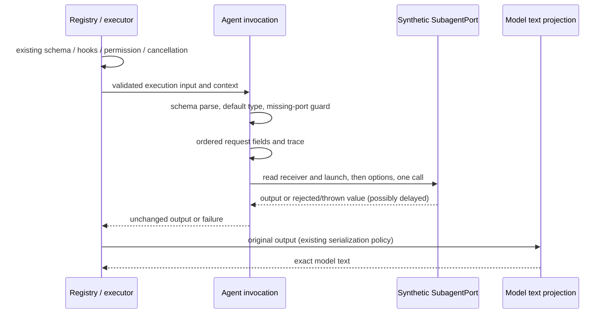

# Agent and Task entrypoint compatibility

## Scope and source facts

This source-exposed rewrite is limited to `tool/handlers/agent.ts`, private Agent
invocation/projection helpers, and named synthetic tests and evidence. Baseline is
`13f1401f79b65aee7de12f3ba982e89ce3673d07` on the fixed CLI lane. The handler's
local lineage reaches snapshot `7619e41`; no later implementation replacement is
recorded. Its raw and LF-normalized SHA256 is
`d4f4f62adc998fdd38d449e38f09b4d4ff7cb68592c91cdf3d353fe261e81f3f`.
The upstream manifest names ZCode commit `872ad960de7ec172591f7e1952f7849229f94521`,
path `apps/zcode-cli/packages/core/src/tool/handlers/agent.ts`, blob
`1261884c65ce46529504704c8a54cc4d7ff77bed`, SHA256
`e29decfaf6c16083368850f8e7f2285c821dd3c6b53b0cf1f5816fbf6fdf3aac`.
Those are manifest facts, not a fresh publisher-byte verification in this lane.
Descriptions, schema declarations, permission and cancellation prose remain
inherited. Existing attribution and the 27 material obligations remain; no
clean-room, whole-file originality or final MIT determination is made.

## One owner and explicit boundaries

The private Agent invocation owns one validation/admission/launch path. Ordered
request projection encodes the existing SubagentPort contract without retaining
runtime task state. Output projection owns only model text assembly. Neither
helper owns children, permissions, approvals, retries, caches, background files,
notification claims, cancellation controllers or profiles. The existing runtime
and executor keep those responsibilities. Helpers import contracts and tool
types, never runtime implementation; the declaration entrypoint imports helpers.

## Frozen behavioral boundary

Implementation decision: `agent-invocation.ts` is the sole launch owner;
`agent-request.ts` encodes parent, workspace and trace context through ordered
field tables rather than repeating context object literals. It produces only one
request frame and keeps no accepted state. `agent-projection.ts` renders one
ordered text sequence using content and usage row iteration. It does not mirror
task state. The declaration entrypoint retains description/profile factories and
public metadata. Required native method-call and guard expressions may remain
where the frozen error text and evaluation order constrain their spelling; this
is a bounded structural rewrite, not a whole-file originality determination.

- `Agent` and `Task` share handler, formatter, input/runtime schemas, permission,
  result budget and cancellation policy by identity. Task's separate metadata
  names it `Task`, hides it from providers and embeds the exact Agent description.
  Factory results are new entries/metadata with the original shared declarations.
- Built-in registration requires `includeAgent: true` for both names; allowed and
  disallowed rules still apply. Dynamic workflow gating uses the registration
  gate. Embedded search and normalized profile descriptions use the existing
  profile formatter unchanged. Static description, factory defaults, explicit
  false, custom and overridden profiles, tool filters and errors are frozen.
- Input parse precedes all context reads; unknown input keys are stripped. Default
  type is `general-purpose` only when `subagent_type` is undefined. Empty strings
  remain allowed. Missing ports produce the original ConfigurationError, code,
  recoverability and `toolName: Agent` even for Task. Native malformed-port and
  getter errors remain observable, including their ordering.
- Required request field insertion/read order is sessionId, turnId,
  parentToolCallId, agentType, description, prompt, callerCanReadOutputFile,
  workingDirectory, workspaceRoot, trace, runInBackground. Trace reads traceId,
  spanId, parentSpanId, sessionId and turnId separately. Caller visibility is an
  exact `Read` or `Bash` match in a Set, with no lowercase/alias broadening.
- The missing-port guard reads subagentPort once; the eventual method receiver
  reads it again after request projection. Launch getter evaluation precedes
  abortSignal and conditional model/override reads. A truthy model and override
  are each read twice; falsy values are omitted. signal is always an own field,
  even undefined. Launch has its port receiver, one call and exact argument keys.
  No run/start fallback, extra abort precheck, validation, wrapping or retry is
  introduced. AbortSignal, model, override and output references are preserved.
- Foreground/background results pass through unchanged. Output formatting first
  uses AgentOutputSchema.safeParse; invalid output uses the exact string/JSON/
  String fallback and retains serialization exceptions. Valid foreground text
  joins all text blocks, checks trimmed emptiness without trimming actual text,
  and appends continuation and ordered usage lines. Background read visibility
  chooses the original two prose sequences. Public JSON schema versus strict
  runtime output schema differences remain unchanged.
- Executor policy, hooks, approval and permission interactions, result display,
  output validation, background tracking, cancellation and trace generation remain
  upstream consumers. Tests exercise these with synthetic ports and snapshots;
  they do not run children, emit external notifications, write output files,
  perform model requests or inspect user state.

## Freeze and verification

Before production edits, explicitly capture direct input/port failures, getter
faults and read order, formatting/fallback/errors, declarations, factory identity,
description/profile matrices, registry contracts and real executor observations.
Capture source and built `dist` observations separately and compare byte-for-byte.
Final tests only read the committed golden file. Test-only
`KNORVIA_AGENT_TOOL_TEST_EMITTED=1` selects actual emitted handler, registry,
executor and permission consumers; absent/other values select source. Before
import, each selected emitted JS file is read, so missing dist is an error rather
than tsx source fallback. This variable has no product effect or configuration
precedence. Test fixtures use fixed clocks and explicit synthetic approvals.

Acceptance additionally covers retained reference/own-key identity, aliases and
hook compatibility, malformed input before a throwing port getter, changing
getters, rejected/non-Error ports, delayed completions, abort propagation and
executor cancellation without a real launch. Final source and emitted tests,
root/CLI types and configured lint, strict owned lint, format, architecture,
actual CLI build and full regression run on final corrected files. Existing
unowned failures and native Windows/macOS/packaged acceptance gaps are reported;
timeouts, permissions, schemas and guards must not be relaxed.
