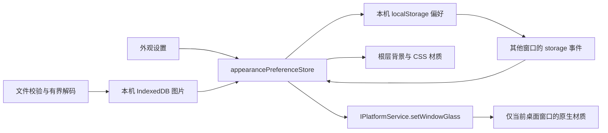

# 玻璃效果与背景图片

## 产品规则

- 在既有“外观”页加入两张紧凑设置卡，不增加导航。玻璃与背景图片分别开关，初始均关闭，保留当前白色初始主题。
- 玻璃提供实时预览、透明度（0–85%，默认 62）与阅读区域底色（65–100%，默认 86）。透明度越高，背后画面越明显；底色越高，输入框、卡片和菜单越实。重置只恢复玻璃的两个参数，关闭开关仍保留参数。
- 背景支持本机 JPG、PNG、WebP，单张上限 20 MB，可上传或拖入、替换、移除、单独关闭。上传后默认启用背景；切页、切项目和重启保留。图片不进入聊天、不上传到服务器或模型。为了避免大图持续占显存，解码后最长边缩到 2560，像素数上限 4800 万。
- 背景图片在应用根层铺满，玻璃开启时轻微模糊。没有背景图片时，支持的桌面系统使用原生磨砂；浏览器与不支持的系统使用本地半透明样式与稳定底色，明确提示原生效果不可用。系统减少透明度、高对比度偏好优先，保留不透明阅读面。
- 深浅主题均使用原有字体、间距和圆角。不降低整窗 opacity，不模糊文字或工具内容。切页不重新读图，关闭图片后释放显示资源。

## 状态与边界

- 偏好的唯一写入者为 appearancePreferenceStore；设置页只发动作。它是此设备的显示偏好，不属于远端项目或 Host，不跨 SSH 传播。Web 手机各自保存自己的显示偏好。
- 图片先校验并持久化成功，再提交引用。失败保持旧图片与旧偏好。快速替换/移除使用请求代次拒收旧结果，读取完成也必须匹配当前图片 ID。旧对象 URL 在替换、关闭或移除时释放。
- 图片字节不放 localStorage；保存失败、存储配额不足、图片不可用都明确显示，不假称已保存。背景只保留当前图片，替换与移除清理原图记录。
- Main 仅管理当前窗口的 Acrylic / vibrancy，不持有业务或外观偏好。IPC 校验布尔参数与窗口来源；不支持时返回 false。桌面接口为 optional，旧宿主和 Web 可正常降级。

## 验收

### 首页与设置容器统一（2026-09-24）

- 首页侧栏与设置导航保持平整、无外框投影；顶部导航浮层和拖拽分隔条都是布局辅助元素，不参与纸片阴影。仅实际内容面板承载一层纸片边缘。
- 玻璃与背景图模式下，阅读底色由 conversation/settings frame 唯一拥有；内部 main 和外部内核聊天容器透明，不能再叠加实心背景造成白色矩形或上下接缝。
- 单聊/群聊切换和内核选择在侧栏中与设置导航共用平整的底面：切换项直接落在侧栏上，只有当前项使用纸片选中态；内核选择是一行透明菜单触发器，不再叠加一整块灰色槽和白色输入框。
- 外部内核聊天根容器不再铺 `bg-background`：不论玻璃是否开启，聊天阅读底色只由父级 conversation frame 提供，避免外部内核页独自变成实心白块，与上下透明区域形成色带。
- 保留现有黑白 token、按钮形状、选中纸片、文字对比和布局。验证内置/外部内核首页、设置、深浅主题及玻璃开关。

1. 初始关闭、参数边界、关闭后保留、仅重置玻璃参数、图片上传失败保留旧图、快速替换/删除不复活旧图的离线回归。
2. 深色实机验证开关、滑块、预览、上传、替换/移除、切页与重启；验证旧聊天与设置阅读区域保持清楚。无模型调用。
3. typecheck、lint、架构、桌面构建通过。原地更新桌面同一便携目录，复制前后数据哈希一致。
