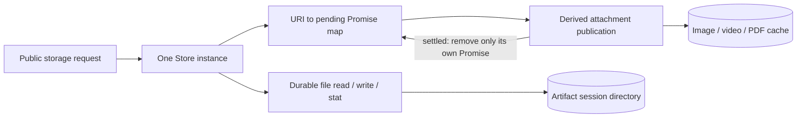

<!-- SPDX-License-Identifier: MIT; Copyright (c) 2026 Knorvia Studio contributors -->

# Tool artifact and derived attachment storage — approved contract

2026-09-29. Root read the current storage entry, public artifact port, shared URI helper, existing artifact test, core media projection and bootstrap prompt attachment callers. This is the approved behavior contract for an isolated independent candidate; root alone performs old-first acceptance and any later production integration. The existing implementation is 18 KB and combines the public barrel, persistent artifact files, media cache and format policy. No UI change or real user data access is part of this batch.

## Public ownership

Keep `NodeToolArtifactStoreOptions` with required `imageCacheRootDir`, `rootDir`, `videoCacheRootDir`, optional `pdfCacheRootDir`. Constructor captures supplied roots; missing/null pdf root defaults to join(dirname(rootDir), "pdf-cache"). Retain `NodeToolArtifactStore` and `createNodeToolArtifactStore(options): ToolArtifactStorePort`, which returns a new class instance. Keep existing session-store and workspace-hook public re-exports and the contracts InMemorySessionEventStore/createInMemorySessionEventStore/options re-export unchanged. Their implementation and license are outside this replacement.

Eight public instance methods: text write, binary write, text/base64 read, binary read, stat, image prime, media prime, media ensure. Standard public request/result types remain in contracts, unmodified. `turnId`, `toolName`, `retention`, `trace` are not used by this adapter. State is disk plus an instance-local Map of URI to in-flight Promise; no permanent in-memory file records. Constructor does not perform IO. No new environment variable, injected port or storage schema.

The Store owns only pending media work. The filesystem remains the persistent owner; completed Promises are not a metadata database. Session-store, hook-trust and contracts re-exports retain their existing separate owners.

## Durable text and binary artifacts

Both writes return a Promise. Before any allocation or IO, a provided already-aborted signal rejects with its Error reason by identity; non-Error reasons use respectively `Tool artifact write cancelled` and `Tool binary artifact write cancelled`. They do not observe later aborts, pass a signal to filesystem operations, or roll back on late cancellation.

ID format `tool-result-<UUID>` using global crypto.randomUUID. The session directory is root plus sanitized sessionId; file name is sanitized String(toolCallId), dash, ID, chosen extension. Existing sanitation replaces every non-ASCII-letter/digit/dot/underscore/dash character with underscore, truncates to120 characters, and uses `unknown` for an empty result. See approved dot-segment repair below. Text type defaults nullishly to application/json; otherwise return the original declared contentType unchanged. Binary type is required and also returned unchanged. A fresh Date is created for createdAt after the successful write. URI is made through the retained shared createArtifactUri public helper. Byte counts use UTF8 for text and copied Buffer length for binary.

Text extension policy trims/lowercases the part before the first semicolon: plain txt, markdown md, JSON json, png png, jpeg/jpg jpg, gif gif, webp webp, PDF pdf; any other type -> json. Binary default uses that result except a json result becomes bin if the _whole original contentType lowercased_ lacks the substring `json`. Explicit binary extension is nullish-preferred; add a leading dot if absent, remove nonalphanumeric/non-dot characters, truncate16, lowercase, accept only one leading dot plus one-or-more alphanumerics, otherwise bin.

Gate mkdir fault on the session directory, await recursive mkdir, gate writeFile fault on final path, then await writeFile. Text uses utf8 and binary copies request.content into a Buffer before the first await. Durable files are written directly, not via temp; no new atomic guarantee in the current behavior. Use the approved coherent request snapshot below. Its intentionally changed mutation behavior must be disclosed, not claimed identical.

## Read and stat

Read and binary-read pre-abort use `Tool artifact read cancelled`; stat uses `Tool artifact stat cancelled`; Error reasons pass by identity and only preflight cancellation is checked. URI parsing uses standard new URL. URL creation failure is wrapped `Invalid tool artifact URI: <uri>` with the native Error as cause. Unsupported protocol has `Unsupported tool artifact URI: <uri>`. Decode the hostname as sessionId, strip leading slashes from pathname and decode remainder as artifactId; either empty -> Invalid message without added cause. Malformed percent decoding stays native URIError. The retained shared URI helper accepts a historical scheme which the current storage parser accidentally rejects; approved repair below.

List the sanitized session directory, select the first entry in returned order whose filename _includes_ the artifactId, without exact-ID parsing or regular-file filtering. None -> `Tool artifact not found: <uri>`. Read uses readFile; stat uses stat; native IO errors retain identity. Return caller's original URI. Text-like inferred types (application/json or startsWith text/) decode UTF8; all others encode base64. Binary read returns new Uint8Array(raw bytes) without textual round trip. Read byte count is raw length; stat size/mtimeMs are the native stat observations.

Read type inference is filename suffix, lowercased: txt plain, md markdown, png image/png, jpg/jpeg image/jpeg, gif image/gif, webp image/webp, pdf application/pdf, bin octet-stream, html/htm text/html, csv text/csv, svg image/svg+xml, json application/json; all other suffixes octet-stream. SVG consequently reads as base64. MIME from write is not persistently recorded and may differ from inferred read MIME; do not silently change the on-disk layout to preserve it.

## Derived attachment cache

Image-prime delegates to media-prime. Prime and ensure return the exact instance singleflight Promise for the same URI, including different requested MIME/bytes while the first operation is in flight. Subsequent calls must not inspect or copy losing bytes before returning the existing flight. Only pending flights are retained, and success/rejection clears the same Promise ownership. Different URI/instance work is independent. These public methods are not all async wrappers; invalid bytes can throw synchronously when prime starts a flight. Do not add a Promise wrapper that breaks identity or error timing.

For materialization derive path only after parsing URI, even for an unsupported MIME. MIME normalization is first semicolon part, trimmed/lowercase. Kind: startsWith image/ => image, startsWith video/ => video, exact application/pdf => pdf; otherwise unsupported. Supported extension map: png; jpeg/jpg -> jpg; gif; webp; mp4; quicktime -> mov; webm; x-matroska -> mkv; x-m4v -> m4v; x-msvideo -> avi; pdf. Unsupported kind or extension returns `{status:"unsupported"}` without filesystem writes. Choose the corresponding cache root, sanitized session directory, and filename `<kind>-<first32 lowercase hex of SHA256(original complete URI)><extension>`. URI spelling/query/fragment therefore affect the cache name even when durable lookup selects the same file.

stat isFile true returns ready without rewriting or content validation. Only a stat error with code ENOENT means missing; other errors propagate. Directory at the path is not a regular file, so later operations proceed and may fail natively. Prime copies supplied bytes for a newly started flight and publishes them; it does not validate image/video/PDF signatures or non-empty content. Unsupported MIME still reaches the byte-copy expression on prime's newly started path before the async materializer result.

Ensure derives the requested cache path, returns unsupported/ready when applicable, otherwise calls this instance's public text/base64 read method with the URI. It then parses a data URL: data: prefix case-insensitive; comma required; first header field trimmed MIME must have the expected kind; final semicolon field trimmed/lowercase must be base64 (other middle parameters permitted). Failure: `Media attachment artifact is not a base64 <kind> data URL: <uri>`. Decode using native lenient Buffer base64; zero bytes -> `Media attachment artifact is empty: <uri>`. PDF ensure additionally requires first five bytes `%PDF-`; failure `Media attachment artifact is not a PDF: <uri>`. Derived output uses _decoded_ MIME, which may have another supported extension within the same kind; no persistent mapping is introduced. Existing ready cache bypasses data URL/PDF validation.

Publication: compute path, skip if existing regular file, allocate temp as `<path>.tmp-<node:crypto randomUUID>`, gate mkdir and await recursive mkdir outside write catch, then inside catch-protected block gate temporary writeFile, write bytes, gate final rename, rename temp to final. Failure attempts unlink(temp) ignoring cleanup errors, then rethrows primary. No fsync, exclusive creation, retry or lock across instances currently exists. Do not claim crash durability or cross-instance serialization. Root may propose a later owned-temp repair only after an actual reproducer, not from static suspicion alone.

## Approved narrow corrections already reproduced on old public API

1. Historical artifact URI: shared helper and callers accept `zcode-artifact://...`, but old storage rejects it due to a duplicated current-scheme check. Root wrote a synthetic ordinary artifact then substituted only its URI scheme; the old public read rejected `Unsupported tool artifact URI`. Accept the retained historical scheme for reads/stat/derived reconstruction; new writes remain current scheme. This is data compatibility, not a dependency on old execution code or new product branding.
2. Dot session component: root wrote a synthetic sessionId `..`; the resulting file escaped the configured artifacts root into the parent, entirely inside the task-owned fixture. Reject a sanitized session component that denotes `.` or `..` before relevant IO, using the exact plain Error and ordering specified below. Apply consistently to durable write/read/stat and derived paths. Preserve ordinary sanitation and existing non-dot session data. This is lexical containment only; it does not by itself solve symlink/junction or all Windows aliasing attacks. Do not call it a complete OS sandbox or assert every application caller exposes the bad ID.

Public signatures and retained-dependency declarations accompany this contract. Do not inspect inherited bodies or validation code.

# Final behavioral clarifications for artifact replacement

2026-09-29. These clarifications are part of this approved contract and resolve the five design questions. Root retains the earlier draft and native observations separately.

## Third narrowly approved repair: coherent durable request snapshot

Root executed two additional native owned-file scenarios. It called text or binary write with a plain valid request, mutated that request immediately after obtaining the Promise while mkdir was awaiting, then observed final disk bytes, returned metadata and public readback. Old text stored after-mutation content in the original session/call path while its returned URI named the later session. Old binary preserved its initial copied bytes and filename but returned the later session URI and later MIME. Both returned URIs failed readback with ENOENT. This proves the public-store failure under caller mutation, not that current app callers necessarily mutate requests.

Approve capturing every used durable request field before the first await, and consistently using that captured value in paths, writes, bytes, MIME and returned URI. No deep clone of unused trace/retention/turn/toolName is needed. Text content is a string snapshot; binary content is a copied Buffer. Ordinary immutable-request behavior remains unchanged. Subsequent request mutation is intentionally changed so it cannot produce an unusable receipt. New tests must retain the old failure rather than disguise this as parity.

Preflight abort remains the first action. Preserve global crypto UUID allocation before extension/path construction. After allocation, capture sessionId, String(toolCallId), text content and nullish-defaulted contentType, or binary contentType/extension. Construct/validate session and output path before binary Buffer copy, then perform the existing fault gates and IO. It is not necessary to reproduce getter/proxy/global-monkeypatch side effects outside the plain public request domain. Capture those ordinary values once before awaits; no new runtime schema validation beyond the approved path guard. createdAt remains a fresh Date only after successful final write.

## Dot-session guard

Use a plain Error, no new cause, message exactly `Invalid tool artifact session path: <original sessionId>` when the existing sanitation result is exactly `.` or `..`. Do not reject other strings or add new reserved-name handling in this batch. Empty sanitized result retains existing `unknown`; all other sanitation retains its original replacement/truncation behavior. This is a narrow lexical guard, not a symlink/junction/device sandbox.

Durable writes: abort check first, then UUID and capture/extension work as above, then guard before mkdir/write fault ports and IO. Reads/stat: abort first, then URL/protocol/decode/nonempty validation, then sanitation guard before readdir. Derived path: parse URI and guard the sanitized session component before MIME kind/extension eligibility or filesystem stat. Consequently invalid/dot URI rejection is not hidden by unsupported MIME.

## Promise and expression boundaries

Prime and ensure check the existing URI flight first. A hit returns the exact Promise immediately and does not copy bytes or inspect MIME, parse URI or perform IO. On a new prime flight, Buffer.from(bytes) runs in the synchronous materialize callback before entering the async publishing operation. Invalid byte input can therefore throw synchronously, even with an invalid URI or unsupported MIME. URI parsing and dot-session guard happen within the async materializer, so those failures reject its Promise. A failed first Promise remains shareable until finally removes that same flight. Preserve image-prime delegation without wrapping it in async.

Ensure's materializer callback is async: URI/guard/unsupported/path errors and a synchronously throwing override of the instance's public text read method all become Promise rejection. Resolve the public read method at call time on the instance, not once in the constructor or a captured prototype binding. New wrappers must not hide an override or change flight Promise identity.

## Exact ensure validation order

First derive and guard the requested MIME path. Unsupported requested MIME returns unsupported before any read or decode, except URI/guard errors already described. A regular file at this first requested path returns ready immediately and bypasses all backing data checks.

When this requested path is absent/nonregular: call current public text read; validate data URL header and same expected kind; decode with native Buffer base64; reject empty bytes; if decoded kind is PDF, validate the five-byte signature; only then enter async publication for decoded MIME. Publication again derives/guards a path, then returns unsupported for a same-kind but unsupported subtype, or ready for its existing regular file. It cannot skip the preceding header/empty/PDF checks merely because the eventual decoded path already exists. Thus requested PNG with nonempty image/unknown data URL -> unsupported, whereas its empty payload -> empty error first. Parsed decoded mediaType stays the trimmed first header value.

## Native error filtering

The regular-file check's catch examines `.code` directly, without requiring Error instanceof. Any rejection value with code ENOENT counts as absent; a string/number/non-null value without that code is rethrown unchanged. Accessing code on null/undefined follows normal JS property-access TypeError. Do not replace this with a narrower Error-only test. Filesystem work remains on Node promises and task validation must use only owned fixture directories.

## Non-goals and remaining handoff

No new temp-file ownership repair, fsync, exclusive creation, rename retry, cross-instance locking, cache schema or late-abort behavior is authorized by this batch. Root will separately provide exact public/dependency declaration inputs without inherited implementation. The candidate may use at most four cohesive modules, retaining the original public barrel and exact re-exports. Implementation may begin only within the isolated directory authorized by root; no main-repository writes.

# Artifact storage acceptance addendum

2026-09-29. Supplement to the frozen approved behavior contract, before production integration.

## Exact current URI spelling

The new-write URI protocol is exactly `knorvia-artifact:`. The historical read/stat/materialization protocol is exactly `zcode-artifact:`. This confirms the value in root's earlier author message; it does not authorize any retained helper body as author input.

## Fourth approved correction: read and ensure request coherence

After the first 136 owned-file old-implementation tests, root extended native acceptance to read/stat receipts and ensure singleflight. In all three lookup methods, a plain request initially named one actual persisted artifact and was mutated to name a second actual persisted artifact immediately after the public call. Old text-read, binary-read and stat returned the first artifact's path/bytes/metadata while their receipt URI named the second artifact. An ensure request initially naming a PNG data URL was then mutated to name a separately stored MP4 data URL; a second caller joining the first URI received the same pending Promise, but the old Promise resolved to the second URI's MP4 bytes/path. These four tests all actually failed the desired coherent result on the frozen old implementation. This demonstrates the public storage boundary behavior, not that existing application callers mutate requests.

Approve capturing each lookup request's URI before its first await and using it consistently for both disk location and the returned receipt. Approve capturing ensure URI and requested MIME for the newly started flight, and using these captures throughout the materialization and data-URL validation. Existing flight hits must still return the exact pending Promise without inspecting losing MIME/bytes. Preserve preflight abort priority, lazy public instance read-method dispatch, native errors, initial ready-cache bypass, decoded-MIME policy and all other original contract behavior. These are intentional repairs, not claims of old mutation parity.

## Unknown MIME and dot-prefixed filename compatibility

All MIME values outside the declared extension table are unknown even if their names coincide with JavaScript Object prototype keys, including `constructor` and `__proto__`. The original contract's text fallback remains `.json`; binary fallback remains `.bin` unless the full lowercased declared MIME contains `json`. File type inference is based on the literal filename suffix, including filenames such as `.txt`, `.json` and `.svg` found by the public substring lookup. Do not introduce a Node extname-only exception for these existing directory entries. Root's expanded old suite passed these cases; these clarify unchanged behavior, not new functionality.

## Evidence and limits

Frozen old target source SHA-256: `bd1e2162914c88d572556a73da9a0dbb57768547b49a0738206916b7aae8e250`.
Old first suite: 136 cases, 118 passed, 18 failed; old expanded first suite: 143 cases, 121 passed, 22 failed, no skipped/cancelled cases. The 22 failures cover the four approved correction families; format/type harness issues are separately recorded and are not product failures. All files were synthetic, inside checked task-owned temporary roots. No real application data, models, credentials or production servers were used.
