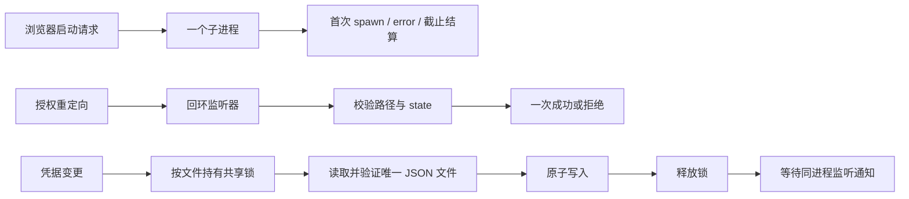

<!-- SPDX-License-Identifier: MIT; Copyright (c) 2026 Knorvia Studio contributors -->

# 认证适配器独立实现

保留 `@knorvia/adapters/auth` 和根入口的五个公开模块：浏览器启动、凭据加密、回环授权回调、共享凭据存储及导出入口。新实现根据先行公开契约和声明编写；共享文件锁、原子私密文件写入、操作系统与 Node 加密接口继续作为外部依赖。此边界不引入产品账号、登录页或新的持久格式。

## 兼容规则

- 浏览器启动按系统选择 `open`、`cmd.exe` 或 `xdg-open`，参数和隐藏窗口规则保持；第一次 spawn、error 或截止结算拥有定时器及监听器清理。默认一秒截止只表示启动已受理；不保证浏览器已经呈现页面，不杀死已启动子进程。
- 凭据密钥在构造时确定：优先使用去除首尾空白后的显式环境密钥；否则按既有前缀和分隔符组合 OS 端口的 platform、home、username，再以 UTF-8 SHA-256 生成密钥。显式空环境不合并进程环境，用户名查询失败才使用既有 unknown 标记。
- 密文继续使用 `enc:v1:`、AES-256-GCM、12 字节 IV、16 字节认证标签及三个 base64url 段。非前缀值原样读取。格式、IV、标签、认证失败分别保留既有错误语义，认证失败保留原始 cause。空文本加密后不能通过解密格式校验的既有限制仍明确保留；存储入口拒绝空值。
- OAuth 只监听 `127.0.0.1` 的临时端口。错误路径和不匹配 state 返回失败响应但不消费待完成回调；匹配后只结算一次。`authCode` 的 nullish 优先级、OAuth 错误属性、固定正文和 URL 解析规则保持。调用者负责授权截止与显式关闭，适配器不添加另一层重试或授权时限。
- 凭据文件仍为所选基目录下的 `.knorvia-studio/v2/credentials.json`。显式 filePath、基目录和环境优先级、仅 `~` 与 `~/` 展开规则保持。没有旧品牌路径回退或自动迁移。
- 文件中每个值必须是字符串。损坏数据做尽力保留后报错，绝不将损坏文件视为空记录覆盖。同步读取继续把文件、解析、验证和解密失败降为 undefined；非空读取值保留原空白。
- 所有非短路变更在同一文件锁内完成读、比较、修改与私密原子写入。条件删除不得删除较新一代凭据；批量变更不可部分提交。监听器按规范化文件路径归组，在成功写入并释放锁后并发通知，等待全部完成，隔离单个通知失败。

## 验收和永久回归

公开合同包含 30 个原始场景和十个补充观察，归入固定的 30 个执行用例。独立旧版源码及旧版编译产物各通过 30/30 后，候选按相同冻结用例验收；没有旧版或候选失败豁免。所有首败与修订原因保留在验收记录中。

永久测试分别绑定当前源码和真实 CLI 编译产物。构建缺失直接失败，不能回退到源码。每个用例使用隔离的临时目录、最小环境、受控 HTTP/OS 端口与浏览器子进程；不读取真实用户凭据、不启动浏览器、不监听真实端口、不联网推理。实际入图文件及声明输入记录摘要，拒绝其他产品实现或未申明依赖混入。

严格类型探针比较真实 auth 声明与保留的兼容声明，并检查真实根入口中的 auth 再导出；仅为这一个有限探针隔离其他根导出，完整 CLI 类型检查另行覆盖整个包。保留声明沿用 Apache-2.0 来源，不计为新 MIT 实现。永久运行不需要重新装入旧源码；历史旧版通过记录属于来源证据，不能伪造成当前测试步骤。

每次切换执行根与 CLI 类型/lint、架构、CLI 构建、source/dist 认证回归和整仓离线回归。真实浏览器、外部 OAuth 服务及在线凭据服务未调用时明确列为未验证。加载器是测试控制，并非操作系统沙箱。
