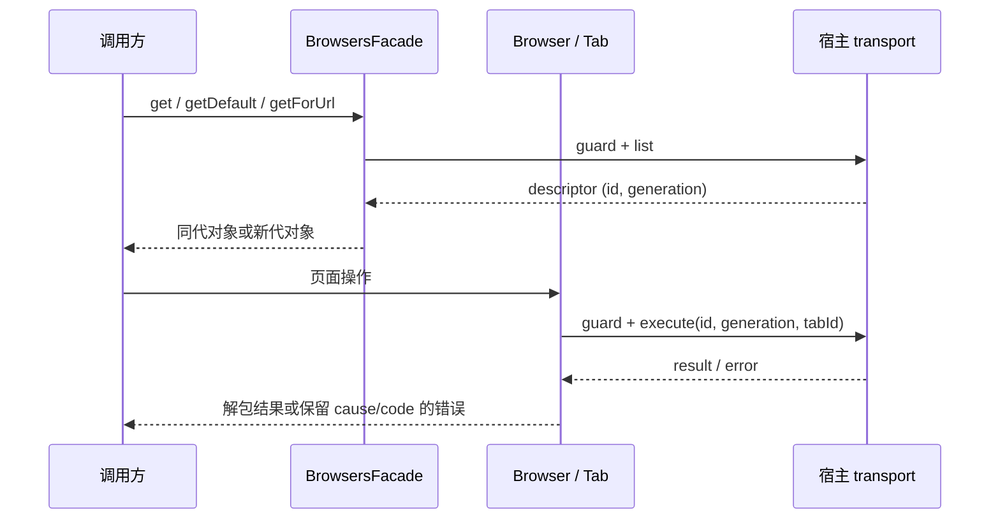

# 浏览器对象与标签页独立实现

替换 core/browser-client/facade.ts 的实现正文，保留它作为公开兼容入口。使用现有 BrowserControlPort 命令与 backend descriptor，不新建浏览器、连接、权限系统或 UI。代码按命令构造、能力、对话框/录制、Tab、列表与 Browser/registry 分开；每个源文件保持小于 400 行。

## 状态与调用边界

- BrowsersFacade 只拥有按连接 id 和 generation 区分的 Browser 对象缓存。每次发现读取 transport.list 并执行可用性 guard；同一代连接保留 Browser 身份并更新元数据/策略，换代创建新对象。旧 Tab 仍携带原连接代际，由宿主拒绝过期请求，不静默重绑定到另一代连接。
- Browser 保存当前 descriptor 和对应 API policy。每条 execute 都先执行 guard，并发送精确 id/generation。策略隐藏明确不支持的成员；Browser/Tab 保留已发布的兼容入口，不能把 raw、navigate 或旧别名当成新增接口删除。Browsers 命名空间及 Playwright 默认视图只显示已声明成员。描述、能力和策略可更新，用户操作仍须经过宿主授权。
- Tab 拥有固定 tabId、命令作用域与最近一次明确观察的 viewport。缺省 id 保持空字符串兼容；未绑定 tabId 的命令仍作用于宿主会话默认页。RawTab 只构造命令并原样返回结果；Tab 的高级方法检查成功状态并解包所需字段。
- viewport 初始化来自绑定摘要；setViewportSize 成功后保存已接受尺寸，getState 与普通导航回执不推定尺寸改变。getter 返回副本。设置只接受契约的整数范围，不截断、钳位或在失败时伪装成功。
- 并发、取消、重试、超时、实际浏览器所有权继续由 transport/宿主负责。SDK 不另建任务队列、自动重放命令或保存业务会话。

## 功能契约

RawTab 保留导航、前后退、重载、状态、截图、snapshot、点击/双击、输入、按键、滚动、hover、选择、check、drag、关闭、elementInfo、evaluate、对话框命令。字符串目标对应 ref，坐标目标保持 Point；额外选项按既有优先级覆盖目标选项。函数 evaluate 转成无参立即调用表达式，字符串原样传递。RawTab 返回失败结果；高级 Tab 抛 BrowserCommandError。

Tab 同时保留已独立实现的 Playwright 客户端、录制、能力、CUA 和 DOM CUA 视图。CUA 鼠标编号为 1/2/3，分别左/中/右；只识别契约定义的精确 modifier 名称，键盘序列原样转交。坐标 downloadMedia / DOM downloadMedia 的现有动作仍是点击，不能在迁移中宣称其已经具备额外媒体下载能力。Dialog 按 alert/confirm/prompt/beforeunload 返回相应操作，未出现对话框时不创建对象。

录制 start/status/cancel 解包 recording，id 缺失本地失败。能力 list 返回描述副本，get 只返回当前声明的能力；visibility 的 get 要求布尔回执，set 发送布尔状态，能力文档按 id 查询。无 transport 的通用 capability 只提供文档，不伪造 visibility 方法。

Tabs.selected 选择 active，否则最后一个；空列表返回 undefined。Tabs.get 先确认列表包含 id，再激活并采用宿主返回的摘要。new 与 reuse 都使用实际回执构造 Tab；reuse 复用已独立实现的 URL 选择器。list 的 id 来自 tabId，false active 不作为可选字段输出。finalize 保留 handoff/deliverable，用户页 claim 使用宿主回执。历史查询当前仍是未实现错误，不能补造历史结果。

registry.list 隐去内部 generation；get 支持精确 id 或 backend type，不提供虚构 default id。getForUrl 读取可用后端的标签页后按既有选择规则选择，单个标签列表失败不阻断其他候选。open 使用默认后端；有 URL 时默认尝试复用，复用失败可退到 newTab，导航错误必须传播。current 取已选择标签，没有则新建。旧 tab(id) 构造时启动一次默认 Browser 查询，后续操作共用这次查询结果。

## 验收

先在旧 facade 上运行协议、payload、错误、能力、页面作用域、viewport、对象代际、tab 复用和失败回退契约测试，再接入独立模块。旧源码仅在仓库外作为只读执行参照，不把实现正文移进新模块。API 名称和类型是兼容边界，公开文档、接口目录和实现方法需一致。

验证当前方法映射和输入失败行为、完整 CLI 构建、真实 plugin bundle 的模拟宿主链路、根/CLI 类型与 lint、架构、格式、来源清单和完整离线回归。测试不联网操作真实浏览器、不调用模型、不覆盖用户数据。记录已接触源代码的事实，不以“零接触 clean-room”描述本次迁移。根许可证及未替换文件许可保持原范围。
