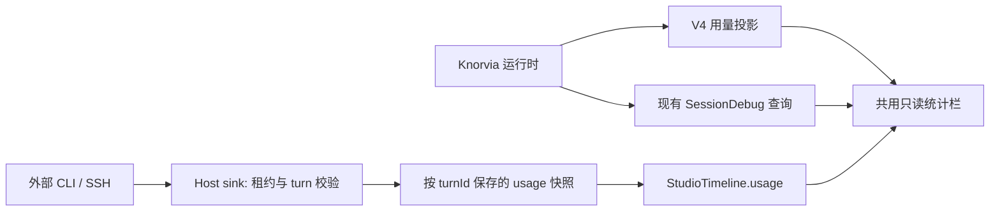

# 聊天底部统计

## 产品规则

- Knorvia 与外部 CLI 单聊共用紧凑统计栏，放在输入卡下方，使用 text-ui-sm、弱文字色和小图标，窄窗口允许按组换行。无对话时不显示。
- 显示对话轮次、当前轮模型步数、最近一次生成速度、Token 用量、缓存命中率和当前上下文百分比。悬浮/键盘焦点解释统计范围；输入/输出 Token 明细不挤占主界面。
- 原生 Knorvia 累计 Token 来自 snapshot.usage；速度复用 session debug 的同源 outputTokens / 首内容到请求结束时长，不用工具运行、网络首包或等待用户的耗时冒充生成速度。
- 外部 CLI 用量按各协议明确的口径展示：Codex 最新模型请求；Claude 当前原生轮次；ACP 上报值。ACP used/size 仅用于上下文，不能加进计费用量。缓存未知不显示 0%，窗口未知不显示 0%。不通过字符数估算 Token。
- 模型步数只用原生报告；未知显示 —。Knorvia 可用本次运行的 requestIndex/请求记录；冷历史无遥测时不编造。分页后的轮次数只是已加载下界，显示 ≥，提示说明。
- 切会话/内核/远程 Host 后不得短暂串用旧统计。错误、取消、重开不清掉已知事实；没有本轮速度时显示 —，不沿用上一轮。

## 所有权和顺序

- 不增加 Renderer 计费累计器。外部用量事件以同 turnId 覆盖/合并已提供字段，重复通知不累加；非有限值和负数丢弃。timeline 仅投影最新执行 turn 的用量，携带 runId/turnId，防止任务排队、分页或重试后错配。
- 现有 useSessionDebug 增加非轮询读取模式：统计栏在会话用量/阶段改变后查询，未连接或草稿不查询；开发者面板保留原来的按完成节拍轮询。旧响应仍按 workspace identity、taskId、service 和 effect 生命周期拒收。
- Desktop 和手机读取同一个 Owner；本修改不改变 continuous / replayable 的事件顺序。新字段 optional，旧 Host/历史没有数据时显示未提供。
- 保留所有既有协议、插件改名与兼容读取成果；不引入额外导航。

## 验收

1. 0% 缓存和未知缓存分开；0/未知窗口、负数、NaN、超出窗口的占用、K/M 格式有确定表现。
2. 重复 usage、缺字段更新、ACP used/size、Claude 缓存输入归一化、Codex 最新请求统计有离线回归。
3. 原生/外部聊天底部采用同一组件；窄窗口和深色可读，切会话不闪旧数，键盘能读取说明。
4. typecheck、lint、架构检查通过；离线验证不消耗模型额度。重建并更新桌面同一个便携目录，保留 data。
