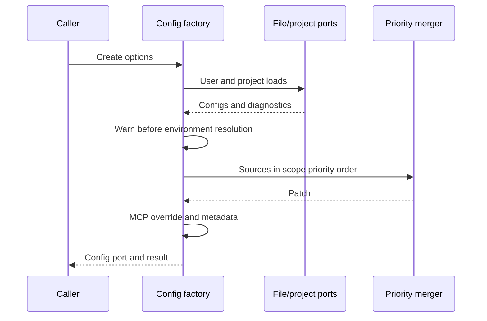

# CLI config behavior owners

Complete substantive owners: config-factory.ts, config-merger.ts, file-config.adapter.ts and project-config.adapter.ts. Retain schema, environment parsing and config-port facade. Public APIs, unknown JSON keys, original configuration/security policies and path discovery stay compatible.

The factory owns synchronous source composition and metadata. The merger owns pure priority reduction. The file adapter owns load/migration/atomic patch I/O. The project adapter owns discovery projection and blocked hook candidates. No new accepted state, cache, trust grant or alternate write route.

Patch order is resolve → read/parse → preserve keys → mkdir → serialize → temp write → rename. Write/rename failures clean up before wrapped errors; directory/serialization failures retain raw identity. Synchronous legacy migration is best effort and does not alter the parsed input passed to retained schema. Project hooks stay blocked and runtime-schema-validated; stdio cwd normalization adds no containment policy.

Minimum synthetic acceptance covers precedence/metadata/error order, ordinary versus plugin/hook merge semantics, key/alias preservation/no-op saves, virtual save errors, project path discovery and hook trust boundaries. All product filesystem/path/config/environment/logger/shared ports are injected; no actual HOME/config/credentials/writes/permissions. Scoped API/syntax/lint/format/architecture checks supplement them. No ordinary suites/build/native acceptance or licence decision. Whole drafts/access and retained expression matches remain frozen for parent classification; zero accepted independence/MIT credit.
