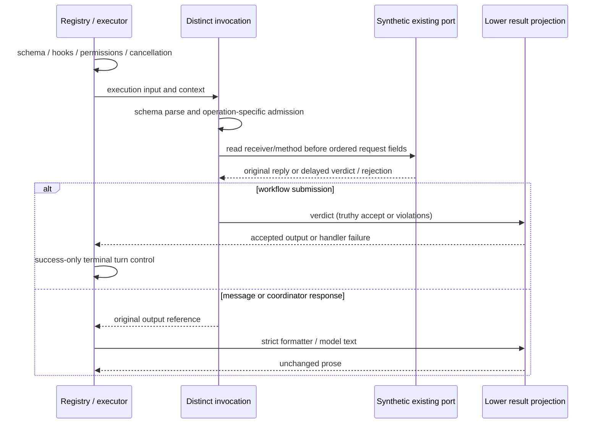

# Collaboration tool entrypoint compatibility

## Scope and lineage

Source-exposed rewrite of `send-message.ts`, `respond-to-coordinator.ts`,
`submit-result.ts` and narrowly named private request/invocation/result helpers.
Baseline: `8c669eb72b6a16afee0892dec76f5baccce0053f` on
`parallel/cli-tools-fast-20261001`. All three files have local path history only
at snapshot `7619e41` and are byte-identical at integrated head
`0d80f9ca37b1daef162ecc69bd18f6e8fc30a146` and the current baseline.

| Handler              | Baseline bytes / SHA256                                                   | Manifest publisher blob / SHA256                                                                                |
| -------------------- | ------------------------------------------------------------------------- | --------------------------------------------------------------------------------------------------------------- |
| SendMessage          | 5475 / `f407ee821862337208e0a61acb224f6a5d9dcf3a5188870804b0083446256bd0` | `02f56dffe79f4cacf3bf59f425dc00b76f53a447` / `cccd96d85ae883055a94b85773144718442fd0cd6a79e58a6b3cc00788fe10b8` |
| RespondToCoordinator | 4941 / `44c31bf7cfa9a1f571174d63d94ecd764bb260a974c8333131cd9a8160628557` | `bb60fa9fc02e57196e4aefb97be02d6a37c90357` / `3ea984153fb7bfa36e829896ab02ba7ce99164fc21c46a3a26de4fc636080a87` |
| submit_result        | 7991 / `4568a59234eb5c3b24cafcfcb4df5ebc78212d6e2e5719ff8316d22b7c0efbd8` | `e8979e4d0c244d1ef51b6b1ce4afd5101ac19614` / `d2a9ec6ed775f4a0681d43b371926a26a7efe89bfb732a01a79c5508ab31d8cf` |

Publisher paths are the corresponding `apps/zcode-cli/packages/core/src/tool/handlers/`
paths in pinned ZCode commit `872ad960de7ec172591f7e1952f7849229f94521`.
These are existing manifest facts; this lane has not freshly verified publisher
bytes for these paths. Source exposure, inherited declarations/prose and retained
expressions remain disclosed. Attribution and all 27 obligations remain; no
clean-room, whole-file originality or final MIT determination is made.

## Owners and meaningful structure

Each operation has one distinct invocation path. A shared private request codec
encodes ordered context fields and trace fallback; a lower result projector
handles model text and submission verdicts. It does not contain port effects.
Ordered context projection and explicit outcome selection replace repeated
request literals and intertwined result construction; mandatory native call,
guard and prose expressions remain where compatibility constrains their form.
Public declaration factories stay at their original entrypoints. No generic gate
substitutes for the three different admission rules.

Existing port closures own recipient/parent/actor/session routing, queues and
workflow verdict state. Executor owns permission, approval, cancellation, result
serialization and terminal turn control. Helpers add no queue, cache, retries,
persistence, notification or termination policy. They depend downward on tool
types and public contracts; SendMessage reuses the unchanged OffPeak guard.

## Frozen invariants

- All schema/declaration identities, public exports, metadata, description and
  permission/approval rules remain. The current provider-output declarations for
  SendMessage/RespondToCoordinator differ from runtime strict schemas; do not
  silently align them. Both remain nonterminal even when status is `failed`.
- SendMessage strictly parses input before OffPeak admission, then checks the
  optional subagent send method. Idle turns are denied with the existing hint,
  recoverability and code; ordinary automation turns are allowed. Method presence
  is truthiness, not a new function-type guard. Receiver/method are read again
  before request arguments. Parent/session/turn/to/summary/message/location/trace
  fields retain insertion and getter order; signal is an own option field even
  undefined. No model or override is forwarded; foreground/background delivery
  and recipient identity remain owned by the existing port.
- RespondToCoordinator parses input first. Scope must be exactly `subagent`;
  failing scope short-circuits the port read. Port is required, read again for
  the bound synchronous respond call, and receives only childToolCallId, summary,
  message and trace. It receives no signal/model/recipient routing options. Async
  malformed port replies retain existing async handler adoption. Error prose and
  continuation ordering, including before arbitrarily long failures, remain.
- submit_result parses generic input, then gates only on workflowSubmitPort
  presence; runtimeScope is not read. Workflow actors can be main. Call has one
  request argument (toolCallId, original result reference, trace), no signal or
  routing options. Wait for verdict; truthy `accept` returns exactly
  `{ status: "accepted" }`. Otherwise return the existing errorCode 1 handler
  failure with ordered violation text, including empty list, sparse/malformed
  lists and getter/native errors. Do not validate/coerce malformed verdicts into
  repaired policy. Reject never produces turn control; existing engine/session
  repair can submit again through a separate tool call.
- Trace prefers context.traceContext by reference with nullish semantics, including
  malformed nonnull values; fallback reads traceId/spanId/parentSpanId/sessionId/
  turnId in order. No trace, port or routing snapshots cache across calls.
- Generic and typed SubmitResult entries share handler/runtime schemas/formatter,
  while each factory creates fresh metadata/permission/budget objects. Generic
  input is the original shared schema with no own strict property; supplied schema
  (anything other than undefined) uses the existing typed declaration builder and
  strict true. Shallow schema/reference and actor-frozen reuse behavior remain;
  no new deep clone/freeze or per-ask mutation is introduced. Declaration schema
  validation and generic runtime validation remain distinct.
- Actual registry include/allow/deny flags, executor output/handler-failure paths,
  display projection, PermissionService decisions, terminal turn-control helper
  and real serial schedule consumers are frozen. Accepted submission cancels later
  groups through the existing mechanism; rejection permits later groups and a
  later repaired submission. Interruption uses current executor cancellation and
  unchanged 10-second SendMessage/response and no-timeout submission policies.

## Synthetic freeze and acceptance

Before production edits, capture unchanged source and actual dist contracts,
exact public d.ts, direct/malformed input and port results, getter faults/order,
formatter branches/errors, typed/generic factories, registry and real executor
observations. Tests only read the committed golden file. Explicit capture takes
an output path and is never run by final tests.

Test-only `KNORVIA_COLLABORATION_TOOL_TEST_EMITTED=1` selects actual emitted
handler, registry, executor, permission, display, scheduler and turn-control
consumers. Other/unset values select source. Each emitted JS is read before
import, so absence is an error rather than tsx source fallback. This has no
product configuration effect. Clocks, communications, recipients, models, files,
approval replies and delayed responses are owned synthetic fixtures. Never send
real messages, use real accounts/files or launch actual children in these tests.

Final source/emitted regression covers schema/read/receiver/signal/reference
ordering, malformed/thrown/rejected/delayed ports, gates, typed/generic declaration
and frozen schema/reference behavior, formatting, no duplicated effects, rejected
repair, accepted turn stop and interruption. Run root/CLI types/build/configured
lint, strict owned lint, formatting, architecture and full regression on final
corrected files. Record actual native gaps and inherited unowned lint failures;
do not weaken permissions, tests, timeouts or skips.
