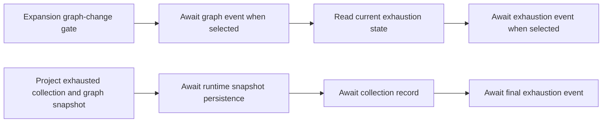

# Remaining E scheduler implementation owners

E owns complete collection-events.ts and prompts.ts replacements under workflow/scheduler. The [frozen packet](../docs/evidence/collection-events-prompts-author-packet-20261003/) is the behavior/public interface authority. A owns graph.ts and graph-* implementations. Existing graph/event/runtime/type contracts remain collaborators; no A/root implementation or commit is merged.

Collection-event effects remain sequential: expansion event when graph changes, then late exhaustion observation; exhaustion persistence, collection record and final event. Signals/phases and original collection ids are read at their specified gates. snapshot persistence stays with the supplied runtime; this owner adds no snapshot-access owner or policy.

Prompt rendering retains exact text, metadata sections, newline/optional-section rules, node/artifact ordering and artifact-name semantics. The prose and advertised JSON are source-derived retained functional output material, not claimed as newly authored text. Fresh authoring applies to the complete rendering/publication implementation using ordinary idioms; artificial novelty is not required.

Freeze complete input-limited author output/read/hash evidence before curator comparison and install a separately bound descendant. Any correction is separately frozen; original artifacts remain unchanged. Each owner remains below400 readable lines and introduces no new public API/runtime dependency.

Current static validation covers declaration/runtime-import equivalence, exact bytes and the mutation-sensitive publication gates. Ordinary tests/builds/typechecks/lint and source/emitted matrices remain deferred. Use a minimal data/publication check only if a concrete new defect warrants it. No global licensing/inventory or release determination follows.

In the current E scheduler tree, collection-runtime.ts and types.ts are pure public declaration boundaries and remain retained without textual-difference rewrites. Other E implementation owners already have exact authored bindings. Keep future/new other-lane modules outside this inventory until root's acceptance phase.
