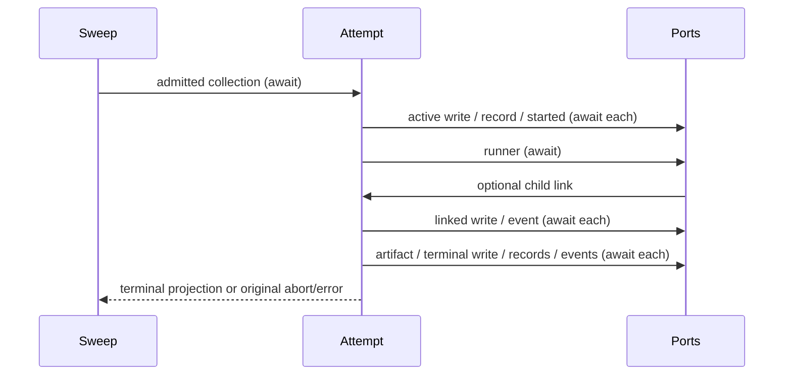

# Collection planner admission and attempt lifetime

Scope: `core/src/workflow/scheduler/collection-planner.ts`, its named fixture,
contracts and receipt. Inventory at 129f47d marks it upstream-modified/unreviewed;
publisher metadata names blob bdcd8ba5e2abdc95cbe52c5a9280ec51079ab7f0.
Local source exposure is explicit. Parent's four-group freeze at 48f045d is
parent-reported and unavailable in this checkout; no claim to have run it here.

## Contract

The exported signature and result fields stay unchanged. With no planner runner,
return the original snapshot and empty additions without inspecting abort. Otherwise
visit the initial normalized collection list in order, checking abort before each
collection. Nonexplorable/out-of-phase collections are skipped. Compute membership,
frontier, completed IDs and unseen completed IDs using the existing graph helpers.
Unseen completions stamp lastCompletionAt and snapshot updatedAt with two ordered
clock calls before exhausted-state admission. Re-read the collection from the updated
graph. Exhausted collections are skipped. Initial positive frontier deferral precedes
frontier-target deferral; both activate the collection without persistence. Planner
run limit precedes consecutive-error limit, with the existing exhaustion publication.
Only an attempted planner increments plannersRan; aggregate added IDs in attempt order.

Create activity ID, start time, run count, input paths and child trace before activating
the collection/activity. Keep all helper clocks in their original evaluation phases.
Activation write → collection record → planner_started are native awaited gates outside
the recoverable catch. A rejected gate propagates its exact error without failed
publication or runner invocation. Runner, snapshot, artifact and event port receivers,
arguments and signal forwarding stay unchanged; add no cancellation guards or retries.

The attempt's mutable snapshot cursor advances only for an active child-session link,
before awaiting its write → workflow_session_linked publication. Keep model truthiness,
session ID and nullish trace/turn fallbacks, event payload omission and exact references.
Runner input graph uses the activation snapshot; input snapshot/task/runId use the cursor.
Default prompt and expansion validation stay with their current owners.

Successful runner settlement → artifact write → expansion → artifact/activity projection
→ completed snapshot write → expansion records → planner_completed → expansion events.
Empty additions emit no graph_expanded. Result identity fields come from the final runner
result, rather than inheriting missing fields from an earlier link. Return added IDs and
the terminal snapshot only after all gates. Preserve own-field presence and insertion
order, all runtime prose and artifact names.

The recoverable catch covers runner through final expansion events. If aborted, rethrow
the caught value unchanged, even when it differs from signal.reason. Otherwise derive
failure from the child-link cursor and active collection: increment error count, apply
the exact threshold, retain truthy linked model/session/turn and nullish trace fallback,
then failed write → collection record → planner_failed → optional collection_exhausted.
Failure publication errors propagate unchanged. A failed completion publication therefore
rolls back the returned graph/artifact view to the cursor; already performed effects stay.
Terminal projections do not advance the cursor. Late callbacks can still find its active
activity and publish a link after terminal publication; preserve this observed boundary.

## Design

One exported sweep owns its accepted snapshot/additions/count. Synchronous admission
returns a decision plus the updated snapshot; it adds no promise settlement. One private
async attempt owns one mutable child-link cursor and immutable activation facts. Terminal
views are projections, not another accepted state. Public port awaits remain in that
attempt or its original async child callback; no extra awaited orchestration helpers.

No private class wrapper, general interpreter, new state subsystem, product policy or
lower dependency rewrite. Fixed protocol/type vocabulary, projections, prompts and
ordinary helper-call/await glue remain attributed. Source-derived reconstruction is
reviewable expression work, not a whole-file independence, clean-room or MIT grant.

## Validation

Freeze five compact behavior groups (the parent's four areas plus late-link/publication
failure), the existing scheduler collection-expansion observation and strict selector
controls against the unchanged predecessor. Archive exact compiled/declaration bytes;
pin original source by commit/hash. Historical loading remains separate from strict
current source/actual compiler-emitted selection, including the actual scheduler caller.
Run these affected groups and owned compile/lint/format/architecture once for the final
coherent candidate. No product build/full suite or live IO. Preserve any red proofs.
