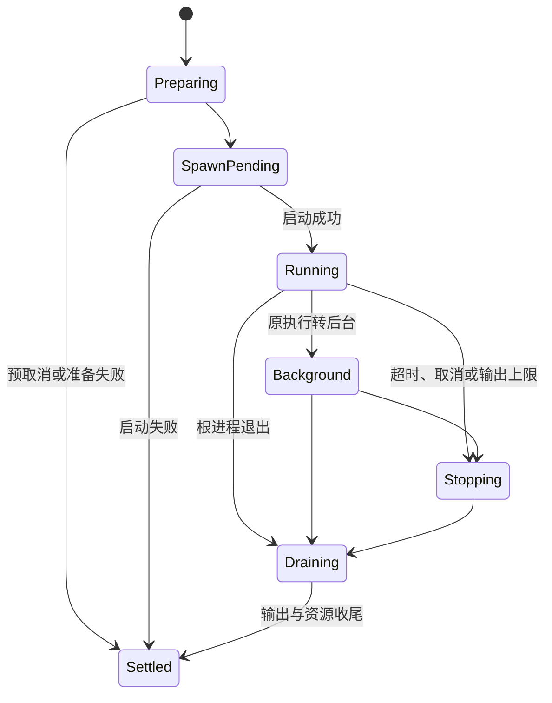

<!-- SPDX-License-Identifier: MIT; Copyright (c) 2026 Knorvia Studio contributors -->

# 命令执行运行时

本轮以独立实现替换 CLI 的执行适配器，保持 `@knorvia/adapters/exec` 公共入口、现有请求及结果结构。环境策略、进程采样、共享协议和第三方解码库继续作为依赖；本规格不改变应用根许可或发布版本。

## 所有权与生命周期

适配器拥有活动执行、后台任务、稳定输出路径、Shell 初始化快照和关闭过程。每次执行从准备开始登记，独占一个子进程、取消源、输出收集器、定时器与最终完成通知。请求、权限策略、上层工作目录状态及回调归调用者所有。此边界不自行增加沙箱或命令重试。

转后台沿用同一进程、输出文件和完成承诺，撤下前台时限与父取消链接；根进程先退出时不能再转后台。`wait` 的取消只结束等待，不取消任务。`close` 幂等并等待活动执行、进程树终止、快照清理结束。

## 环境、平台与事件

请求明确指定工作目录；执行不会修改宿主工作目录。环境继承、运行时字段清理和网络策略先应用，请求的 unset/set 最后生效；Windows 环境键按大小写不敏感处理。argv 默认不经 shell，Windows 批处理通过 CMD，Bash/Git Bash 使用已选定的 shell。启动脚本按先调用者、后内部序言的顺序组合，参数按数据引用。没有真实 rg 后端时不能伪造 rg 包装器。

运行超时从成功启动后计时。首次停止原因获胜，取消或关闭在异步准备后与实际启动前均复核。启动失败发送 `failed` 事件，其他终态发送带结果的 `completed`；事件回调的异步完成不拥有执行结算权。

输出状态优先级为启动错误、超时、主动取消、普通输出上限、退出码。普通持久化输出超限在启用 `killProcessOnPersistedLimit` 时触发停止，结果状态为 `failed`，错误分类为 `output_limit`。Bash 直接文件超限保持 `cancelled`、退出码 137 及既有 `5GB` 文案。普通非零退出不虚构分类错误。

## 输出与恢复

普通输出计量全部原始字节，分别保存有界前缀、尾部、磁盘文件。持久化模式为 none、on_truncate、always；越过磁盘预算才调用一次限额停止回调。写盘失败只记录文件截断，不能冒充输出超限取消原本成功的命令。背压暂停输入直到 drain 或错误处理恢复。

Bash 合并文件由子进程直接写入，适配器只拥有文件句柄、轮询和有限读取。轮询必须串行、取消后拒收过期结果；遥测只接受非敏感汇总，不包含命令、路径、会话、用户内容或凭据。清理只能删除本次创建并拥有的输出或快照，清理失败不能覆盖主结果。

成功 shell 请求可捕获并验证真实工作目录，后台或非零退出不返回可应用的 cwd。快照失效降级到登录 shell。Windows 解码优先合法 UTF-8，再使用明确配置、代码页或地区回退；同次执行复用一个选择。

## 验收

独立准备行为合同与公共声明，源码与测试分别设计、冻结；封闭加载器使用自有进程、时钟和文件系统端口，旧实现先通过后才运行候选。保留所有首次失败与最小修正记录。接入主仓后运行同一测试在源码与实际 CLI 编译产物上、根及 CLI 类型检查、lint、架构检查、构建和统一离线回归。

有限端口测试不能替代真实平台进程树、shell、原生代码页及文件系统竞态的验证。主仓既有相关回归提供额外证据，未执行的真实环境检查必须在交付记录中列出。
