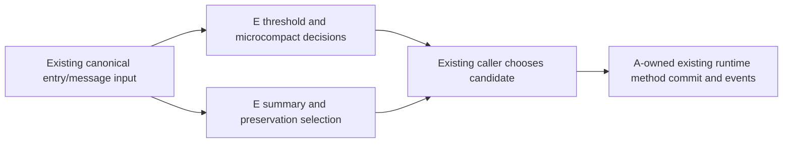

# Complete E core compaction planning owners

E independently authors complete compact/policy.ts, compact/microcompact.ts and runtime/helpers/compact-selection.ts from frozen functional/API-only inputs. Each gets a new input-limited author with no inherited conversation. Existing public declarations/constants/message text/tuple/config/protocol fields remain retained compatibility material; ordinary projection/map/regex/traversal idioms need no artificial novelty. Curator is source-exposed; instruction-only shared execution is not OS isolation.

These owners derive budget decisions, local tool-result reductions and summary/preservation/overflow-retry candidates. They add no accepted runtime state, write path, filesystem/network IO or history commit policy. Existing estimator/content/clone/group/provider/trace collaborators remain imported. Date.now is limited to the retained valid idle-trigger gate; optional logger warnings remain at retry gates.

Preserve default/capped numeric rules and observed callback order, media/result-group protection, clone/reference depth, unchanged-result policies, source-tagged prefix rules, assistant rounds, bounded/cycle-safe overflow-cause extraction, retry/drop/preserve limits, marker/diagnostic text and key order. No provider/schema/clone implementation, A method queue, workflow/expert, permission/full-access/security or previously accepted source owner is reauthored/imported.

Freeze scoped inputs before invocation and complete outputs/receipts before curator body review; preserve any findings, original drafts and functional clarifications. Install exact separately bound descendants. Static checks cover resolved public exports, runtime dependency bindings, byte receipts and untouched collaborator/caller boundaries. Ordinary tests/builds/project typecheck/lint remain skipped under the requested cadence; minimum synthetic only if an actual data-write safety concern needs resolution. Current architecture tool remains unavailable due missing local TypeScript, with earlier failure evidence preserved. No global provenance/license/inventory reclassification or release follows.
