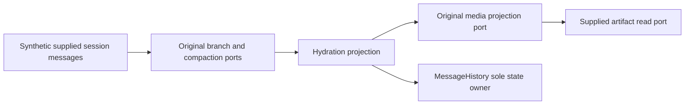

# Allocated hydration reconstruction

Root allocates exactly `agent/file-part-hydration.ts` and `agent/session-history-hydrator.ts` at the hashes recorded in the packet reservation, from published baseline f9bd59f6bad64590e6d854ddff62fbebd20a841c. CLI is the existing unmanaged architecture module; no new module/layer/dependency. Original contracts, branch selectors, compaction, history/model/turn dependencies and formatter/media ports are retained.

History is owned by supplied MessageHistory. Projection appends through the existing public port and never persists or mutates supplied session/media/write state. File projection may perform one supplied text-artifact read; history projection calls the existing media port. Privacy suppresses pending shared context before media/history operations. Durable media references retain artifact identity without live original path. Selection/compaction ordering, last-object/first-position part deduplication, user envelope/reminder/media grouping, assistant usage anchors and tool-result ordering remain as the frozen body-free contracts specify.

Use two fresh GPT-6.1 Sol/high/fork:none instruction-only authors. Saved Fast unchanged/unverified. Freeze and commit whole drafts and full receipts before body review; any real correction returns to the same author as a new whole version with cumulative receipt. Source-exposed curator and full historical exposure/repair qualifications remain; no OS isolation/audit or licensing assertion.

Only scoped input/import/public declaration/receipt/data/byte/boundary checks and minimum synthetic media identity/history ordering/privacy/write-state checks. Ordinary suites/builds/lint/project/semantic typechecks/source-emitted matrices are explicitly deferred by parent. Prior missing local TypeScript architecture failure is preserved, not repeated. No real files/media/providers/user data or cross-lane implementation import.

Read-state hydration remains HOLD: local a different recorded digest versus root 5acb4ca49c0fa4a42a4f057b4e475b67ac67175e0c0d7aec9f29d4eab23a3466, bound by root's licensing/evidence/read-state-hydration-20260930.json. Preserve both without import/reauthor. Runtime-task registry remains held pending root historical receipt review. Other allocations, root desktop and A model/turn runtime unchanged. All 21 material obligations stay open; no release/main merge/global licensing changes.
