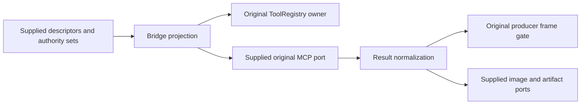

# Allocated MCP bridge and normalization reconstruction

Root allocates exactly `apps/cli/packages/core/src/mcp/index.ts` at0b819ddfa17c664ac432c9fcdcff2dcb46bd35a2af63e03183e86193449b5f58 and `image-normalization.ts` at8e959fc63c11d0b02149a50ca20250088a5547e77cdef87e237033903ef71032. Published baseline ee44306130f36450d3450618badcd21d05f115b6 and verified repository origin accomplish07zrh-eng/knorvia-studio; same E branch/PR8. Both original owners are ledger upstream-modified; root bounded evidence search found migration inventory only, no accepted review. CLI remains existing unmanaged architecture module; no new module/layer/dependency/state owner.

ToolRegistry owns registration. Existing visibility/name/trust/formatter/frame contracts and image/artifact ports are the only boundaries. Authority comes from supplied verified sets/producer gate, never names or descriptor presentation. Source-only reconstruction preserves allow/deny aliases, Windows approval constraints, title-presentation compatibility, route/trace/workspace context, result ordering/metadata identity and image size/identity. Original imported dependencies/policy remain unchanged.

Two fresh Sol/high/fork:none instruction-only authors consume frozen body-free public behavior/ports/data; Fast saved unchanged/unverified. Archive full original drafts/source and receipts before body review; real corrections return to same author as whole new versions with full cumulative receipts. No curator patch. Source-exposed curator and all prior exposures/repaired scratch-write breach retained; no OS isolation/audit/rights assertion. Original exported numeric/schema expressions and required protocol/text/static material retained honestly.

Minimum synthetic visibility/frame-authority/image identity/size/result-preservation checks plus scoped public API/import/input/receipt/data/byte/immutable boundaries only. No real tools/providers/browser/frames/user media/credentials or access grants. No suites/build/lint/project/semantic typechecks/source-emitted matrix; prior missing-TypeScript architecture failure remains recorded and is not repeated or bypassed. No cross-lane source import/main integration/deploy/release/global licensing/MIT decisions.

Name/windows-computer-use/result-format helpers, registry/tool visibility/CUA producer policy remain unchanged. Read-state/root-local hash divergence and runtime-task registry held; A profile/runner separately reserved. Completed hydration/other queues and root desktop untouched. All21 third-party material obligations remain open.
