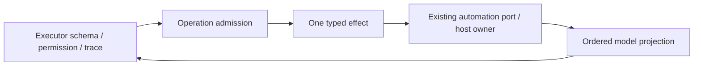

# Lane A Cron admission and effect replacement

## Scope and source exposure

Start at immutable `bf0cc48` on `parallel/cli-tools-fast-20261001`. Own only
`cron.ts`, narrowly named Cron helpers/contracts/tests, this spec and the lane
handoff. All earlier handlers and checkpoints remain unchanged. Root integrates
and regenerates shared provenance. No production deployment, release or merge.

The implementation has been read. `cron.ts` follows snapshot commit `7619e41`,
is audited upstream-modified and unreviewed, and currently hashes to
`e75564081cb218b7b0df1a2d5451aaa505be76c37cff4332664da64c04bdbfa2`.
Its upstream blob is `2ccaa68c7f50ad0dfebd694b07d6131b1378dbe4`. Public
schemas/declarations, inherited instructions/comments and applicable licences
are retained. This is an exposed-source bounded replacement, with no clean-room,
whole-file originality or MIT relicensing claim. LICENSE/NOTICE, preview identity
and all 27 unresolved material obligations remain unchanged.

## Frozen behavior

| Operation | Direct admission order                          | Effect                                        | Turn differences                    |
| --------- | ----------------------------------------------- | --------------------------------------------- | ----------------------------------- |
| Create    | automation guard, input schema, configured port | create(parsed, runtime model/session context) | automation denied; off-peak allowed |
| Update    | automation guard, input schema, configured port | update(parsed)                                | automation denied; off-peak allowed |
| Delete    | automation guard, input schema, configured port | delete(parsed)                                | automation denied; off-peak allowed |
| List      | input schema, configured port                   | list()                                        | both turn flags allowed             |

Do not substitute OffPeak's guard. Denial is permission_denied, unrecoverable
and nonretryable with call ID/name. Missing port is configuration_error,
unrecoverable, with existing default retryability. Input errors propagate as
Zod errors; port throws and accessors retain their original thrown values.
Executor validates schemas before handler guards, then owns hooks, permission,
approval, cancellation, timeout, trace and result presentation. Preserve that
different ordering; do not add abort arguments or change the 30-second budget.

Each admitted invocation calls precisely one port method with its receiver.
Create supplies an own sessionId key even when undefined, and only supplies
runtime provider/model identity when model is truthy. Keep property read order
and argument counts. Update/delete never inspect session/model; list has zero
arguments. Parsed requests retain strict schemas, trim/default/optional/null
semantics and refinement errors. No timezone conversion or new clock source.

Outputs project the existing ordered field whitelist, including scheduleRule,
and exclude runtime model/mode and other port-only fields. Optional undefined
fields remain own properties in direct outputs; list preserves order and
duplicates. Create/update confirmation and delete success/not-found text remain
exact. Preserve unvalidated direct response behavior and executor output checks.

## Ownership and implementation decision

The existing automation port/host owns tasks, binding, scheduling and persistence.
The executor owns permission, traces and cancellation. The handler owns no task
state. Replace four repeated pipelines with one operation-aware admission
compiler, a discriminated single-use effect and one executor/result projection
path. Keep inherited guard bodies and entry declarations in the compatibility
entrypoint. Helpers import types/contracts and never import the entrypoint.
Effects defer context/port reads until invocation to preserve receiver and lazy
failure ordering. No retries, cache, queue, alternate scheduler or fallback.

Protocol tests exercise the actual source and built automation adapter with
synthetic requestClient/session records. Freeze active-automation refusal,
dedicated binding check, only -32601 legacy-list fallback, fail-closed errors,
runtime model/mode precedence, session target, relative/calendar/carrier
parameters, title freeze, update clearing rules, limit error mapping and response
validation. No actual transport, tasks, accounts, prompts or notifications.
Service/runtime denylist readers remain read-only consumers; no policy edits.

## Acceptance and migration boundary

Before production changes, generate frozen inherited declarations and observations
from `bf0cc48`, build actual CLI dist, and run named source/emitted tests. Freeze
malformed inputs, guard failures, all operation/turn combinations, missing ports,
direct and executor outputs/errors, registry/schema identity and protocol cases.
Record fixture failures before correcting fixture wiring; never relax old tests.

After replacement, run the identical contracts in both modes. A temporary exact
inherited reference outside Git supports a seeded differential comparison;
there is no shipped inherited fallback. `KNORVIA_CRON_TEST_EMITTED=1` selects only
test imports of actual core/bootstrap dist. Test executor refusals and approvals,
pre/pending cancellation, interleaving, response schemas, create-limit turn stop
and policy consumers. Run final CLI builds/types, root types, configured and
owned lint/format, changed/full architecture and full offline regression on the
final corrected production source. Never change timeout or security settings.

Native Windows/macOS, packaged/TUI/desktop/Web acceptance and live host database,
scheduling clock/timezone/account behavior cannot be established by synthetic
fixtures. Report these gaps and unchanged unrelated lint failures factually.

## Baseline fixture findings

The first source run passed 17/18 named tests. The new policy-reader assertion
incorrectly treated a single CronUpdate denylist item as a complete automation
turn signal. The existing reader requires all three mutation names. Corrected
only the new fixture expectation and added the complete-set case; product policy
is unchanged. The first formatting pass made the combined protocol fixture
419 lines, so it was split into narrowly named test support before committing.
Strict owned lint found duplicate imports introduced during that split; those
new test imports were corrected. No inherited tests were edited or relaxed.
