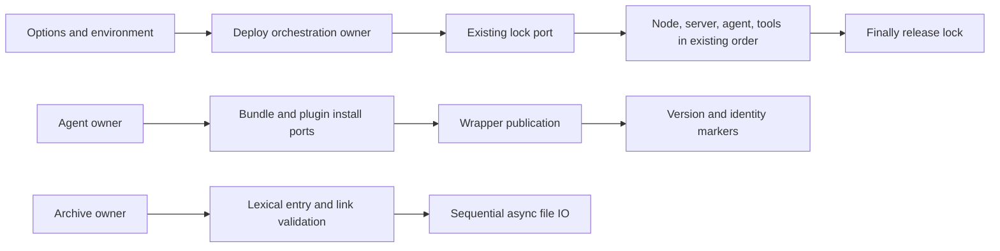

# Deployment owner queue, 2026-10-03

Five complete owners: localTarGz, agentDeploy, agentDevDeploy, deployShared and deploy. Existing public declarations, paths, dependency ports and permission policy remain compatible. Each full implementation is authored by a fresh API/behavior-only internal author; source-exposed curator review and shared-filesystem limitations remain explicit.

Ownership: the archive owner controls sequential async archive IO and lexical path admission; agent owners control development/production install and version-marker ordering; deploy controls option resolution, preflight, install-root lock, component scheduling and final release. Existing excluded cache/network/permission-repair ports retain implementation and policy.

Failures, cancellation identity, stderr/exit status, cleanup/rollback, quoted command text, version and SHA decisions and backend-specific ordering must retain baseline behavior. Desktop/mobile delivery semantics are not changed by this asset lifecycle work.

Validation is limited by user cadence to changed-file lint, syntax-only diagnostics, changed architecture and whitespace. Ordinary tests, semantic types and builds remain deferred. A minimal synthetic check is warranted only for concrete write/deletion/permission risks observed during candidate review; no real remote commands, credentials or user data. Excluded implementations and global licensing/provenance inventories remain untouched. This evidence supports later parent classification, not a licence grant.
