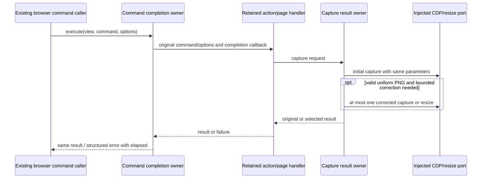

# Complete browser command and capture owners

Batch44 continues PR9 froma8a2305a55719b900556f0c50fbdadf7f1ac48b4 on the same
branch. Exact selected paths: browserCommandExecutor.ts and browserScreenshotCapture.ts
under packages/desktop/src/main/browserView. Current inventory and local/public
receipts were screened; command executor was only an unchanged consumer in earlier
Playwright work, not an accepted complete owner. No accepted exact-path review for
either selection. Two fixed origin reads match inventory blob/digest. PR8/10/11/12
metadata has no occupation. Inaccessible private history remains a qualification.

Command executor owns dispatch, per-call elapsed completion and structured error
classification; retained handlers own actual interactions/navigation. Capture owner
owns the single first capture, optional one corrected capture, bounded quality-source
scale, resizing decisions and result selection. No duplicate queue/state or new
retry policy. Retain public helper/state/handler APIs and dependencies unchanged.

Two fresh nofork Sol/high authors receive body-free behavior/API packets only.
Freeze full outputs/access reports before inspection. Curator source-exposed
packet derivation and static validation; product integration only fullcopy plus
formatter. Corrections require complete new literal from own memory and bounded
facts, no earlier output/source/sibling reread. Preserve failures and all variants.
Shared fs is instruction separation, not OS isolation; Fast unverified. No novelty
requirement or copyright/independence credit from source/line/identifier changes.

Source-only speed cadence: scoped restricted semantic/API and syntax checks,
lint/format/architecture and byte binding only. No ordinary-test expansion, native
window/browser/capture, network/listener/production/database/SSH/auth/permissions,
full types/build or aggregate acceptance. Captures/PNG bytes are not executed with
real data. Native composition and aggregate compatibility remain pending.

Do not reopen RecoveryStore. All root HOLD, D provider and root resolver/provider-node
repository scopes excluded. Protect broadcastHub accepted historical
SHA952483102919545cdc33a4aa839f947614f909e8d139d9218596cbb4ffb53d05 and
networkTelemetryAggregator bounded accepted
SHAf3baa2a776cbd7976ae1a6a0f4e128b8636500f2adbc6451421e506d1e708b6c;
no overwrite/reset from public old baseline. No Library403 bypass/cancelled upload.
LICENSE/global provenance/inventory/reviews/manifests remain untouched. Normalized
identical material gets zero new independent-expression/MIT acceptance credit.
