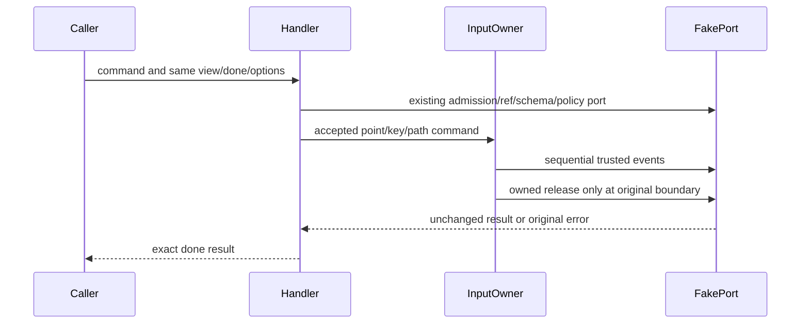

# Complete desktop browser command owners

Batch41 continues original PR9/branch from be595244e43ba851f2d977399919ce9b9685d53f. Selected exact inherited-modified owners: browserCommandInput.ts, browserCommandInteractionHandlers.ts, browserCommandPageHandlers.ts. Origin and exact receipt/history/PR-path screen are saved before authoring. Missing reviews alone does not establish inheritance. Fixed upstream objects remain unavailable; no fresh source/rights verification or MIT claim. Root broadcastHub/databaseStartupRelay are excluded, taskRealtimeBus HOLD, prior Playwright owners and other-lane/root/private403/UI403/schedule holds untouched.

One input invocation owns its ordered trusted event sequence, live point/path references, held modifiers and drag-path release boundary. Interaction handler owns only command admission and forwarding/result projection through existing ref/script/input/clipboard/state/schema ports. Page handler owns navigation recovery budget, screenshot branch/metrics parameters and state/schema/result projection. These owners add no shared cache, permission policy, persistence schema or UI.

Fresh no-inherited-context authors receive full public declarations and behavior facts only. Freeze complete author-reported literal before any candidate comparison; keep all original drafts, failures and complete author corrections. Source-exposed curator integrates full copies/formatting only; any own-source transformation or access exception must be disclosed. No novelty/renaming/extraction credit. Static key data, schemas/scripts/dependencies, public protocol/error vocabulary and all matching source expressions remain without independence credit.

Minimum fake-port authority/lifetime groups cover ordered keys and input failures/release, interaction ref/clipboard/schema/error identity, navigation blocked/aborted equivalence/cancellation, screenshot compositor/clip/metrics selection, page schema/evaluate/state compatibility. Existing authored Playwright callers are directly affected and receive only necessary selected fake-port/static checks. No real browser/page execution/network/userdata/permissions, full suites/builds or aggregate integration. Target syntax/public surface/scoped types/lint/format/direct architecture only; synthetic ambient types are explicitly distinct from actual product/native type closure. Prior pnpm wrapper ENOENT remains blocked, no retry/install/store/permission workaround; lawful existing tools record independent results. Node mismatch retained. Same draft PR, no cross-lane/main merge.
