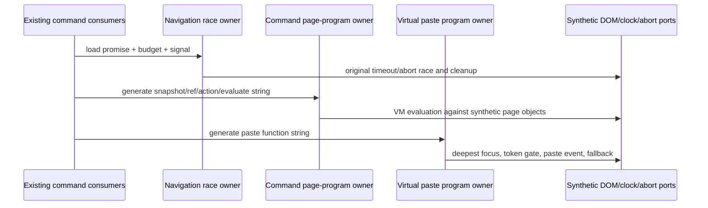

# Complete command page chain owner batch

Batch47 continues PR9 from748b910f5b562de5cee1b368265a14d9561a2233. User explicitly
authorizes four cohesive full owners: browserCommandState.ts,
browserScreenshotTransientRetry.ts, browserCommandScripts.ts and
browserVirtualClipboardPageScript.ts. Exact current SHA/receipt/history/fixed-origin
and PR8/10/11/12 scope checks precede code. No accepted exact-path receipt found;
private history absence not established.

Navigation state owner handles read projections and the existing load/timeout/abort
race. Transient retry owner alone owns first-failure time and attempt count. Command
page-program owner alone generates snapshot/ref/action/evaluate programs and owns
their existing page ref-map effects when executed. Paste page-program owner alone
owns target/focus/selection and cancellation-aware paste dispatch/fallback behavior.
Existing desktop callers and permissions stay unchanged. No duplicate queue/cache,
new retry, URL policy, recovery, third-party loader or GuestManager modification.

Four fresh nofork GPT-6.1 Sol/high authors receive complete behavior/public ports;
freeze each full literal/hash/access report before curator inspection. Whole author
corrections from memory and bounded facts only, no implementation/draft/test/sibling
reread. Curator exposed to source. Install wholecopy plus formatter, never semantic
patch. Shared filesystem separation instructional. Primary G original UI GPT-6.1
Sol/high/Fast1 parent-verified02:39; executor did not see UI; author Fast separate
unverified. No novelty/line reduction/MIT/OS-cleanroom claim.

Fixed IAB token/protocol values and retained VIEWPORT_SCRIPT glue get zero new
independence credit. Regenerated opaque source strings may have different inferred
literal types: preserve raw declaration comparison and separately disclose consumer
string-contract projection, not an assertion of exact raw type identity. No inherited
substantive paste/snapshot source bodies are passed through public declaration ports.

Minimal fake clock/abort/lifetime and synthetic DOM/VM data/authority checks only.
No actual browser/page/clipboard/userdata/permission/Electron/media/native/network
runtime. Focused semantic/API/syntax/lint/format/architecture and byte retention;
full types/build/aggregate suite only at final integration. Preserve failures/all
drafts; identical bodies/expressions zero new independent/MIT acceptance. Root/D/A/B/E
boundaries, all HOLD, dormant RecoveryStore, fixed third-party loader/declarations/
wiring, global licensing/inventory/manifests retained. No main/crosslane merge.
