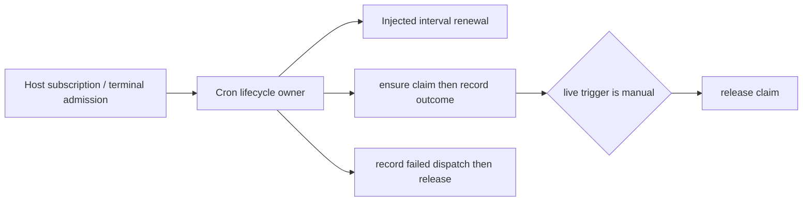

# Cron claim lifecycle complete-owner candidate

Batch49 starts at89382dab9a909e7317bbcc2d8e923a37e075c839 on draft PR9. Only packages/desktop/src/host/cronRunLifecycle.ts is allocated (raw SHA4abdf9ac019702363132961be4a4f664928f9b056cc6426fea9fe13cfbc2b539). Preserve every existing lease/auth/identity/terminal/error behavior and A core scheduler/runtime. Host index consumer remains unchanged.

The owner registers referenced renewal intervals and clears only its original timer token. It does not admit tasks, choose terminal state or change lease policy. Repository ports own persisted authority. Calls are bound and live at each original phase; ensureRunClaimed receives the original params reference. Await boundaries preserve current repo/identity/trigger reads. Disposal does not cancel in-flight renewals. Warning and dispatch-conversion exceptions retain their current propagation; release is sequenced, never moved into finally.

Four complete export contracts and full phase/error/receiver rules are in the body-free author packet under licensing/evidence/desktop-cron-claim-owner-20261003/. Curator is source-exposed. One no-fork GPT-6.1 Sol/high author produces a full literal; raw bytes/access report freeze before review. Corrections are whole new literals using memory and bounded facts; integration is copy plus formatter only. Shared filesystem instructions do not establish OS isolation, novelty or accepted independent provenance.

Validation is one minimal injected repo/clock/interval authority/lifetime group, covering live renewal/disposal, sequential outcome/terminal release, repository/warning failure identities and failed dispatch conversion/release. Owner restricted semantic/public shape checks plus direct Host consumer syntax and scoped lint/format/architecture. No ordinary previous-owner tests, full suite/build/native, actual task/database/permission/process/network/server/userfile operation.

Prompt attachment transfer from batch48 is now explicitly HOLD: parent reports accepted private checkpoint a3d4b1f6812cb3651514840a1c9b608008b2ebf4 at2026-10-01 19:58, accepted SHAa777a064c6cbfe84c4ff45b2b191ab18f00a7134d5b207f2e2cde2b14b5e72d6 and receipt licensing/evidence/prompt-transfer-owner-replacement-20261001.json. Those private bytes/receipt are unavailable here; local old bytes are not verified equal to that accepted version and must not overwrite it. Services' similarly named44-line file is D's distinct scope. No alternate read/fetch/restore/author/test occurs. GuestManager, dormant recovery, root HOLD sources and all cross-lane policies remain retained.

Exact origin/inventory/old receipt lookup is bounded; absence in visible records does not establish private absence. Fixed messages, status, interval and normalized identical expressions/bodies receive zero new independence credit; parent classification/MIT decision remain deferred. Root LICENSE/global inventories/reviews/dependencies remain unchanged. Same draft PR9, ordinary scoped source push, no merge; final aggregate integration only by parent after all lanes collected.
