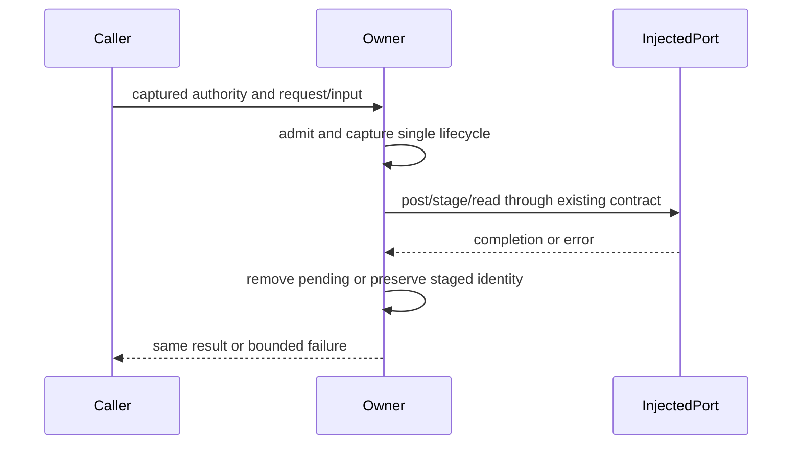

# Desktop host behavior owners

Three explicitly reserved modules are screened at the preceding commit using exact current digests, pinned same-path modified origins, migration/history and bounded prior-candidate receipts. Missing accepted reviews alone is not eligibility. Root/main, renderer, preload, large host index and accepted adjacent database/attachment/realtime owners stay unchanged.

Browser bridge owns captured backend authority, pending request/timer correlation and recording-result settlement. Admission precedes posting; correlation is registered before post and removed before cancellation or recording materialization. Duplicate/stale authority rejection preserves original requests. Dispose settles pending work but does not cancel already detached materialization or permanently close the bridge.

Attachment owner holds a per-call lazily resolved remote staging root, sequential staging and ordered literal content replacements. Remote/local attachment identities and extra data are preserved. Lexical root admission, exact existing injected command/permission strings, upload arity, original causes and best-effort cleanup remain compatible; no new containment policy or real IO is introduced. Task/session proxy boundaries retain receivers, pass-through arguments and qualification semantics.

Service collection owner composes exact remote/local bindings, reporting inside attachment wrappers, and local-setting authority for remote runtime preferences. The imported legacy assertion gates factories. Settings failure is encoded as resolution failure; response failure reaches captured onError without retry. Registry tokens/order/lifetimes and static configuration are retained contract data.

Fresh instruction-limited authors get public signatures and external behavior only. The source-exposed curator freezes whole drafts before inspection; only whole-source copies and formatting install candidates. Static/retained expressions earn zero new credit; parent decides provenance/MIT after collection.

Minimum synthetic authority, data-preservation and lifetime tests use only fake ports and virtual data. No actual browser/process/SSH/network/provider/files/media/credentials/transfers/settings or permissions. Scoped API AST, syntax/transpile, source/helper lint, format and changed architecture checks complement those cases. No broad suites/builds, semantic dependency/native acceptance or cross-lane/main integration. Node differs from pinned version; wrapper failures stay frozen and direct checked-in script results are reported separately.
