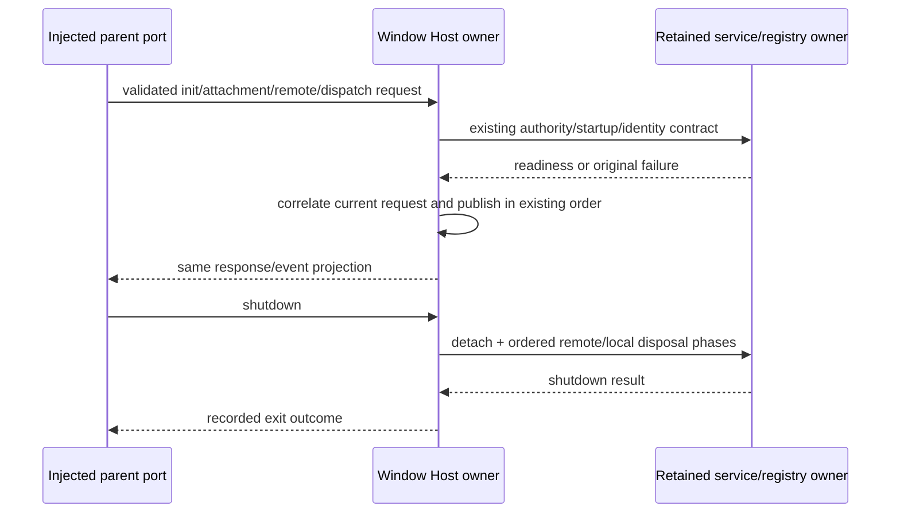

# Window Host orchestration owner candidate

Root explicitly allocates host/index.ts at fef90ea4f8057372f31b6af1f5f4a24bfaabf3083d8717ad480d73b5678d4d15 after batch38. It remains one window Host orchestration owner: process-message admission, local service authority/startup, scoped RPC attachments, remote service facades, automation dispatch correlation and teardown. Accepted database startup/controller/connection/attachment registry/media/realtime dependencies remain unchanged and authoritative.

Preserve existing local/remote environment isolation, exact workspace/session/request/run identities, dynamic remote dependency loading, imported guard/projection/network/security policy, external callback receivers and data identity, deferred startup attachment publication, transport flow ordering, task-ready versus prompt ACK lifetime and shutdown phase barriers. No fallback from missing remote identity to local authority. No behavioral cleanup improvements or security changes folded into authoring.

Fresh no-inherited-context Sol/high author receives a complete body-free public/behavior packet. Freeze whole initial/corrected raw drafts before source-exposed review; whole installation/formatting only. Private cohesive implementation structure free, no forced novelty. Matching source/expressions/static contracts get zero new independence/MIT acceptance; curator exposure/shared-filesystem access limits disclosed.

Minimum synthetic gates cover message/startup authority and owner uniqueness, remote scoped attachment/rebinding data identity, task/automation admission correlation and transport/shutdown lifecycle using fully injected ports. No actual process/Host/IPC/SSH/network/provider/user files/credentials/grants. Only affected source and direct focused consumer checks plus scoped API/syntax/lint/format/changed architecture; no broad suite/build/imported semantic types/native/aggregate acceptance.

Root main/B UI and all accepted dependencies excluded. studioWorkflowSchedule.ts and studioScheduleOutcome.ts stay source-unchanged at root's exact digests; a bounded Git/spec origin note may provisionally retain them without assigning inherited provenance or MIT credit. Same PR9/recovery branch, no cross-lane/main merge or cancelled-upload/Library403 access.
