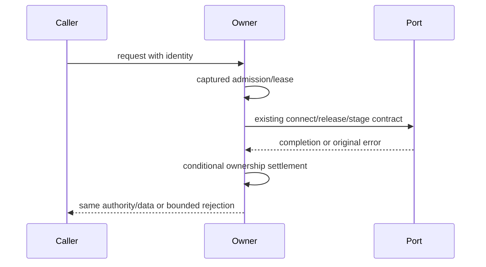

# Desktop host resource and connection owner candidates

Batch38 screens45 host TypeScript paths at7d102a943141f5a970487b76132698c7c80d1114. Exact origin/hash/history and bounded technical receipt checks precede selection. Only windowRemoteConnectionRegistry.ts, hostRemoteWorkspaceProxyState.ts and browserRecordingArtifactMaterializer.ts selected. Large index and ambiguously new Studio schedule owners held for explicit allocation; accepted/excluded database/attachment/controller/session observer/media/realtime, previousG candidates and root main/B UI untouched. Remaining metadata-only entries are not blanket eligible replacements or accepted independence; simple config/type/telemetry facades retained without forced novelty.

Window registry owns shared SSH/WSL and dedicated Docker transports, logical sessions, exact workspace scopes, per-workspace release generations, cancellation/close and idle/dispose lifetimes. New owners must wait an in-flight release; abandoned deferred releases cannot clear a new owner. Existing memoization, synchronous error boundaries, cache retention and late completion semantics remain; no native lifecycle cleanup improvements are folded into reimplementation. Imported key/secret projection policies unchanged.

Proxy state owns task metadata reference identity and workspace/task-ready subscriptions. Synchronous ready replay is handled before registration; task-ready removal precedes disposal while workspace clear preserves its original dispose-before-delete boundary and raw errors. Identity keys delegate to existing resolver.

Recording materializer owns local staging and remote upload selection/containment. Path validation semantics, data/reference preservation, replacement order and cleanup/error boundaries remain platform-compatible. All fs/path/backend ports injected for focused tests; no user files/media or real transfers.

Three fresh instruction-limited authors receive complete body-free public/behavior packets, no inherited private bodies; curator source exposure disclosed. Freeze every whole raw draft before review/install; only whole copies/formatting allowed. Retained expressions/static catalogs earn zero new credit and parent decides provenance/MIT. Minimum synthetic authority/identity/data/lifetime cases only; scoped API/syntax/lint/format/changed architecture. No broad suites/builds/native/semantic dependency/full integration acceptance, no actual host/process/browser/SSH/network/files/permissions, no cross-lane/main merge, global license/inventory/manifests or security changes. Existing node/pnpm/environment limits remain honest; direct checker command is distinct from failed pnpm wrapper histories.
