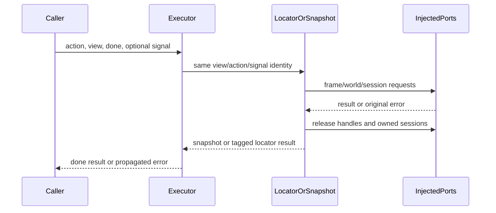

# Desktop Playwright execution owners

Batch40, branch recovery/server-lifecycle-20261002, existing draft PR9; parent allocated all three paths and confirmed other lanes have no unpublished allocation. Root PR12 window/IPC/Host/network/runtime, B UI, D service/storage/permissions, A runtime, E evidence stay outside this batch. Both Studio schedule files and private-backup403 remain HOLD.

Replace complete browserPlaywrightDomSnapshot, browserPlaywrightLocatorExecutor and browserPlaywrightExecutor owners, preserving every public signature, dependency port, page/frame/session identity, observable command sequence and existing errors. A source-exposed curator prepares public declarations and behavior facts; fresh fork-none authors freeze complete literal drafts before predecessor-body/test/history comparison. Shared filesystem restrictions are instructional, not an OS clean room. Existing expression/data and fixed external protocol names receive no independent-expression or MIT credit. Sources remain pending verification.

Each snapshot invocation owns its context cache and attached sessions until capture cleanup. Each locator invocation owns contexts, root target, frame geometry and sessions until final disposal; actionability probe races own timer/abort listeners. Executor owns only per-action polling/evaluation listeners and screenshot overlay lifetime. No extra shared cache, policy or permission gate; grantUniveralAccess remains false and existing isolated-world vocabulary stays compatible. Root native window/process state is untouched. No persistence migration, schema change or UI change.

Acceptance uses bounded fake CDP/page/input/clipboard/clock ports, preserving view/signal/handle/session/error reference identity. Minimal groups cover snapshot normalization/iframe fallback/release, locator trusted input and cancellation/disposal/permission boundaries, executor routing/waiting/evaluation/overlay cleanup. Target syntax/public surface/lint/architecture checks only; semantic types are separately qualified if virtual declarations are used. No ordinary/full suites/build, actual browser/page execution, connection, permissions or userdata operations. Freeze original drafts and every red output before corrections. All unselected tracked source and protected licensing/dependency files must keep exact hashes. No cross-lane/main merge.
