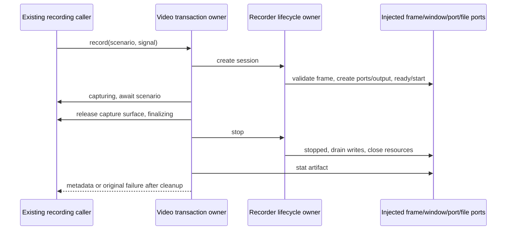

# Complete recording and presentation lifecycle owners

Batch45 continues draft PR9 from327a2d773c9735c8b60c20ba7a1a99f23cbf5c67. Exact
selected paths under desktop main/browserView: browserVideoRecorder.ts,
electronBrowserWebmRecorder.ts, browserTransparentWindowBootstrap.ts. Current
inventory/history/receipt screen and three fixed publisher blob/digest checks
precede authoring; no accepted exact-path receipt found, other PR8/10/11/12 paths
unoccupied. Inaccessible private history cannot be excluded.

Video transaction alone owns capture/finalization/artifact success and failure
cleanup; Electron factory alone owns recorder-window/ports/deferred handshake,
serialized chunk writes and session cleanup; bootstrap alone owns temporary
visibility/opacity/taskbar restoration and focus takeover. Retain all existing
authority predicates, renderer messages, preload/channel path and webPreferences.
No permission/security change, new lifetime policy, competing state or native IO
execution. All actual side effects exercised only through fake ports.

Three fresh nofork Sol/high authors receive behavior/API/public declarations only.
Freeze completed whole literals and access/hash reports before curator inspection.
Curator exposed to source for packet derivation/static comparison; integration
wholecopy/formatter only. Full corrections from author memory and bounded facts,
no old output/source/sibling reads. Preserve all variants/errors. Shared fs isolation
is instructional; Fast not independently verified. No novelty or line-count credit.

Minimal new-owner authority/lifetime fake checks plus target restricted semantic/API,
syntax/lint/format/architecture and exact byte bindings. No tests of completed/unchanged
owners expanded. No real window/browser/native/media/image/userdata/files/network/
permission operation, listeners/production/SSH/database/deployment, full types/build
or aggregate suite. Native/browser renderer composition remains unvalidated; generated
renderer script receives only syntax validation. Preserve existing cleanup/abort
races and rejection boundaries, not hypothetical safety improvements.

Protect all earlier candidates/evidence and root HOLD, especially broadcastHub
historical accepted SHA952483102919545cdc33a4aa839f947614f909e8d139d9218596cbb4ffb53d05
and networkTelemetryAggregator bounded accepted
SHAf3baa2a776cbd7976ae1a6a0f4e128b8636500f2adbc6451421e506d1e708b6c.
RecoveryStore stays dormant and is not reopened. D provider/root resolver/personal
configuration repository excluded. No Library403 alternate route/cancelled upload.
LICENSE/global provenance/inventory/reviews/manifests unchanged. Normalized matches
receive zero new independent-expression/MIT acceptance; parent classification pending.
