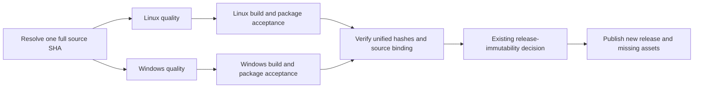

# Knorvia Studio 0.8.0-preview.4 desktop release

## Behavior and ownership

Publish a new, non-draft GitHub Release for Windows x64 setup and portable ZIP,
and Linux x64 AppImage, deb, rpm and pacman packages. Keep the preview channel
until its acceptance boundaries warrant a stable version. Existing tags,
releases and attachment bytes remain immutable. Root `package.json` is the
single version source. The public maintainer email is
`accomplish07zrh@gmail.com`, authorized by the user on 2026-10-03.

The existing native task owns Desktop builder configuration, packaging hooks
and installation scripts. The existing UI task owns installer brand images and
their previews. The integration task owns the release workflow, acceptance
helpers, publication metadata, root version and cumulative source inventories.
These are build utilities outside the managed runtime module roots. No runtime
state owner, profile path, protocol or product identity changes in this release.

## Ordered release path

Both reusable quality jobs must check the same full source SHA. Packaging
checks out that SHA; acceptance records bind version, source SHA and actual
artifact hashes. A failed, cancelled, skipped or missing required check blocks
publication. A candidate dry run executes the same read-only acceptance and
immutability gates. After the normal main merge, final release packages are
built afresh from that exact main commit; candidate bytes and historical
preview.3 artifacts must never be relabeled as preview.4.

Each platform records a manifest after actual package acceptance. One aggregate
helper verifies all bytes and emits `SHA256SUMS`, per-file `.sha256` attachments,
release metadata, installation guidance and retained legal notices. It rejects
missing platforms, duplicate names, malformed hashes, source/version mismatch,
failed acceptance or a manifest whose current bytes differ from its hashes.
The existing `scripts/release-immutability.mjs` remains the only authority for
create/upload/skip/reject. Upload only its named assets, without overwrite or
tag deletion. Read-only validation also runs for dry runs.

## Installation and acceptance boundaries

The Windows guided installer uses Knorvia's existing black-and-white brand,
welcome/progress/finish pages, a selectable directory and shortcut options.
Upgrades preserve profiles. Ordinary uninstall preserves application data by
default. Windows portable ZIP uses its existing marker and adjacent `data/`
directory; marker presence is checked in the extracted ZIP, and absence in the
setup payload is checked independently. Installed Desktop and Linux AppImage
use the existing system-user configuration base. AppImage is a portable
deployment format, not a promise of adjacent portable profile storage.

Run package acceptance outside the source checkout using freshly extracted or
installed products and isolated synthetic profiles. Required checks cover
executable/ASAR/bundled CLI identity, metadata version/commit, native package
policy, actual CLI startup and storage preparation, SQLite data preservation,
PTY loading and packaged native search tools. Windows additionally exercises
silent setup, reinstall and ordinary uninstall on the hosted runner, checking
that synthetic data survives. Linux verifies all package formats, maintainer,
license and extracted payload identity before runtime acceptance. Never infer
real model-task, existing-user migration or human installer GUI acceptance from
these bounded checks.

Do not create signing credentials or fabricate a signature. Record actual
Windows Authenticode status; clearly document unsigned packages when signing
is unavailable. Root Apache-2.0, NOTICE and per-component licenses remain.
Packaging evidence is not a new rights decision or proof of full independent
authorship. Preserve prior failures and historical product input SHAs.

## Regression scenarios

Aggregate metadata tests reject a wrong full SHA, platform version mismatch,
missing required formats, failed package acceptance, duplicate attachment names
and altered package bytes. Existing immutable-release tests retain their tag,
digest, unknown-query and idempotency assertions. Register new release helper
tests in the existing root offline test entry. Use the pinned Node/pnpm versions
and required reusable quality workflow; avoid repeated local full suites.
