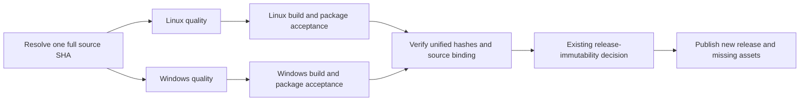

# Knorvia Studio 0.8.0-preview.4 desktop release

## Behavior and ownership

Publish a new, non-draft GitHub Release for Windows x64 setup and portable ZIP,
plus the native self-extracting portable EXE; publish Linux x64 AppImage, deb,
rpm and pacman packages plus a separately marked portable AppImage and tar.gz.
Keep the preview channel
until its acceptance boundaries warrant a stable version. Existing tags,
releases and attachment bytes remain immutable. Root `package.json` is the
single version source. The requested maintainer email is
`accomplish07zrh@gmail.com`. On 2026-10-04 at 00:34 UTC the end user directly
confirmed public GitHub PR and Release-package disclosure of that exact
maintainer address. The parent supplied the question, answer and direct message
lookup. Resume the existing release work within that scope; retain the earlier
refusal receipts and stop any action that receives a new approval rejection.

The user subsequently authorized the exact public maintainer address directly
in this original integration task and instructed continuation of merge/release.
The earlier cancellation and review refusals remain historical outcomes.
The release workflow supplies the official Electron URL through ELECTRON_MIRROR,
the actual input read by bundle.mjs, as well as the runtime-assets variable.

The existing native task owns Desktop builder configuration, packaging hooks
and installation scripts. The existing UI task owns installer brand images and
their previews. The integration task owns the release workflow, acceptance
helpers, publication metadata, root version and cumulative source inventories.
These are build utilities outside the managed runtime module roots. No runtime
state owner, profile path, protocol or product identity changes in this release.

The first actual candidate exposed two probe defects, not accepted product
results. ASAR extraction uses host-native path separators, so nested metadata
paths must use `join` on Windows as well as Linux. Packaged Main is an ES module;
its inspector expressions obtain a require function through
`process.getBuiltinModule("module").createRequire` rooted in the actual packaged
ASAR. They must not depend on a CommonJS global or inject changes into Main.
All source binding, created-window and persistence assertions remain required.
The inspector can attach during Electron's Node bootstrap, before its module
alias is registered. State polling explicitly reports not-ready until the
actual Electron module cache registration exists; after registration any
evaluation failure still fails acceptance. The existing startup deadline stays
unchanged. This is an initialization marker, not a swallowed runtime error.
Both state and quit inspector expressions are synchronous. Their transport
must use `awaitPromise:false`; awaiting an inspector-created Promise during
Node bootstrap yielded `Promise was collected` before any launch acceptance.
The transport still rejects every evaluation error and reports actual state.
Windows attached even earlier, before Node had assigned getBuiltinModule.
The state expression explicitly reports `node-module-api-pending` until that
bootstrap API exists, then waits for Electron's registration. No runtime error
after either readiness marker is ignored.
The local actual Electron41.0.3/Xvfb minimal fixture reproduced3/3 baseline
failures: process/global or Node module cache was still being initialized.
Before accessing Node modules, state polling now waits for browser type and
resourcesPath, and absence of Electron's appCodeLoaded bootstrap property.
Electron's pinned browser/init.ts removes that property only after its app/API
setup, immediately before loading the application's entry. This event boundary
prevents the probe from reentering partially initialized Node/Electron modules;
it is not a delay or swallowed exception. Node cache is read defensively while
pending; app/API errors after that boundary still fail acceptance.
The corrected minimal fixture passed3/3 with an actual window and normal exit0.
Failure cleanup awaits the owned process close event after terminating only its
tree/group, with bounded escalation if required. Owned fixture removal uses
bounded Windows busy-file retries. Cleanup errors are recorded separately from
the original acceptance failure and cannot leave a passed manifest eligible
for upload. Product startup/quit deadlines and assertions stay unchanged.
Inspector evaluation does not request command-line console extensions: the
explicit packaged loader needs none. Actual Windows bootstrap threw inside
Node's console-extension installation before the expression ran. The probe
sets includeCommandLineAPI:false and retains the last observed readiness state
in timeout diagnostics, without changing the startup budget.
Failed native child commands retain exit code, signal, stdout and stderr in
the acceptance report. The Windows PTY smoke records bounded runtime and phase
markers on stderr so a native process exit can be distinguished from a JS
assertion. No PTY, SQLite or packaged-resource assertion is skipped.
Actual b1 Windows receipt shows PTY exitCode0, expected output and completed
SQLite, followed by probe-process SIGTERM at its unchanged 20s command limit.
The smoke owns its ConPTY connection. After asserting the natural PTY exit
and output it invokes the public `kill()` cleanup API to release that owned
connection/worker; it never calls process.exit or changes either time budget.
The whole smoke process must still exit normally with code0.
An actual owned Node ESM inspector regression covers synchronous return values,
absence of injected CommonJS require/console helpers, exception rejection and
normal fixture shutdown. It exercises the shared transport over WebSocket;
it does not stand in for Electron package/window/profile acceptance.

## Ordered release path

Both reusable quality jobs must check the same full source SHA. Packaging
checks out that SHA; acceptance records bind version, source SHA and actual
artifact hashes. A failed, cancelled, skipped or missing required check blocks
publication. A candidate dry run executes the same read-only acceptance and
immutability gates. After the normal main merge, final release packages are
built afresh from that exact main commit; candidate bytes and historical
preview.3 artifacts must never be relabeled as preview.4.

Targeted diagnosis uses the same workflow and package/acceptance owners with
`diagnostic_variant` selecting `win-installed`, `linux-portable` or `remaining`.
It requires `dry_run: true`, skips reusable source jobs explicitly, and cannot
validate or publish a Release. Reports and artifacts are marked diagnostic;
actual built payloads are retained even when acceptance fails for focused reuse.
The aggregate owner rejects diagnostic manifests. PR source checks still run
normally. Before merging, passed targeted package results plus passed exact-head
PR checks may qualify the correction; they do not constitute a complete same-SHA
candidate Release acceptance. Final main publication requires the default `all`
mode, both fresh source checks and all four freshly built/accepted package groups.

Each platform records a manifest after actual package acceptance. One aggregate
helper verifies all bytes and emits `SHA256SUMS`, per-file `.sha256` attachments,
release metadata, installation guidance and retained legal notices. It rejects
missing platforms, duplicate names, malformed hashes, source/version mismatch,
failed acceptance or a manifest whose current bytes differ from its hashes.
The existing `scripts/release-immutability.mjs` remains the only authority for
create/upload/skip/reject. Upload only its named assets, without overwrite or
tag deletion. Read-only validation also runs for dry runs.

Native source head `1836f419aa2ac41117e21b1ba01e196d66227a2a` adds the
variant/profile and guided shortcut contracts. Its source batch is unverified;
the earlier Linux package receipts do not establish its acceptance. Build
installed and marked-portable variants in separate matrix jobs/output trees.
The existing Windows staging helper still owns the compatible setup/portable
ZIP filenames. The additional native portable EXE and Linux portable packages
are accepted and named separately, without a second profile-selection owner.
Aggregate all four required platform/variant manifests; the same immutable
publication decision applies to every attachment.

For marked portable products, launch the actual artifact twice in a hosted
runner fixture, without explicit Knorvia profile-root overrides. Read actual
packaged Main paths through its localhost Node inspector, require a created
Electron window and the data root beside the original launcher, then request
normal application quit. Check fixture-file and SQLite sentinel persistence
across launches. Linux uses a private Xvfb display and documented AppImage
extract-and-run when FUSE is unavailable. These are bounded actual startup and
path checks, not human GUI, model-task or full legacy-migration acceptance.
Every process/display/profile created by this probe has a recorded owner;
terminate only those processes on failure, and never remove preexisting data.

## Installation and acceptance boundaries

The Windows guided installer uses Knorvia's existing black-and-white brand,
welcome/progress/finish pages, a selectable directory and shortcut options.
Upgrades preserve profiles. Ordinary uninstall preserves application data by
default. Windows portable ZIP uses its existing marker and adjacent `data/`
directory; marker presence is checked in the extracted ZIP, and absence in the
setup payload is checked independently. Installed Desktop and Linux AppImage
use the existing system-user configuration base. AppImage is a portable
deployment format, not a promise of adjacent portable profile storage.

Run package acceptance outside the source checkout using freshly extracted or
installed products and isolated synthetic profiles. Required checks cover
executable/ASAR/bundled CLI identity, metadata version/commit, native package
policy, actual CLI startup and storage preparation, SQLite data preservation,
PTY loading and packaged native search tools. Windows additionally exercises
silent setup, reinstall and ordinary uninstall on the hosted runner, checking
that synthetic data survives. Linux verifies all package formats, maintainer,
license and extracted payload identity before runtime acceptance. Never infer
real model-task, existing-user migration or human installer GUI acceptance from
these bounded checks.

Do not create signing credentials or fabricate a signature. Record actual
Windows Authenticode status; clearly document unsigned packages when signing
is unavailable. Root Apache-2.0, NOTICE and per-component licenses remain.
Packaging evidence is not a new rights decision or proof of full independent
authorship. Preserve prior failures and historical product input SHAs.

## Regression scenarios

Aggregate metadata tests reject a wrong full SHA, platform version mismatch,
missing required formats, failed package acceptance, duplicate attachment names
and altered package bytes. Existing immutable-release tests retain their tag,
digest, unknown-query and idempotency assertions. Register new release helper
tests in the existing root offline test entry. Use the pinned Node/pnpm versions
and required reusable quality workflow; avoid repeated local full suites.
