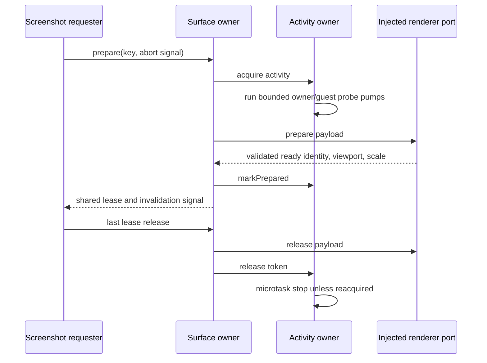

# Complete desktop screenshot owners

Continue the existing PR9/branch from42bccd729bf2fef1b5d874ef8c3bdc90df29ebcf.
Select only browserScreenshotSurfaceCoordinator.ts and
browserScreenshotActivityController.ts before authoring. Both exact current bytes
match the inherited inventory; fixed publisher blobs and digest mappings verified
through two exact-path connector reads. Local/public receipt screening finds no
accepted replacement; inaccessible private history is not excluded. No novelty claim.

Surface coordinator alone owns keyed preparation groups, admission queue, active
renderer handshake and shared surface leases. Activity controller alone owns
window/guest-keyed activity tokens, microtask restoration and owner/guest probe pumps.
Retain existing contract/helper, bootstrap, retry and wiring implementations.
Preserve option/reference identities, reentrant ports, failure partial states,
timers/listeners and viewport/sender validation ordering. No new state owner,
dependency, business rule, deployment, permission or persistence behavior.

Fresh Sol/high nofork authors receive body-free behavior/API packets only and
write complete files. Curator read inherited owners/contracts/wiring to derive
packets and is source-exposed; curator copies frozen complete literals and formats
them, without semantic source-exposed rewrites. Shared filesystem separation is
instructional, not OS isolation; Fast execution mode is not independently verified.
Freeze completion/hash/access reports before candidate inspection. Preserve all
versions/errors. Any corrections are whole literals from the author's own memory
and bounded facts, not rereads of old candidates or source.

Speed-first source-only batch: required scoped syntax/public API shape, lint,
format, architecture and byte retention checks only; no ordinary test expansion,
native capture, listener, real window/browser, runtime, network, full types/build or
aggregate suite. Final compatibility acceptance remains with parent integration.
Dependencies, constrained expressions and normalized matches receive zero new
independent-expression or MIT credit. No root/global provenance edits.

RecoveryStore qualification is additive static evidence only: current candidate
remains unconnected with no main constructor/injection, type-only GuestManager
import and optional calls. Existing index deliberately disables cross-process
shell/pageState restore to preserve full-exit clearing and avoid duplicate attach.
Do not count dormant candidate as completed functionality; no reauthor, revert,
injection or runtime validation. Parent's historical rejected candidate hash is
bound to pre42 source, not an accepted final version.

Root HOLD includes broadcastHub.ts (accepted SHA952483102919545cdc33a4aa839f947614f909e8d139d9218596cbb4ffb53d05),
networkTelemetryAggregator.ts (bounded accepted SHAf3baa2a776cbd7976ae1a6a0f4e128b8636500f2adbc6451421e506d1e708b6c),
databaseStartupRelay.ts, taskRealtimeBus.ts and all previously excluded UI/services/
runtime/network scopes. No Library403 workaround or cancelled upload retry.
